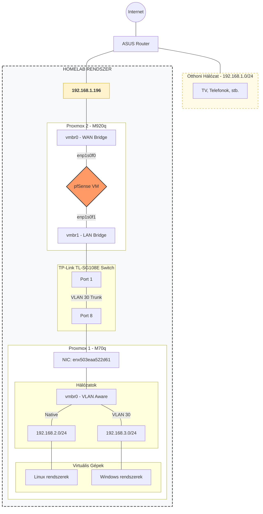

```mermaid
graph TD
    %% Külső világ
    Internet((Internet)) --- Asus[ASUS Router]

    %% Külön ágak az ASUS-tól lefelé
    Asus --- Home_Net_Box
    Asus --- Entry_IP

    %% Otthoni hálózat szekció
    subgraph Home_Net_Box [Otthoni Hálózat - 192.168.1.0/24]
        Devices[TV, Telefonok, stb.]
    end

    %% Homelab belépési pont
    Entry_IP[192.168.1.196]

    subgraph Homelab_System [HOMELAB RENDSZER]
        direction TB
        
        %% Proxmox 2 - M920q
        subgraph Node2 [Proxmox 2 - M920q]
            VMBR0_P2[vmbr0 - WAN Bridge]
            pfS{pfSense VM}
            VMBR1_P2[vmbr1 - LAN Bridge]

            VMBR0_P2 -- "enp1s0f0" --- pfS
            pfS -- "enp1s0f1" --- VMBR1_P2
        end

        Entry_IP --- VMBR0_P2

        %% Fizikai Switch
        VMBR1_P2 --- SW_P1
        
        subgraph Switch [TP-Link TL-SG108E Switch]
            SW_P1[Port 1] -- "VLAN 30 Trunk" --- SW_P8[Port 8]
        end

        %% Proxmox 1 - M70q
        SW_P8 --- P1_NIC
        
        subgraph Node1 [Proxmox 1 - M70q]
            P1_NIC[NIC: enx503eaa522d61]
            P1_Bridge[vmbr0 - VLAN Aware]
            
            P1_NIC --- P1_Bridge

            subgraph Subnets [Hálózatok]
                P1_Bridge -- "Native" --- LAN2[192.168.2.0/24]
                P1_Bridge -- "VLAN 30" --- VLAN3[192.168.3.0/24]
            end

            %% Átnevezett virtuális gép csoportok
            subgraph VMs [Virtuális Gépek]
                LAN2 --- Linux[Linux rendszerek]
                VLAN3 --- Windows[Windows rendszerek]
            end
        end
    end

    %% Stílusok a tiszta vizualizációhoz
    style Homelab_System fill:#f8f9fa,stroke:#333,stroke-width:2px,stroke-dasharray: 8 4
    style Entry_IP fill:#fff3cd,stroke:#d4a017,font-weight:bold
    style pfS fill:#f96,stroke:#333,stroke-width:2px
    style Home_Net_Box fill:#fffbe6,stroke:#d4a017,stroke-dasharray: 5 5
    style Node1 fill:#fff
    style Node2 fill:#fff
```
