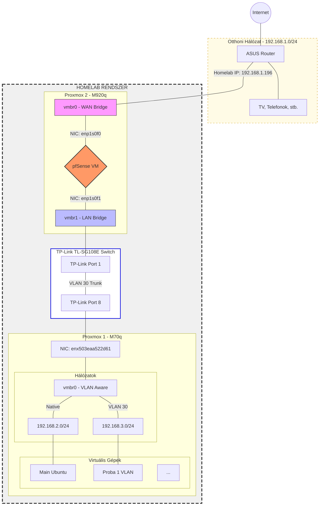

```mermaid
graph TD
    %% Külső világ
    Internet((Internet)) --- Asus[ASUS Router]

    subgraph Home_Net [Otthoni Hálózat - 192.168.1.0/24]
        Asus --- Devices[TV, Telefonok, stb.]
    end

    %% Csatlakozás a Lab-hez
    Asus -- "Homelab IP: 192.168.1.196" --- VMBR0_P2

    subgraph Homelab [HOMELAB RENDSZER]
        
        %% PROXMOX 2 - A Tűzfal (M920q)
        subgraph Node2 [Proxmox 2 - M920q]
            VMBR0_P2[vmbr0 - WAN Bridge]
            VMBR1_P2[vmbr1 - LAN Bridge]
            pfS{pfSense VM}

            VMBR0_P2 -- "NIC: enp1s0f0" --- pfS
            pfS -- "NIC: enp1s0f1" --- VMBR1_P2
            
            %% Management IP-k (opcionális, de a terminál írta)
            style VMBR0_P2 fill:#f9f,stroke:#333
            style VMBR1_P2 fill:#bbf,stroke:#333
        end

        %% Fizikai Switch
        VMBR1_P2 --- SW_P1[TP-Link Port 1]
        
        subgraph Switch [TP-Link TL-SG108E Switch]
            SW_P1 -- "VLAN 30 Trunk" --- SW_P8[TP-Link Port 8]
        end

        %% PROXMOX 1 - A VM Szerver (M70q)
        subgraph Node1 [Proxmox 1 - M70q]
            P1_NIC[NIC: enx503eaa522d61]
            P1_Bridge[vmbr0 - VLAN Aware]
            
            P1_NIC --- P1_Bridge

            subgraph Subnets [Hálózatok]
                P1_Bridge -- "Native" --- LAN2[192.168.2.0/24]
                P1_Bridge -- "VLAN 30" --- VLAN3[192.168.3.0/24]
            end

            subgraph VMs [Virtuális Gépek]
                LAN2 --- Ubu[Main Ubuntu]
                VLAN3 --- P1V[Proba 1 VLAN]
                %% A terminálban látott rengeteg veth interfész jelölése
                Sub_VMs[...] 
            end
        end

        SW_P8 --- P1_NIC
    end

    %% Stílusok
    style Homelab fill:#f0f0f0,stroke:#333,stroke-width:3px,stroke-dasharray: 10 5
    style pfS fill:#f96,stroke:#333,stroke-width:2px
    style Switch fill:#fff,stroke:#00d,stroke-width:2px
    style Home_Net fill:#fffbe6,stroke:#d4a017,stroke-dasharray: 5 5
```
