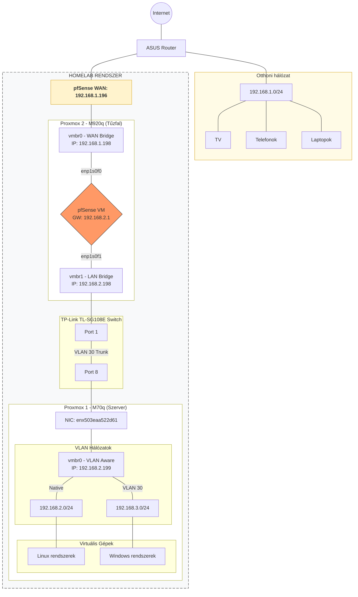

```mermaid
graph TD
    %% Külső világ
    Internet((Internet)) --- Asus[ASUS Router]

    %% Otthoni hálózat - külön szálon, hogy ne zavarjon semmit
    subgraph Home_Net ["Otthoni hálózat"]
        Subnet["192.168.1.0/24"]
        TV["TV"]
        Phone["Telefonok"]
        Laptop["Laptopok"]
    end
    Asus --- Subnet
    Subnet --- TV
    Subnet --- Phone
    Subnet --- Laptop

    %% A Homelab kapuja (pfSense WAN)
    Entry_IP["pfSense WAN: 192.168.1.196"]
    Asus --- Entry_IP

    %% TELJES HOMELAB
    subgraph Homelab_System ["HOMELAB RENDSZER"]
        direction TB

        %% Node2 - Itt lakik a pfSense
        subgraph Node2 ["Proxmox 2 - M920q (Tűzfal)"]
            P2_WAN["vmbr0 - WAN Bridge <br/> IP: 192.168.1.198"]
            pfS{pfSense VM <br/> GW: 192.168.2.1}
            P2_LAN["vmbr1 - LAN Bridge <br/> IP: 192.168.2.198"]

            P2_WAN -- "enp1s0f0" --- pfS
            pfS -- "enp1s0f1" --- P2_LAN
        end

        Entry_IP --- P2_WAN

        %% Fizikai Switch
        subgraph Switch ["TP-Link TL-SG108E Switch"]
            SW_P1[Port 1] -- "VLAN 30 Trunk" --- SW_P8[Port 8]
        end

        P2_LAN --- SW_P1
        SW_P8 --- P1_NIC

        %% Node1 - Itt laknak a szerverek
        subgraph Node1 ["Proxmox 1 - M70q (Szerver)"]
            P1_NIC["NIC: enx503eaa522d61"]
            P1_Bridge["vmbr0 - VLAN Aware <br/> IP: 192.168.2.199"]

            P1_NIC --- P1_Bridge

            subgraph Subnets ["VLAN Hálózatok"]
                P1_Bridge -- "Native" --- LAN2["192.168.2.0/24"]
                P1_Bridge -- "VLAN 30" --- VLAN3["192.168.3.0/24"]
            end

            subgraph VMs ["Virtuális Gépek"]
                LAN2 --- Linux["Linux rendszerek"]
                VLAN3 --- Windows["Windows rendszerek"]
            end
        end
    end

    %% Stílusok a tiszta képért
    style Home_Net fill:#fffbe6,stroke:#d4a017
    style Entry_IP fill:#fff3cd,stroke:#d4a017,font-weight:bold
    style pfS fill:#f96,stroke:#333
    style Homelab_System fill:#f8f9fa,stroke:#333,stroke-dasharray: 8 4
    style Node1 fill:#fff
    style Node2 fill:#fff
```
