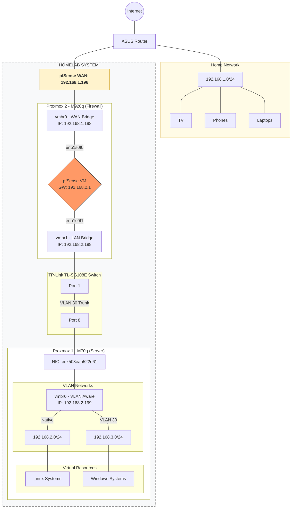

← [Back to Homelab Main Page](../README.md)

[🇬🇧 English](README.md) | [🇭🇺 Magyar](README_HU.md)

---

# 1. Network and Services

---

## 1.1 Network and Services Overview

| Service / Area                         | Tools / Software                                         |
|----------------------------------------|----------------------------------------------------------|
| [1.2 Firewall / Router](#pfsense)      | pfSense                                                  |
| [1.3 VPN](#vpn)                        | Tailscale, WireGuard, OpenVPN, NordVPN                   |
| [1.4 APT cacher proxy](#apt)            | APT-Cacher-NG                                             |
| [1.5 VLAN](#vlan)                      | TP-LINK SG108E switch                                    |
| [1.6 Reverse Proxy](#reverseproxy)     | Nginx Proxy Manager (replaced), Traefik (current)        |
| [1.7 Radius / LDAP](#radiusldap)       | FreeRADIUS, FreeIPA                                      |
| [1.8 Ad-blocking](#reklamszures)       | Pi-hole (replaced), AdGuard Home (current)               |
| [1.9 PXE Boot](#pxe)                   | iVentoy                                                  |
| [1.10 DNS](#dns)                       | BIND9, Namecheap, Cloudflare, Windows Server 2019 DNS    |
| [1.11 Network Debugging](#debug)       | Wireshark                                                |
| [1.12 DHCP](#dhcp2)                    | ISC-KEA, Windows Server 2019 DHCP                        |
| [1.13 Notifications](#notification)    | Gotify                                                   |

**The homelab network topology is shown in the diagram below:**

---

## 1.2 pfSense

In my homelab, I use a **pfSense-based firewall and router** to manage all traffic.

### 1.2.1 NAT and Routing
- **Outbound NAT** configuration for internal networks.
- **Port Forward NAT** for exposing external services.
- **Inter-VLAN routing** for traffic management between internal subnets.

### 1.2.2 DHCP Server Configuration and Operation
- **IP Range Management**: Granular control over address allocation.
- **Static DHCP Leases**: Fixed IP addresses for infrastructure elements.
- **Gateway and DNS Assignment**: Automatic client configuration.
- **Static ARP Entries**: Servers and clients on the 2.0 network receive static IP–MAC binding, which provides protection against **ARP spoofing**.
- **Management Access**: The switch is configured with a manual static IP to ensure the management interface is always accessible, independent of the DHCP server.

### 1.2.3 NTP Server Operation 
- Centralized time synchronization for internal clients.
- Clients utilize the **chronyd** service.
- pfSense serves as the NTP server for all LXCs and VMs (except for the FreeIPA LXC).

### 1.2.4 WireGuard VPN
- Modern, fast, and low-latency VPN solution.
- Provides secure remote access to the internal network.

### 1.2.5 OpenVPN
- Certificate-based authentication for high-level security.
- Broad compatibility with various clients.
- Custom firewall rules and routing through the VPN tunnel.

### 1.2.6 Dynamic DNS (DDNS)
- Automatic handling of dynamic public IP changes via Cloudflare API.
- Ensures **continuous accessibility of the VPN network from the internet**, regardless of IP changes.

---

## 1.3 VPN Usage in the Homelab

- I use **OpenVPN** and **WireGuard**, but I have also tested **Tailscale** and **NordVPN Meshnet** solutions.
- **Public Services**: Directly accessible from the internet (via Reverse Proxy) without a VPN.
- **Internal Services**: Accessible exclusively **via VPN**, ensuring the protection of management interfaces.
- **Full Tunnel**: Enabled on mobile devices to route all traffic through the home network, allowing me to enjoy **Pi-hole / AdGuard Home** ad-blocking remotely.

---

## 1.4 APT Cacher NG

### 1.4.1 Why use it?

- Optimized for **Ansible-scheduled VM and LXC updates** (set to 3:00 AM).
- Prevents every machine from downloading the same packages individually, saving significant bandwidth.
- **Efficiency**: Once one machine downloads an update, others retrieve it from the local cache at LAN speeds.

On certain days, the "cache hit" rate reached **88.26%**: out of 34.05 MB of traffic, 30.05 MB was served from the local cache. Overall, the system saves gigabytes of internet bandwidth.

  

---

## 1.5 VLAN and Network Segmentation

- **Proxmox Integration**: VLAN-aware bridge (`vmbr0`) and tagged interfaces (e.g., `.30`).
- **Isolation**: Creation of new subnets (192.168.3.0/24) for testing purposes.
- **Hardware Support**: VLAN trunk configuration on the TP-Link switch.
- **Firewall Rules**: Strict regulation on pfSense to limit lateral movement between network segments.

---

## 1.6 Reverse Proxy

Centralized **SSL/TLS certificate management** and traffic routing.

### 1.6.1 Usage of Local DNS Names (Nginx / Traefik)

I never use static IPs in proxy configurations — only DNS names.
- **Advantage**: If an IP address changes, the proxy doesn't break; only the internal DNS needs to be updated.
- **Readability**: Cleaner, more transparent setup.

### 1.6.2 SSL/TLS (Let’s Encrypt) – DNS-01 Wildcard

- **Security**: Full HTTPS encryption via Let’s Encrypt.
- **Validation**: DNS-01 challenge via Cloudflare API.
- **Advantage**: Allows the use of wildcard certificates (e.g., `*.trkrolf.com`) without opening internal ports.

---

## 1.7 RADIUS and LDAP

### 1.7.1 FreeIPA as LDAP
- Centralized user and permission management across the entire lab.
- Unified configuration of Sudo rules.

### 1.7.2 FreeRADIUS
- **pfSense Authentication**: Access to the pfSense GUI is handled via RADIUS.
- **Management**: SQL + PhpMyAdmin integration for user management.
- **Safety Net**: Local user fallback configured to prevent lockout.

---

## 1.8 Ad-blocking

### 1.8.1 AdGuard Home

- DNS-based network-level ad and tracker filtering.
- Integrated into the WireGuard VPN for mobile protection.

The figure below shows my **conditional forwarding** rules.

  

The figure below shows the blocklists utilized.

  

---

## 1.9 PXE Boot – iVentoy

- Network ISO booting (Clonezilla, Windows, Ubuntu installers).
- Eliminates the need for physical USB drives; installers load directly over the network.

---

## 1.10 DNS Architecture

### 1.10.1 Public DNS (Namecheap + Cloudflare)
- I purchased my domain through **Namecheap**, but **Cloudflare** is the DNS provider; I delegated the domain to their nameservers.
**Why Cloudflare?**
  - DNS-01 Challenge: Allows Traefik to automatically request Wildcard SSL certificates via API much easier than with Namecheap.
  - Record updates propagate significantly faster.

### 1.10.2 Private DNS Server (Bind9)
- Local Zone: `otthoni.local`.
- **DNS Override**: Wildcarded `*.trkrolf.com` records resolve directly to the local Traefik IP on the internal network, bypassing external lookups.

### 1.10.3 Bind9 + AdGuard Home + Unbound + Traefik Operational Logic

When a query for a local domain occurs, AdGuard Home forwards it to the Bind9 server based on the **conditional forwarding** rules for `otthoni.local`, and Bind9 provides the answer.

  

If a query for my own public domain occurs, AdGuard Home follows the **conditional forwarding** rules. Even though `trkrolf.com` is a public domain, it is forwarded to the Bind9 server, which provides an **override** answer: the IP address of the Traefik proxy.

  

If a query for a public domain occurs, AdGuard Home follows the **conditional forwarding** rules. Since it is not the `otthoni.local` or `trkrolf.com` domain, it is forwarded to the **Unbound** server, which then contacts the root servers.

  

---

## 1.11 Network Debugging – Wireshark

Deep packet analysis to study:
- DNS, DHCP, and ARP handshakes.
- TCP/IP stack processes and network performance verification.

---

## 1.12 DHCP

Detailed DHCP configuration can be found in the [pfSense DHCP section](#dhcp).

---

## 1.13 Notification

### 1.13.1 Gotify

**Gotify** is a lightweight, self-hosted server for sending real-time notifications to quickly stay informed about errors and statuses.

**Advantages:**
- **Self-hosted:** Full control, no third-party dependency.
- **Simple API:** Easily integrates with scripts and **webhooks**.
- **Real-time:** Push notifications sent to mobile instantly.

**Where do I use it?**
- If Proxmox loses TrueNAS mounts, I receive a notification. ❗ Script: [/11-Scripts/proxmox/mount-monitor](/11-Scripts/proxmox/mount-monitor)
- I receive notifications from Proxmox regarding warnings/errors, such as low disk space. Configurable in the Proxmox GUI.
- Notifications for S.M.A.R.T. errors. ❗ Script: [/11-Scripts/proxmox/S.M.A.R.T.](/11-Scripts/proxmox/S.M.A.R.T.)
- Radarr/Sonarr sends a notification when a movie/series finishes downloading. Supported natively in their GUIs.
- My Ansible update playbook sends a notification upon completion, indicating whether the client updates succeeded or failed. ❗ Script: [/06-Automation/Ansible_Semaphore/Playbooks/upgrade-system.yaml](/06-Automation/Ansible_Semaphore/Playbooks/upgrade-system.yaml)
- Notifications for VM/LXC backup results on Proxmox Backup Server. Configurable in the PBS GUI.
- Verification results of backups on Proxmox Backup Server. Configurable in the PBS GUI.

The image below shows a notification received when the NAS was unavailable for 2 hours.

  

---

← [Back to Homelab Main Page](../README.md)

