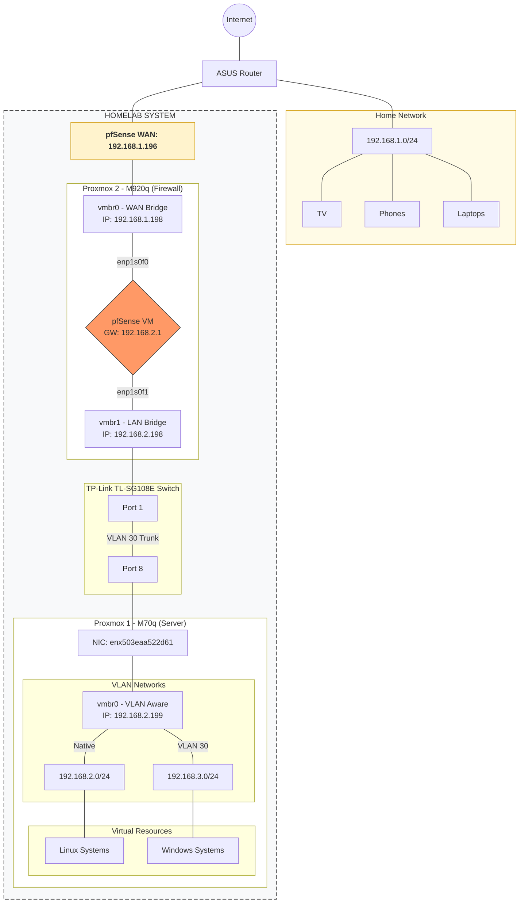

← [Vissza a Homelab főoldalra](../README_HU.md)

[🇬🇧 English](README.md) | [🇭🇺 Magyar](README_HU.md)

---

# 1. Network and Services

---

## 1.1 Network and Services áttekintés

| Szolgáltatás / Terület                 | Eszközök / Szoftverek                                     
|----------------------------------------|----------------------------------------------------------
| [1.2 Tűzfal / Router](#pfsense)        | pfSense                                                  
| [1.3 VPN](#vpn)                        | Tailscale, WireGuard, OpenVPN, NordVPN                   
| [1.4 APT cacher proxy](#apt)            | APT-Cacher-NG                                             
| [1.5 VLAN](#vlan)                      | TP-LINK SG108E switch                                    
| [1.6 Reverse Proxy](#reverseproxy)     | Nginx Proxy Manager (lecserélve), Traefik (jelenlegi)    
| [1.7 Radius / LDAP](#radiusldap)       | FreeRADIUS, FreeIPA                                      
| [1.8 Reklámszűrés](#reklamszures)      | Pi-hole (lecserélve), AdGuard Home (jelenlegi)                                                  
| [1.9 PXE Boot](#pxe)                   | iVentoy                                                  
| [1.10 DNS](#dns)                       | BIND9, Namecheap, Cloudflare, Windows Server 2019 DNS    
| [1.11 Hálózati hibakeresés](#debug)    | Wireshark                                                
| [1.12 DHCP](#dhcp2)                    | ISC-KEA, Windows Server 2019 DHCP                        
| [1.13 Notification](#notification)   | Gotify 

**A homelab hálózat topológiája az alábbi diagramon látható:**

---

## 1.2 pfSense

A homelabomban egy **pfSense alapú tűzfalat és routert** használok a forgalom kezelésére.

### 1.2.1 NAT és Routing
- **Outbound NAT** konfiguráció a belső hálózatok számára.
- **Port Forward NAT** a külső szolgáltatások közzétételéhez.
- **Belső hálózatok közötti forgalomirányítás** (Inter-VLAN routing).

### 1.2.2 DHCP szerver konfiguráció és működés
- **IP tartományok kezelése**: Granuláris kontroll a kiosztások felett.
- **Statikus DHCP foglalások**: Fix IP címek az infrastruktúra elemeinek.
- **Gateway és DNS kiosztás**: Automatikus kliens konfiguráció.
- **Statikus ARP bejegyzések**: A szerverek és kliensek a 2.0-s hálózaton statikus IP–MAC kötést kapnak, ami védelmet nyújt az **ARP spoofing** ellen.
- **Menedzsment hozzáférés**: A switch manuálisan beállított statikus IP-t kapott, hogy a menedzsment felület a DHCP szervertől függetlenül is mindig elérhető legyen.

### 1.2.3 NTP szerver futtatása 
- Központi időszinkronizáció a belső kliensek számára.
- A kliensek a **chronyd** szolgáltatást használják.
- A pfSense szolgál NTP szerverként minden LXC és VM számára (kivéve a FreeIPA LXC-t).

### 1.2.4 WireGuard VPN
- Modern, gyors és alacsony késleltetésű VPN megoldás.
- Biztonságos távoli hozzáférést biztosít a belső hálózathoz.

### 1.2.5 OpenVPN
- Tanúsítvány alapú hitelesítés a magas szintű biztonságért.
- Széleskörű kompatibilitás különböző kliensekkel.
- Egyedi tűzfalszabályok és forgalomirányítás a VPN tunnelen keresztül.

### 1.2.6 Dinamikus DNS (DDNS)
- A dinamikus publikus IP változások automatikus kezelése Cloudflare API-n keresztül.
- Biztosítja a **VPN hálózat folyamatos elérhetőségét az internet felől**, függetlenül az IP változásoktól.

---

## 1.3 VPN használata a Homelabban

- **OpenVPN**-t és **WireGuard**-ot használok, de teszteltem a **Tailscale** és **NordVPN Meshnet** megoldásokat is.
- **Publikus szolgáltatások**: Közvetlenül elérhetők az internetről (Reverse Proxy-n keresztül) VPN nélkül is.
- **Belső szolgáltatások**: Kizárólag **VPN-en keresztül** érhetők el, biztosítva a menedzsment felületek védelmét.
- **Full Tunnel**: Mobilról engedélyezve a teljes forgalom a hazai hálózaton megy át, így távolról is élvezhetem a **Pi-hole / AdGuard Home** reklámszűrését.

---

## 1.4 APT Cacher NG

### 1.4.1 Miért használom?

- Az **Ansible-al ütemezett VM és LXC frissítésekhez** (hajnali 3 órára beállítva) optimalizálva.
- Megakadályozza, hogy minden gép egyenként töltse le ugyanazokat a csomagokat, így jelentős sávszélességet takarít meg.
- **Hatékonyság**: Ha egy gép letölt egy frissítést, a többi már helyi hálózati sebességgel éri el a gyorsítótárból.

Volt olyan nap, amikor a "cache hit" arány elérte a **88,26%-ot**: a 34,05 MB-os forgalomból 30,05 MB a helyi cache-ből szolgált ki a rendszer. Összességében több gigabájtnyi adatot takarít meg a rendszer az internetes sávszélességen.

  

---

## 1.5 VLAN és hálózati szegmentáció

- **Proxmox integráció**: VLAN-aware bridge (`vmbr0`) és tag-elt interfészek (pl. `.30`).
- **Izoláció**: Új alhálózat létrehozása (192.168.3.0/24) tesztelési célokra.
- **Hardveres támogatás**: VLAN trunk konfiguráció a TP-Link switch-en.
- **Tűzfalszabályok**: Szigorú szabályozás pfSense-en a hálózati szegmensek közötti mozgás korlátozására.

---

## 1.6 Reverse Proxy

Központosított **SSL/TLS tanúsítványkezelés** és forgalomirányítás.

### 1.6.1 Helyi DNS nevek használata (Nginx / Traefik)

Soha nem használok fix IP-ket a proxy konfigokban — kizárólag DNS neveket.
- **Előny**: IP cím változás esetén nem törik el a proxy, csak a belső DNS-t kell frissíteni.
- **Olvashatóság**: Tisztább, átláthatóbb setup.

### 1.6.2 SSL/TLS (Let’s Encrypt) – DNS-01 Wildcard

- **Biztonság**: Teljes HTTPS titkosítás Let’s Encrypt segítségével.
- **Validálás**: DNS-01 challenge a Cloudflare API-n keresztül.
- **Előny**: Lehetővé teszi a wildcard tanúsítványok (pl. `*.trkrolf.com`) használatát belső portok megnyitása nélkül.

---

## 1.7 RADIUS és LDAP

### 1.7.1 FreeIPA mint LDAP
- Központosított felhasználó- és jogosultságkezelés a teljes laborban.
- Sudo szabályok egységes konfigurációja.

### 1.7.2 FreeRADIUS
- **pfSense autentikáció**: A pfSense GUI-ba való belépés RADIUS-on keresztül történik.
- **Kezelés**: SQL + PhpMyAdmin integráció a felhasználók kezeléséhez.
- **Biztonsági tartalék**: Helyi felhasználó fallback beállítva a kizáródás megelőzésére.

---

## 1.8 Reklámszűrés

### 1.8.1 AdGuard Home

- DNS-alapú hálózati szintű reklám- és követő kód szűrés.
- Integrálva a WireGuard VPN-be a mobilvédelem érdekében.

Lenti ábrán láthatom a **conditional forwarding** szabályaimat.

  

Lenti ábrán láthatom a felhasznált blokklistát.

  

---

## 1.9 PXE Boot – iVentoy

- Hálózati ISO bootolás (Clonezilla, Windows, Ubuntu telepítők).
- Megszünteti a fizikai pendrive-ok szükségességét; a telepítők közvetlenül a hálózaton keresztül töltődnek be.

---

## 1.10 DNS architektúra

### 1.10.1 Publikus DNS szerver (Namecheap + Cloudflare)
- **Namecheap** domain registar-on vásároltam a domain-em, de **Cloudflare** a DNS provider, delegáltam a domainem a nameservereire.
**Miért a Cloudflare?**
  - DNS-01 Challenge: Lehetővé teszi a Traefik számára a Wildcard SSL tanúsítványok automatikus igénylését a Cloudflare API-n keresztül, jóval egyszerűbben, mint Namecheap-en.
  - Gyorsabban frissülnek a rekordjai.

### 1.10.2 Privát DNS szerver (Bind9)
- Helyi zóna: otthoni.local.
- **DNS override**: A wildcardolt trkrolf.com (*.trkrolf.com) rekordok belső hálózaton közvetlenül a Traefik helyi IP-re oldódik fel, kikerülve a külső lekérdezést.

### 1.10.3 Bind9 + AdGuard Home + Unbound + Traefik működési logikája

Amennyiben lokális domainre vonatkozó lekérdezés történik, az AdGuard Home-ban **conditional forwarding**-ban megadott szabály alapján, az otthoni.local alapján a Bind9 szerverre továbbítja, a Bind9 válaszol.  

  

Ha a saját publikus domainemre vonatkozó lekérdezés történik, az AdGuard Home-ban **conditional forwarding**-ban megadott szabály alapján, a trkrolf.com noha publikus domain, mégis akár az otthoni.local-t, a Bind9 szerverre továbbítja, a Bind9 válaszol, mivel **overrideolva** van, mégpedig a Traefik IP címét adja vissza.   

  

Ha egy publikus domainre vonatkozó lekérdezés történik, az AdGuard Home-ban **conditional forwarding**-ban megadott szabály alapján, mivel ez nem az otthoni.local vagy a trkrolf.com domain, így az Unbound szerverre továbbítja, ami  felkeresi a szervereket.   

  

---

## 1.11 Hálózati hibakeresés – Wireshark

Mélyreható csomagelemzés a következők tanulmányozására:
- DNS, DHCP és ARP kézfogások.
- TCP/IP folyamatok és hálózati teljesítmény ellenőrzése.

---

## 1.12 DHCP

A részletes DHCP konfiguráció a [pfSense DHCP fejezetben](#dhcp) található.

---

## 1.13  Notification

### 1.13.1 Gotify

**Gotify** egy könnyű, saját hosztolt szerver valós idejű értesítések küldésére, hogy gyorsan értesüljek hibákról, állapotokról.  

**Előnyök:**
- **Saját hosztolt:** Teljes kontroll, nincs harmadik fél függés.
- **Egyszerű API:** Könnyen integrálható scriptekkel, **webhookkal**.
- **Valós idejű értesítések:** Push értesítések mobilra azonnal.

**Hol használom?**  
- Proxmox ha elveszíti a TrueNAS mountolásokat, erről értesítést kapok. ❗ Script: [/11-Scripts/proxmox/mount-monitor](/11-Scripts/proxmox/mount-monitor)
- Proxmox-ról értesítést kapok warnings/errors témákban, például ha kevés a lemezhely. Promox GUI-ban beállítható.
- S.m.a.r.t. hibákról kapok értesítést. ❗ Script: [/11-Scripts/proxmox/S.M.A.R.T.](/11-Scripts/proxmox/S.M.A.R.T.)
- Radarr/Sonarr ha végez a film/sorozat letöltésével, értesítést kapok erről. Radarr/Sonarr GUI-ja támogatja natívan, GUI-ból.
- Ansible update playbookom, ami updateli a klienseket, ha lefut, akkor ennek eredményéről értesítést kapok, hogy sikeresen vagy sikertelenül futott-e le.❗ Script: [/06-Automation/Ansible_Semaphore/Playbooks/upgrade-system.yaml](/06-Automation/Ansible_Semaphore/Playbooks/upgrade-system.yaml)
- Proxmox Backup Server-re törtétnő VM/LXC mentés után az eredményről értesítést kapok. PBS GUI-ban beállítható.
- Proxmox Backup Serveren a backupok verifikálásának eredményéről. PBS GUI-ban beállítható.

Lenti képen látható, 2 órán át nem volt elérhető a NAS és erről kaptam értesítést.

  

---

← [Vissza a Homelab főoldalra](../README_HU.md)

