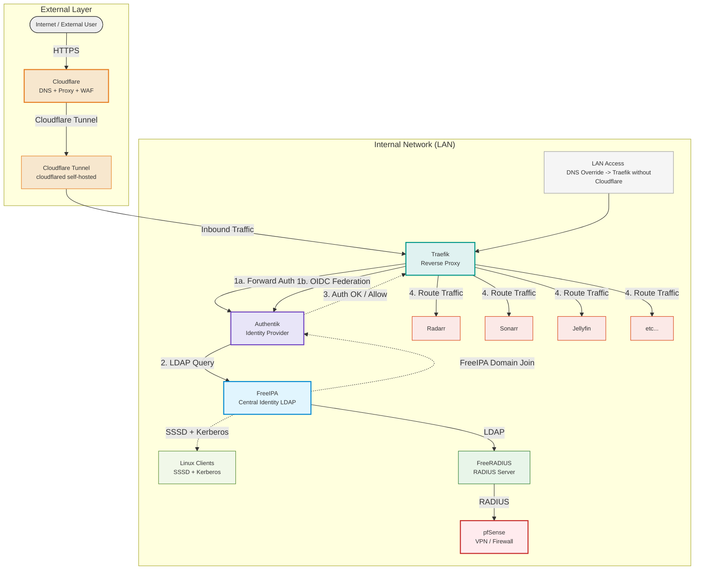
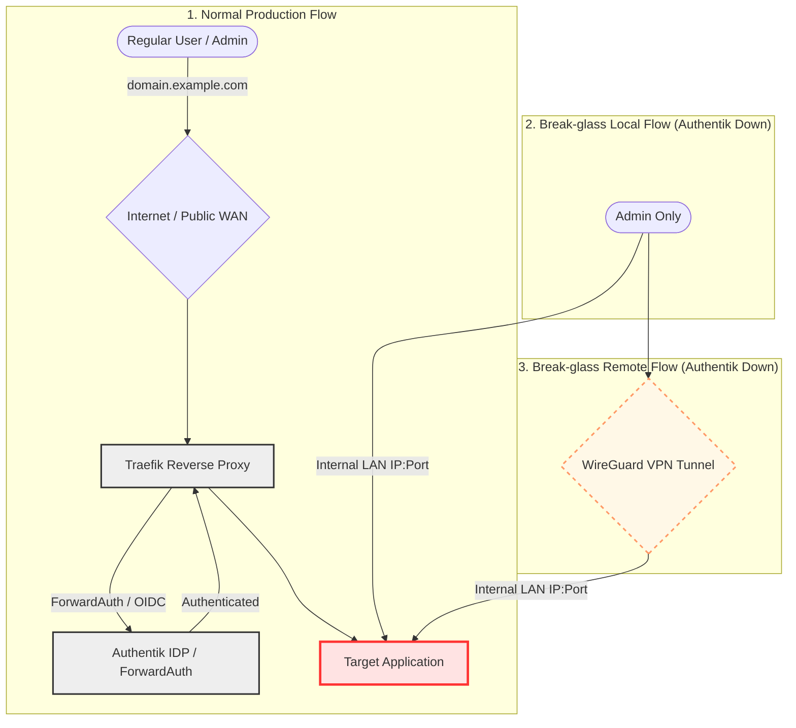

← [Back to Homelab Home](../README.md)

[🇬🇧 English](README.md) | [🇭🇺 Magyar](README_HU.md)

---

# 1. Identity and Access Management 

---

## 1.1 📚 Table of Contents

- [1.2 Overview](#overview)
- [1.3 FreeIPA](#freeipa)
- [1.4 FreeRADIUS](#freeradius)
- [1.5 Authentik](#authentik)
- [1.6 Teleport](#teleport)
- [1.7 Vaultwarden](#vaultwarden)

---

## 1.2 Overview

- **External Traffic Protection:** Inbound requests from the internet are routed through the Cloudflare global network, providing DNS resolution, Web Application Firewall (WAF), and reverse proxy protection.
- **Secure Ingress Channel:** Network traffic enters the internal LAN via a self-hosted Cloudflare Tunnel (`cloudflared`), eliminating the need to open public inbound ports on the firewall.
- **Internal Ingress Layer:** Traefik serves as the internal ingress controller and reverse proxy, accepting traffic from the Cloudflare Tunnel. Utilizing a middleware layer, it performs ForwardAuth / OIDC integration with Authentik for authentication validation, routing traffic to target internal services only upon successful authentication.
- **Centralized Authentication:** Authentik acts as the central Identity Provider (IdP) and single sign-on (SSO) layer for the entire infrastructure.
- **Central Directory Backend:** Authentik utilizes FreeIPA as its identity source and system of record via secure LDAP / Kerberos integration.
- **Service Isolation:** Internal applications (e.g., Radarr, Sonarr, Jellyfin, etc.) are strictly isolated behind Authentik and are inaccessible without valid session authentication.
- **Unified Identity Management (AAA):** FreeIPA provides centralized identity management (LDAP) and Kerberos-based authentication, serving as the auth backend for both local Linux clients and the FreeRADIUS server.
- **Network Access Control:** FreeRADIUS integrates with FreeIPA to provide RADIUS-based authentication, which is utilized for secure administrative (GUI) logins on the pfSense firewall.
- **Split-Horizon Bypassing (LAN Direct Access):** A local network direct access path is implemented via internal DNS overrides (BIND9), pointing directly to the internal Traefik/Authentik deployment without leaving the LAN or routing through Cloudflare.

---

## 1.3 FreeIPA as LDAP Provider
- **Client & Infrastructure Authentication:** Centralized LDAP directory used for user authentication across Ubuntu workstation clients and administrative GUI access on the pfSense firewall.
- **Authentik Integration:** Authentik (IdP) dynamically synchronizes and provisions user accounts from FreeIPA to feed the web-based SSO layers.

---

## 1.4 FreeRADIUS Server
- **Network AAA:** Enforces RADIUS-based Authentication, Authorization, and Accounting (AAA) for pfSense firewall administration and network security layers.
- **LDAP Backend Connection:** FreeRADIUS operates statelessly without a local user database; it queries and validates user credentials directly against the **FreeIPA** directory service.

---

## 1.5 Authentik (Identity Provider & SSO)

Authentik serves as the primary **Identity Provider (IdP)** for the homelab infrastructure, enforcing modern security protocols and providing a streamlined Single Sign-On (SSO) experience.

| Application | Method | 
| :--- | :--- | 
| **Nextcloud** | OIDC | 
| **Grafana** | OIDC | 
| **Portainer** | OIDC | 
| **Jellyfin** | OIDC | 
| **Teleport** | OIDC | 
| **ArgoCD / Semaphore** | OIDC | 
| **TrueNAS SCALE** | OIDC | 
| **Guacamole** | OIDC | 
| **Prometheus / AdGuard** | Proxy Provider | 
| **Vaultwarden** | Proxy Provider | 
| **Switch (TP-Link) UI** | Proxy Provider | 
| **Arr Stack (Radarr, etc.)** | Proxy Provider | 
| **qBittorrent / Gotify** | Proxy Provider | 
| **Webmin / PXE / Apt-Cacher**| Proxy Provider | 
| **pfSense** | Proxy Provider | 
| **FreeIPA** | LOCAL | 
| **Proxmox VE 1 & 2** | Primarily OIDC (root@pam retained as break-glass emergency access) | 
| **PBS (Backup Server)** | Primarily OIDC (root@pam retained as break-glass emergency access) | 

### Core Implementations:
- **OAuth2 & OpenID Connect (OIDC):** Native integration for modern applications ensuring secure, token-based authentication and standard claim scopes.
- **Forward Auth / Proxy Provider:** Traefik-orchestrated protection for legacy or basic applications lacking native authentication modules (e.g., iVentoy, Apt-Cacher NG). This intercepting middleware redirects unauthorized requests to the central Authentik login page, granting upstream passage only upon verification of a valid session cookie.
- **Custom Authentication Flows:** Developed two isolated custom Authentik flows:
  - A **Passkey-only Authentication Flow** that exclusively enforces **WebAuthn-based** authentication, entirely eliminating standard password entry to mitigate phishing and credential-stuffing vectors.
  - A dedicated **Passkey Registration Flow** requiring pre-authentication via traditional username and password credentials on a restricted endpoint before binding a new hardware cryptokey. Identities are validated against the FreeIPA directory backend to ensure strict provisioning controls.
- **Passwordless & Break-glass Access:** Prioritizes secure, passwordless multi-factor authentication via Passkeys (WebAuthn). To mitigate lockout scenarios, **Static Recovery Tokens** are pre-generated and stored securely offline, ensuring disaster recovery pathways if physical authenticators are lost or compromised.
- **Authentik Failover / Break-glass Degraded Access Strategy:** In the event of a total Authentik service outage, a degraded access pathway allows critical infrastructure access directly via internal IP and port numbers over local LAN or secure VPN tunnels, completely bypassing the SSO tier. Local emergency admin accounts with cryptographically strong, unique passwords are retained natively on all critical servers. This bypass path is strictly restricted to **administrative accounts**, ensuring high availability during control plane failures while minimizing the overall attack surface.
- **Centralized Authorization & Group-Based Access Control (GBAC):** Application access is controlled through Authentik policies and FreeIPA group membership synchronization. Users can access only the services assigned to their respective groups (e.g. `admins`, `media`). This ensures centralized authorization management and enforcement of the principle of least privilege.

---

## 1.6 Teleport (Access Plane & Zero Trust)

Teleport architecture delivers secure, infrastructure-grade access to homelab resources following strict **Zero Trust** principles.

### Key Capabilities:
- **Unified Access Plane:** Consolidates access pathways onto a single web-based interface (Web UI) for unified management of server infrastructure and administration terminals.
- **Session Recording & Audit Logging:** Tracks, logs, and live-records all active SSH and administrative graphical (GUI) sessions. Closed sessions are fully replayable and auditable, which is critical for security incident response and post-mortem analysis.
- **Role-Based Access Control (RBAC):** Implements a strict access matrix mapping permissions using cryptographic resource tags (labels), ensuring accounts are bound only to explicitly authorized assets.
- **Short-lived Certificates Infrastructure:** Replaced static SSH identity keys entirely with dynamic, ephemerally signed short-lived X.509 and SSH certificates valid for only a few hours. This eliminates manual key management, rotation overhead, and widespread key sprawl.
  - *Security Benefit:* In the event of endpoint compromise or device theft, the extracted user access credentials expire automatically within hours, neutralizing long-term threat vectors and removing the need for broad emergency public-key revocation across downstream server nodes.

---

## 1.7 Vaultwarden Password Manager

Vaultwarden provides a decentralized, **self-hosted credential vault** tailored for standalone password management within the homelab environment.

### Core Features:
- **Secure Credential Isolation:** All infrastructure credentials and secrets are fully isolated and stored locally, completely avoiding dependencies on third-party public cloud platforms.
- **Self-Hosted Sovereignty:** Ensures complete operational control over encryption parameters, internal container configurations, data retention schedules, and database storage profiles.

---

← [Back to Homelab Home](../README.md)
