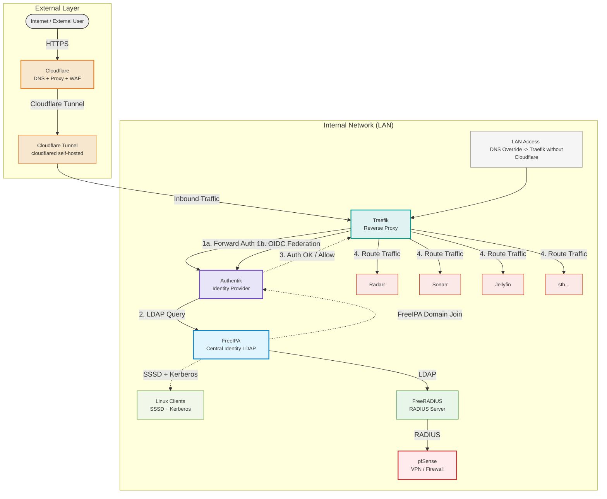
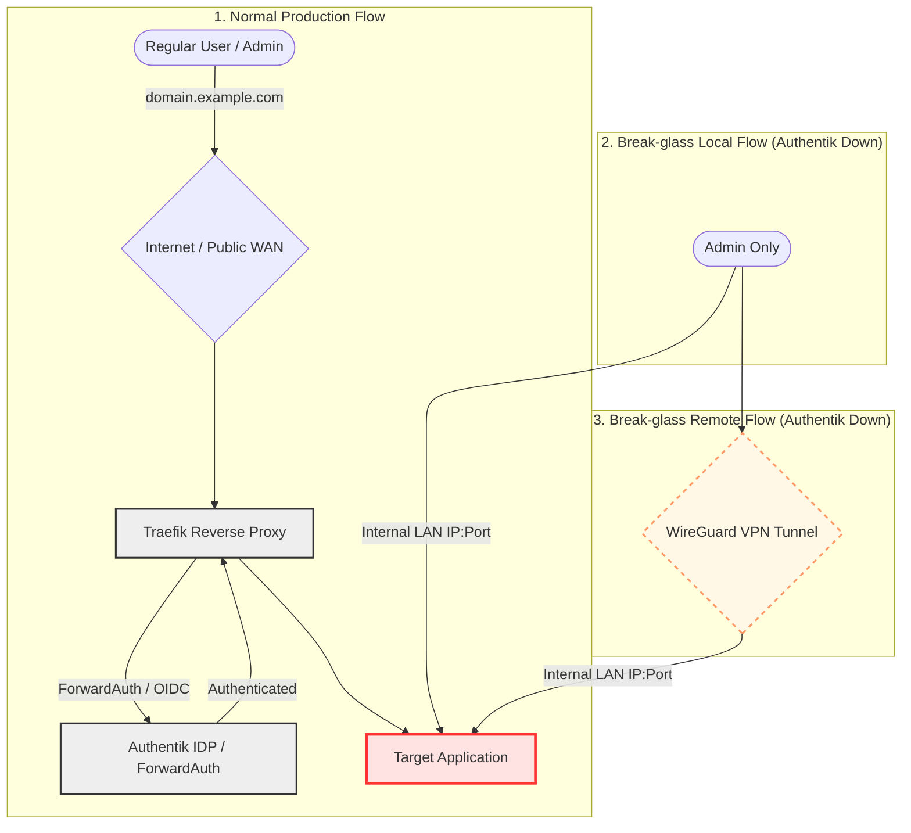

← [Vissza a Homelab főoldalra](../README_HU.md)

[🇬🇧 English](README.md) | [🇭🇺 Magyar](README_HU.md)

---

# 1. Identity and Access Management 

---

## 1.1 📚 Tartalomjegyzék

- [1.3 Áttekintés](#summary)
- [1.3 FreeIPA](#freeipa)
- [1.4 FreeRADIUS](#freeradius)
- [1.5 Authentik](#authentik)
- [1.6 Teleport](#teleport)
- [1.7 Vaultwarden](#vaultwarden)

---

## 1.2 Áttekintés

- A felhasználó az internet felől érkezik, ahol a Cloudflare biztosít DNS, WAF és reverse proxy védelmet
- A forgalom egy self-hosted Cloudflare Tunnel-en (cloudflared) keresztül jut be a belső hálózatba
- A Traefik szolgál a belső ingress rétegként (reverse proxy), amely a Cloudflare Tunnel-ből érkező forgalmat fogadja. Middleware rétegként ForwardAuth / OIDC integrációt használ az Authentik felé történő autentikációs ellenőrzéshez, és csak sikeres hitelesítés esetén továbbítja a kérést a megfelelő belső szolgáltatások felé
- Az autentikáció központja az Authentik (OIDC / Forward Auth), amely egységes SSO rétegként működik
- Az Authentik a FreeIPA rendszert használja identity source-ként (LDAP / Kerberos integráció)
- A belső szolgáltatások (Radarr, Sonarr, Jellyfin stb.) Authentik mögé vannak zárva, és csak hitelesítés után érhetők el
- A FreeIPA biztosítja a központi identitáskezelést (LDAP), a Kerberos alapú hitelesítést, valamint a Linux kliensek és FreeRADIUS számára az autentikációs hátteret
- A FreeRADIUS a FreeIPA-val integrálva biztosít RADIUS alapú autentikációt, amelyet a pfSense adminisztrációs (GUI) bejelentkezéshez használok
- Létezik egy LAN-only direct access útvonal is, ahol a belső DNS override (BIND9) Cloudflare nélkül az Authentik belső elérésére mutat

---

## 1.3 FreeIPA mint LDAP
- **Kliens és Infrastruktúra hitelesítés:** Ezzel a központi LDAP-pal lépek be az Ubuntu kliens gépekre és a pfSense tűzfal admin felületére is.
- **Authentik integráció:** Az Authentik (IAM) szintén a FreeIPA-ból szinkronizálja és húzza be a felhasználókat a webes SSO-hoz.

---

## 1.4 Freeradius mint RADIUS szerver
- **Hálózati AAA:** A pfSense tűzfal a FreeRADIUS-on keresztül végzi a hálózati szintű hitelesítést.
- **LDAP Backend összeköttetés:** A FreeRADIUS nem maga tárolja a felhasználókat, hanem a háttérben közvetlenül a **FreeIPA-ból** kéri le és ellenőrzi a usereket.

---

## 1.5 Authentik (Identity Provider & SSO)

Az Authentik a homelab központi **Identity Provider (IdP)** megoldása, amely lehetővé teszi a modern biztonsági protokollok integrációját és a zökkenőmentes, biztonságos beléptetést.

| Alkalmazás | Módszer | 
| :--- | :--- | 
| **Nextcloud** | OIDC | 
| **Grafana** | OIDC | 
| **Portainer** | OIDC | 
| **Jellyfin** | OIDC | 
| **Teleport** | OIDC | 
| **ArgoCD / Semaphore** | OIDC | 
| **TrueNAS SCALE** | OIDC | 
| **Guacamole** | OIDC | 
| **Prometheus / AdGuard** | Proxy Provider | 
| **Vaultwarden** | Proxy Provider |
| **Switch (TP-Link) UI** | Proxy Provider | 
| **Arr Stack (Radarr, stb.)** | Proxy Provider | 
| **qBittorrent / Gotify** | Proxy Provider |
| **Webmin / PXE / Apt-Cacher**| Proxy Provider | 
| **pfSense** | Proxy Provider | 
| **FreeIPA** | LOKÁLIS | 
| **Proxmox VE 1 & 2** | Elsődlegesen OIDC, de a root@pam megmarad vészhelyzeti elérésnek.. |
| **PBS (Backup Server)** |  Elsődlegesen OIDC, de a root@pam megmarad vészhelyzeti elérésnek. |

### Főbb implementációk:
- **OAuth2 & OpenID Connect (OIDC):** Natív integráció a modern alkalmazásokkal a biztonságos, token-alapú hitelesítés érdekében.
- **Forward Auth / Proxy Provider:** Traefik alapú védelem olyan legacy vagy egyszerű szolgáltatásokhoz, amelyek nem rendelkeznek saját bejelentkezési felülettel vagy hitelesítéssel (pl. iVentoy, Apt-Cacher NG). A megoldás az Authentik központi login oldalára irányítja a felhasználót, és csak érvényes session birtokában engedi elérni az alkalmazásokat.
- **Egyedi hitelesítési folyamatok:** Két külön Authentik flow-t implementáltam:
  - egy **Passkey-only hitelesítési flow-t**, amely kizárólag **WebAuthn** alapú azonosítást fogad el, ezzel jelentősen csökkentve a phishing támadások kockázatát a jelszavas bejelentkezés teljes kizárásával;
  - valamint egy külön **Passkey regisztrációs flow-t**, ahol a felhasználó egy dedikált linken keresztül először köteles hitelesíteni magát felhasználónév és jelszó által, mielőtt új Passkey-t regisztrálhatna. A felhasználói identitásokat az Authentik FreeIPA integráción keresztül szinkronizálja, biztosítva a központi identitáskezelést és a kontrollált Passkey provisioninget.
- **Passwordless & Break-glass Access:** Elsődlegesen **Passkey (WebAuthn)** alapú, jelszómentes hitelesítést alkalmazok. A kizáródás elleni védelem érdekében **Static Recovery Tokeneket** generáltam és biztonságosan tároltam, garantálva a hozzáférést a hitelesítő eszköz meghibásodása vagy elvesztése esetén is.
- **Authentik Failover / Break-glass Degraded Access Strategy:** Authentik kiesése esetén a szolgáltatások közvetlenül IP + port alapon érhetők el a belső hálózaton vagy VPN-en keresztül, megkerülve az SSO réteget. A lokális alkalmazás felhasználók minden kritikus rendszerben megmaradnak, kizárólag erős, egyedi jelszavakkal védve. Ez a hozzáférési mód kizárólag az **adminisztrátori fiókokra** vonatkozik, a normál felhasználók számára nem elérhető a bypass út. Ez biztosítja, hogy a rendszer működőképessége fennmaradjon Identity Provider kiesése esetén is, miközben a támadási felület minimális marad.
- **Központosított jogosultságkezelés & Group-Based Access Control (GBAC ):** Az alkalmazásokhoz való hozzáférést Authentik policy-k és FreeIPA csoporttagságok alapján szabályozom. A felhasználók kizárólag a számukra kijelölt csoportokhoz tartozó szolgáltatásokat érhetik el (pl. `admins`, `media`). Ez biztosítja a központi jogosultságkezelést és a least privilege elv érvényesítését.

---

## 1.6 Teleport (Access Plane & Zero Trust)

A Teleport biztosítja a biztonságos, infrastruktúra-szintű hozzáférést a homelab erőforrásaihoz, a **Zero Trust** elveit követve.

### Megoldások:
- **SSH & Server Access:** Kiváltottam a statikus SSH-kulcsokat így, és nincs többé ssh kulcs menedzselés.
- **Session Recording & Audit:** Minden SSH és GUI-alapú munkamenet rögzítésre kerül. A tevékenységek visszajátszhatóak és auditálhatóak, ami kritikus a biztonsági incidensek elemzésekor.
- **Unified Access Plane:** Egyetlen felületen (Web UI) keresztül érem el a szervereket SSH-n.
- **RBAC (Role-Based Access Control):** Szigorú jogosultságkezelés: a felhasználók csak a számukra kijelölt címkékkel (labels) ellátott erőforrásokhoz férhetnek hozzá.
- **SSH & Server Access (Short-lived Certificates):** Teljesen kiváltottam a statikus SSH-kulcsokat, így nincs többé kulcsmásolgatás és kézi menedzselés. Örök életű kulcsok helyett a Teleport rövid élettartamú (pár óráig érvényes) tanúsítványokat használ. 
  - *Biztonsági előny:* Ha elhagyom vagy ellopják a laptopomat, a rajta lévő hozzáférések maguktól lejárnak, mielőtt a támadó egyáltalán használni tudná őket. Nem kell pánikszerűen végigjárni a szervereket a publikus kulcsok törléséhez.

---

## 1.7 Vaultwarden Password Manager

A Vaultwarden célja: **önálló, self-hosted jelszókezelés a homelabban**.

---

### Funkciók

- **Biztonságos jelszó tárolás**: a homelab összes jelszava **nem kerül ki az internetre**.  
- **Self-hosted**: teljes kontroll a szerver felett.  

---

← [Vissza a Homelab főoldalra](../README_HU.md)

