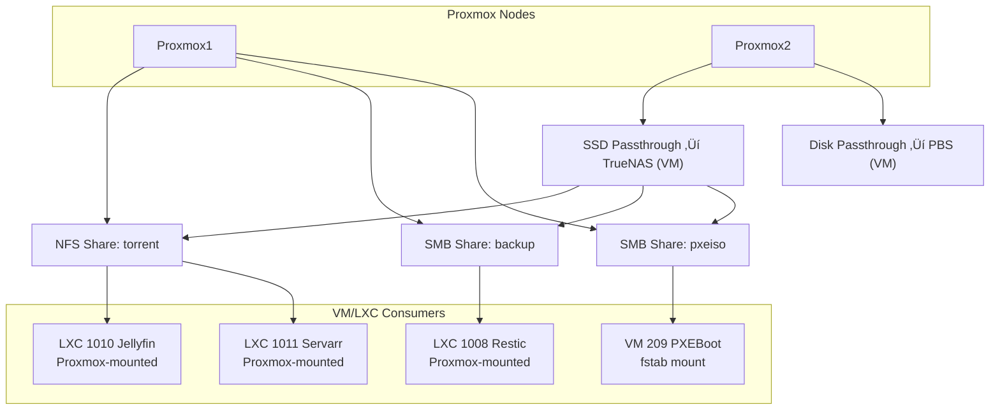

← [Back to Homelab main page](../README.md)

[🇬🇧 English](README.md) | [🇭🇺 Magyar](README_HU.md)

---

# Design Decisions and Rationale

Here I present why I chose certain technologies and architectural approaches.

---
## Proxmox and VMs initially sharing a 1TB M.2 SSD, later separating them so Proxmox moves to a 250 GB SSD while VMs remain on the fast 1 TB M.2 SSD

- **Space saving**: This way, Clonezilla backup is only required for the 250 GB SSD containing Proxmox. The VMs are backed up by Proxmox Backup Server (PBS), so Clonezilla backup for them is unnecessary. Result: faster backups and less storage usage.
- **I/O load separation**: The Proxmox host and the VMs both perform I/O operations. If they were on the same disk, the load would accumulate. With separate SSDs, operations are distributed, providing a more stable and faster system.

---
## Replacing FreeFileSync with Restic

- I back up the important files from my new laptop to the TrueNAS server using **Restic**.
- Why Restic:
  - **Safe**: With Restic, accidentally deleted source files can be restored. With FreeFileSync, if I sync after deleting a source file, I cannot restore it.
  - **Versioning**: Previous states can be restored at any time.
  - **Efficient**: Compression, fast operation. FreeFileSync was much slower at detecting changes and copying modified files.

---
## Why Nextcloud?

- Self-hosted file and photo management
- No need for Google Drive / other cloud providers — Nextcloud is my own Google Drive
- Full control and security

---
## Why Vaultwarden?

- Self-hosted password manager
- Passwords never leave my infrastructure
- Full control and security

---
## I run every possible service as an LXC, each service in its own LXC

The main goal is that **every service runs in its own LXC**, fully isolated. If one container stops, it **does not affect other services**.

**Advantages of LXC compared to VMs:**
- **Lower resource usage**: less RAM and CPU required, faster startup
- **Faster deployment**: new containers can be created in minutes
- **Scalability**: more containers fit on a host than VMs
- **Isolation**: a failed service does not bring down others

---

## My mounting strategy

- No disk passthrough on Proxmox1 node
- On Proxmox2 node there are 2 disk passthroughs (for TrueNAS and Proxmox Backup Server)
- I mount TrueNAS shares to the Proxmox host, which then passes them to unprivileged LXCs
- In the case of VMs, I mount TrueNAS shares directly inside the VM via fstab, not through Proxmox



---

## Bind9, AdGuard Home, Unbound cache and TTL strategy

**BIND9 (Local authoritative source):**
- Since pfSense assigns static IPs, internal service addresses are constant, the name-IP mapping does not change.
- The **1 hour (3600s) TTL** in zone files creates an ideal balance between stability and flexibility during testing.

**Unbound (Recursive resolver):**
- **TTL Capping (0–3600s)**: Unbound respects the original TTL but caps it at 1 hour.
- **Optimistic Caching**: With serve-expired enabled, expired records are kept for another hour.

**AdGuard Home (Client-side filtering):**
- **TTL range (0–86400s)**: Maximum limit raised to 1 day.
- **Optimistic caching**: Ensures availability even if BIND9/Unbound stops.

Layer / Server                | Cache Size                               | Minimum TTL | Maximum TTL
-----------------------------|-------------------------------------------|-------------|-------------
AdGuard Home (for clients)  | 128 MB                                    | 0           | 86400 (1 day)
BIND9 (local zones)         | default                                   | 3600        | 3600
Unbound (public DNS)        | msg-cache 64 MB, rrset-cache 128 MB       | 0           | 3600 (1 hour)

---

## Scheduled tasks (Backup & Maintenance)

```mermaid
gantt
    title Optimized System Task Scheduling
    dateFormat  HH:mm
    axisFormat  %H:%M
    todayMarker off
```

| Time | Task Name | Target Device | Frequency | Duration |
| :--- | :--- | :--- | :--- | :--- |
| **22:00** | Prune (Retention) | PBS Server | Daily | 1 min |
| **22:30** | Apt-Cacher-NG Maintenance | Apt-Proxy Server | Daily | 1 min |
| **23:00** | Ansible Update | VM/LXC | Daily | - |
| **01:00** | SMART Long Test | Proxmox 1 & 2 | Monthly (1st Sat) | - |
| **02:00** | SMART Short Test | Proxmox 1 & 2 | Daily | - |
| **04:00** | VM/LXC Backup | Proxmox 1 -> PBS | Weekly (Sunday) | 15 min |
| **05:30** | VM/LXC Backup | Proxmox 2 -> PBS | Weekly (Sunday) | 5 min |

---

## Confusion caused by identical VM/LXC IDs in Proxmox Backup Server

... (rest unchanged)

---

## VM/LXC naming convention

The VM/LXC name refers to the service or role running on it, extended with the last octet of its IP address.

<p align="center">
  
</p>

---

← [Back to Homelab main page](../README.md)
