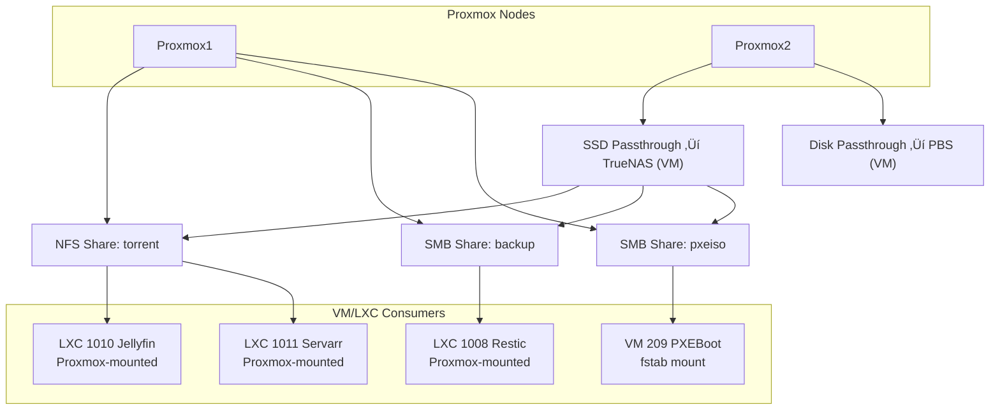

← [Back to the Homelab main page](../README.md)

[🇬🇧 English](README.md) | [🇭🇺 Magyar](README_HU.md)

---

# Design Decisions and Rationale

Here I present why I chose certain technologies and architectural approaches.

---

## Proxmox and VMs initially sharing a 1TB M.2 SSD, later separating them: Proxmox moved to a 250 GB SSD, VMs to the fast 1 TB M.2 SSD

- **Space saving**: This way, a Clonezilla backup is only required for the 250 GB SSD that contains Proxmox. The VMs are backed up by Proxmox Backup Server (PBS), so Clonezilla backups for them are unnecessary. Result: faster backups and significantly less storage usage.
- **I/O load separation**: Both the Proxmox host and the VMs perform I/O operations. If they share the same disk, the load adds up. Using separate SSDs distributes the load, resulting in a more stable and faster system.

---

## Replacing FreeFileSync with Restic

- I back up the important files from my new laptop to the TrueNAS server using **Restic**.
- Why Restic:
  - **Safe**: With Restic, accidentally deleted source files can be restored. With FreeFileSync, if I accidentally sync after deleting a source file, I cannot recover it.
  - **Versioning**: Previous file states can be restored at any time.
  - **Efficient**: Compressed, fast. FreeFileSync was much slower at detecting changes and copying modified files.

---

## Why Nextcloud?

- Self-hosted file and photo management  
- No need for Google Drive or other cloud services — Nextcloud is my own Google Drive  
- Full control and security  

---

## Why Vaultwarden?

- Self-hosted password manager  
- Passwords never leave my infrastructure  
- Full control and security  

---

## I run every possible service in LXC, each service in its own container

The main goal is that **each service runs in a separate LXC**, ensuring isolation: if one container stops, it **does not affect the other services**.

**Advantages of using LXC compared to VMs:**

- **Lower resource usage**: requires less RAM and CPU, faster startup
- **Faster deployment**: new containers can be created in minutes
- **Scalability**: more containers can run on a host than VMs
- **Isolation**: a failing or stopped service does not bring down others

---

## My mounting strategy

- On Proxmox1 node there is no disk passthrough
- On Proxmox2 node there are 2 disk passthroughs (for TrueNAS and Proxmox Backup Server)
- I mount the TrueNAS shares to the Proxmox host so it can pass them to unprivileged LXCs.
- In the case of VMs, I mount the TrueNAS shares directly inside the VM via `fstab`, not through Proxmox.

---

## Bind9, AdGuard Home, and Unbound Cache/TTL Strategy

**BIND9 (Local Authoritative Source):**
- Since pfSense assigns static IPs, the IP addresses of my private domains remain constant; services are always mapped to the same IP.
- A **1-hour (3600s) TTL** in the zone files provides an ideal balance between stability and flexibility for testing and updates.

**Unbound (Recursive Resolver):**
- **TTL Capping (0-3600s)**: Unbound respects the original TTL but caps it at 1 hour. This protects against stale records while allowing **CDN** to offer closer or faster servers via short TTLs (e.g., 10s).
- **Optimistic Caching**: Using the `serve-expired` feature, expired records are retained for an additional hour. If the upstream server is unavailable or slow, Unbound responds instantly from the cache, making network errors or latency invisible to clients.

**AdGuard Home (Client-side Filter):**
- **TTL Range (0-86400s)**: The maximum limit is raised to 1 day.
- **Optimistic Caching**: AdGuard also utilizes this feature. If the BIND9 container or Unbound were to go down temporarily, AdGuard can serve known internal names from its cache for up to 24 hours, ensuring continuous access to homelab services.

Layer / Server                 | Cache Size                          | Minimum TTL | Maximum TTL
-------------------------------|-------------------------------------|-------------|-------------
AdGuard Home (for clients)     | 128 MB                              | 0           | 86400 (1 day)
BIND9 (local zones)            | default                             | 3600        | 3600
Unbound (public DNS)           | msg-cache 64 MB, rrset-cache 128 MB | 0           | 3600 (1 hour)

---

## Scheduled Tasks (Backup & Maintenance)

This schedule is optimized to prevent IO thrashing by isolating disk-intensive operations (SMART tests, Garbage Collection, and Verify) from active backup and update windows.

| Time       | Task Description            | Target Device         | Frequency               |
|------------|----------------------------|---------------------|------------------------|
| 22:00      | Prune (Retention Policy)   | PBS Server           | Daily                  |
| 23:00      | Ansible Update             | VM/LXC               | Daily                  |
| 01:00      | SMART Long Test            | Proxmox 1 & 2        | Monthly (1st Sat)      |
| 02:00      | SMART Short Test           | Proxmox 1 & 2        | Daily                  |
| 04:00      | VM/LXC Backup              | Proxmox 1 -> PBS     | Weekly (Sunday)        |
| 05:30      | VM/LXC Backup              | Proxmox 2 -> PBS     | Weekly (Sunday)        |
| Sat 08:00  | Garbage Collection         | PBS Server           | Weekly                 |
| Sun 10:00  | Backup Verify              | PBS Server           | Weekly/Monthly         |

---

## Proxmox Backup Server: Confusion caused by identical VM/LXC IDs

**Problem**

When using multiple Proxmox nodes, the PBS (Proxmox Backup Server) organizes backups based on VM/LXC IDs by default. If identical IDs are used (e.g., 101 on Node1 and 101 on Node2), I encountered the following issue: The PBS interface does not distinguish whether a given ID 101 VM/LXC arrived from Node1 or Node2. Consequently, it places the backups of two different VM/LXCs under the same identifier instead of keeping them separate.

**Solution**
Use Globally Unique VM/LXC IDs, which are assigned systematically based on the table below rather than randomly.
I am renumbering my current system according to this table, and for new VM/LXC creations, I will assign IDs based on these ranges. I register every VM/LXC in a table to track which ID is assigned to whom.

| ID Range | Category | Note |
| :--- | :--- | :--- |
| **100 - 499** | **LXC Core infrastructure** | Mandatory LXC for basic operation |
| **500 - 999** | **VM Core infrastructure** | Mandatory Virtual Machines for basic operation |
| **1000 - 1099** | **LXC services** | Additional services (LXC) |
| **1100 - 1199** | **VM linux servers** | Linux-based servers |
| **1200 - 1299** | **VM linux clients** | Linux-based clients |
| **1300 - 1399** | **VM windows servers** | Windows-based servers |
| **1400 - 1499** | **VM windows clients** | Windows-based clients |

**My specific allocation**

**LXC Core infrastructure (100-499)**
- `100:dns`, `101:unbound`, `102:traefik`, `103:adguard`, `104:pi-hole`, `105:nginx`

**VM Core infrastructure (500-999)**
- `500:pfsense`, `501:pbs`, `502:truenas`

**LXC Services (1000-1099)**
- `1000:zabbix`, `1001:ansible`, `1002:nextcloud`, `1003:homarr`, `1004:guacamole`, `1005:apt-cacher`, `1006:freeipa`, `1007:freeradius`, `1008:restic`, `1009:vaultwarden`, `1010:jellyfin`, `1011:servarr`, `1012:gotify`, `1013:portainer`, `1014:pulse`, `1015:changedetection`

**VM linux servers (1100-1199)**
- `1100:crowdsec`, `1101:pxeboot`

**VM linux clients (1200-1299)**
- `1200:mainubuntu`, `1201:kali`, `1202:probaubi`

**VM windows servers (1300-1399)**
- `1300:winszerver1`, `1301:winszerver2`, `1302:winszerver-core`

**VM windows clients (1400-1499)**
- `1400:mainwindows11`, `1401:win11kliens1`, `1402:win11kliens2`

---

← [Back to the Homelab main page](../README.md)
