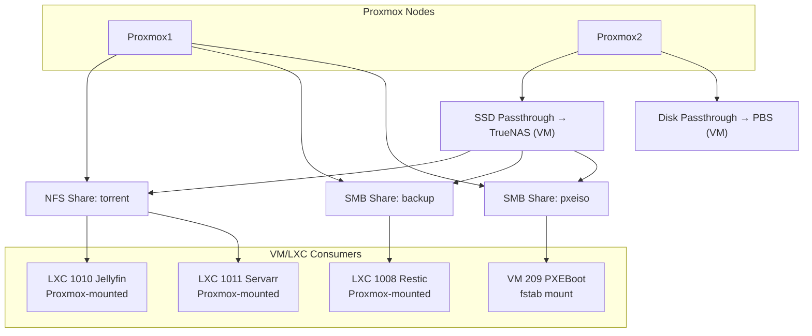

← [Vissza a Homelab főoldalra](../README_HU.md)

[🇬🇧 English](README.md) | [🇭🇺 Magyar](README_HU.md)

---

# Tervezési döntések és érvek

Itt bemutatom, hogy miért esett a döntésem bizonyos technológiákra és architektúrákra.

---
## 1TB-os M.2 SSD-n Proxmox és VM-ek közösen, később ezt szétválasztom és Proxmox kerül a 250 GB SSD-re míg VM-ek gyors 1 TB-os M.2 SSD-re

- **Helyspórolás**: Így Clonezilla mentés csak a 250 GB-os Proxmox-ot tartalmazó SSD-ről szükséges. A VM-eket a Proxmox Backup Server (PBS) menti, róluk szükségtelen Clonezilla mentés. Eredmény gyorsabb és kevesebb tárhelyet igénylő mentés.
- **I/O terhelés szétválasztása**: a Proxmox host és a VM-ek is végeznek I/O műveleteket. Ha egy lemezen lennének, a terhelés összeadódna, külön SSD-vel pedig a műveletek eloszlanak, ami stabilabb és gyorsabb rendszert biztosít.
---
## FreeFileSync lecserélése Restic-re

  - Az új laptopomon lévő fontos fájlaimról **Restic** segítségével készítek biztonsági mentést a TrueNAS szerverre.
  - Miért Restic:
    - **Biztonságos**: Restic-nél a véletlen forrásfájl törlés esetén visszaállítható a törölt fájl, míg FreeFileSync-nél, ha a forrásfájl törlése után véletlen szinkronizálok, akkor nem tudom visszaállítani a fájlt.
    - **Verziózás**: akár korábbi állapotok is visszaállíthatók.
    - **Hatékony**: tömörít, gyors, FreeFileSync sokkal lassabban ellenőrizte le a változásokat és lassabban másolta  a megváltozott fájlokat.
---
## Miért Nextcloud?

- Self-hosted fájl- és képkezelés  
- Nem szükséges Google Drive / más felhő, Nextcloud a saját Google Drive-om
- Teljes kontroll és biztonság  
---
## Miért Vaultwarden?

- Self-hosted jelszókezelés  
- Jelszavak nem kerülnek ki az internetre  
- Teljes kontroll és biztonság  
---
## Minden szolgáltatást, amit tudok, LXC-ként futtatok, minden szolgáltatás külön LXC-n fut

A fő cél, hogy **minden szolgáltatás külön LXC-ben fusson**, így izoláltak: ha egy konténer leáll, az **nem érinti a többi szolgáltatást**.

**Előnyök LXC használatával VM-ekhez képest:**
- **Kisebb erőforrásigény**: kevesebb RAM és CPU szükséges, gyorsabb indítás
- **Gyorsabb deployment**: új konténerek percek alatt létrehozhatók
- **Skálázhatóság**: több konténer fér el egy hoston, mint VM
- **Izoláció**: hibás vagy leállt szolgáltatás nem állítja le a többit

---

## Mountolási stratégiám

- Proxmox1 node-on nincsen disk passthrough
- Proxmox2 node-on fut van 2 disk passthrough (TrueNAS-nak és Proxmox Backup Servernek)
- Proxmox hosthoz csatolom a TrueNAS megosztásokat, hogy továbbadja az unprivileged LXC-nek.
- VM esetében az fstab segítségével mountolom a VM-hez közvetlenül a TrueNAS megosztásokat és nem a Proxmox adja tovább.

---

## Bind9, AdGuard Home, Unbound cache és TTL stratégiája

**BIND9 (Lokális autoritatív forrás):**
- Mivel a pfSense statikus IP-ket oszt, a belső szolgáltatások címei állandóak, a név-IP párosítás nem változik.
- A zónafájlokban rögzített **1 órás (3600s) TTL** ideális egyensúlyt teremt a stabilitás és a tesztelés alatti rugalmasság között.

**Unbound (Rekurzív feloldó):**
- **TTL Capping (0-3600s):** Az Unbound tiszteletben tartja az eredeti TTL-t, de 1 órában maximalizálja azt. Ez megvéd az elavult rekordoktól, miközben engedi a **CDN**-nek, hogy a rövid TTL-lel (pl. 10s) mindig a legközelebbi/leggyorsabb szervert ajánlják fel.
- **Optimistic Caching:** A serve-expired funkcióval a lejárt rekordokat további 1 óráig megőrzi. Ha az upstream szerver nem elérhető vagy lassú, a cache-ből azonnal válaszol, így a hálózati hiba vagy késleltetés észrevétlen marad a kliensek számára.

**AdGuard Home (Kliens oldali szűrő):**
- **TTL tartomány (0-86400s):** Itt a maximum limit 1 napra van emelve.
- **Optimistic caching** Az AdGuard szintén használ -et. Ha a BIND9 konténer vagy az Unbound ideiglenesen leállna, az AdGuard akár 24 órán át képes kiszolgálni a már ismert belső neveket a cache-ből, biztosítva a homelab szolgáltatások folyamatos elérését.

Layer / Server                 | Cache Size                          | Minimum TTL | Maximum TTL
-------------------------------|-------------------------------------|-------------|-------------
AdGuard Home (for clients)     | 128 MB                              | 0           | 86400 (1 day)
BIND9 (local zones)            | default                             | 3600        | 3600
Unbound (public DNS)           | msg-cache 64 MB, rrset-cache 128 MB | 0           | 3600 (1 hour)
 
---

## Ütemezett feladatok (Backup & Karbantartás)

```mermaid
gantt
    title Optimalizált Rendszerfeladatok Ütemezése
    dateFormat  HH:mm
    axisFormat  %H:%M
    todayMarker off

    section Napi Rutin
    Prune (Metaadat)             : 22:00, 45m
    Ansible Update               : 23:00, 60m
    SMART Short Test             : 02:00, 20m

    section Mentési Ablak
    PVE1 -> PBS Mentés           :crit, 04:00, 75m
    PVE2 -> PBS Mentés           :crit, 05:30, 75m

    section Karbantartás
    SMART Long (Havi)            :done, 01:00, 4h
    Garbage Collection (Szo)     :done, 08:00, 2h
    Verify Jobs (Vas)            :done, 10:00, 3h
```

| Időpont | Feladat megnevezése | Érintett eszköz | Gyakoriság |
| :--- | :--- | :--- | :--- |
| **22:00** | Prune (Retenció) | PBS Server | Naponta |
| **23:00** | Ansible Update | VM/LXC | Naponta |
| **01:00** | SMART Long Test | Proxmox 1 & 2 | Havonta (1. Szo) |
| **02:00** | SMART Short Test | Proxmox 1 & 2 | Naponta |
| **04:00** | VM/LXC Backup | Proxmox 1 -> PBS | Hetente (Vasárnap) |
| **05:30** | VM/LXC Backup | Proxmox 2 -> PBS | Hetente (Vasárnap) |
| **Szo 08:00** | Garbage Collection | PBS Server | Hetente |
| **Vas 10:00** | Backup Verify | PBS Server | Hetente/Havonta |

---

## Proxmox Backup Server mentésnél azonos VM/LXC ID-k miatti kavarodás

**Problélma**

Több Proxmox node használata esetén a PBS (Proxmox Backup Server) alapértelmezés szerint a VM/LXC ID-k alapján rendszerezi a mentéseket. Azonos ID-k használata (pl. 101 a Node1-en és 101 a Node2-n) esetén az alábbi hibába ütköztem. A PBS felületén nem különbözteti meg, hogy az adott 101-es VM/LXC az most a Node1 vagy Node2-ről érkezett-e, így egy azonosító alá helyeté a kétféle VM/LXC mentését, nincsenek különvélasztva.

**Megoldás**
Globálisan Egyedi VM/LXC ID-k használata, és ezeket nem véletlenszerűen adom meg, hanem egy rendszerbe foglalom, az alábbi táblázat alapján.
A jelenlegi rendszerem átszámozom a táblázat alapján és az új VM/LXC létrehozásakor a táblázat szerinti osztok ID-t. Minden VM/LXC-t regisztrálok a egy táblázatban, hogy kinek milyen ID van kiosztva.

| ID Tartomány | Kategória | Vizuális Jelölés | Megjegyzés |
| :--- | :--- | :---: | :--- |
| **100 - 499** | **LXC Core infrastruktúra** | Alapvető hálózati konténerek |
| **500 - 999** | **VM Core infrastruktúra** | Alapvető virtuális gépek |
| **1000 - 1099** | **LXC services** | Kiegészítő szolgáltatások (LXC) |
| **1100 - 1199** | **VM linux szerverek** | Linux alapú szerver OS-ek |
| **1200 - 1299** | **VM linux kliensek** | Linux munkaállomások és teszt OS-ek |
| **1300 - 1399** | **VM windows szerverek** | Windows Server példányok |
| **1400 - 1499** | **VM windows kliensek** | Windows 10/11 munkaállomások |

---

← [Vissza a Homelab főoldalra](../README_HU.md)

