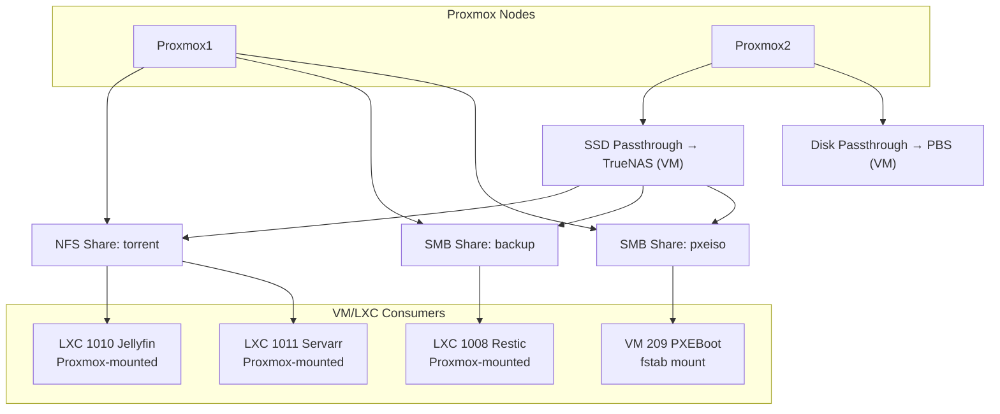

← [Vissza a Homelab főoldalra](../README_HU.md)

[🇬🇧 English](README.md) | [🇭🇺 Magyar](README_HU.md)

---

# Tervezési döntések és érvek

Itt bemutatom, hogy miért esett a döntésem bizonyos technológiákra és architektúrákra.

---
## 1TB-os M.2 SSD-n Proxmox és VM-ek közösen, később ezt szétválasztom és Proxmox kerül a 250 GB SSD-re míg VM-ek gyors 1 TB-os M.2 SSD-re

- **Helyspórolás**: Így Clonezilla mentés csak a 250 GB-os Proxmox-ot tartalmazó SSD-ről szükséges. A VM-eket a Proxmox Backup Server (PBS) menti, róluk szükségtelen Clonezilla mentés. Eredmény gyorsabb és kevesebb tárhelyet igénylő mentés.
- **I/O terhelés szétválasztása**: a Proxmox host és a VM-ek is végeznek I/O műveleteket. Ha egy lemezen lennének, a terhelés összeadódna, külön SSD-vel pedig a műveletek eloszlanak, ami stabilabb és gyorsabb rendszert biztosít.
---
## FreeFileSync lecserélése Restic-re

  - Az új laptopomon lévő fontos fájlaimról **Restic** segítségével készítek biztonsági mentést a TrueNAS szerverre.
  - Miért Restic:
    - **Biztonságos**: Restic-nél a véletlen forrásfájl törlés esetén visszaállítható a törölt fájl, míg FreeFileSync-nél, ha a forrásfájl törlése után véletlen szinkronizálok, akkor nem tudom visszaállítani a fájlt.
    - **Verziózás**: akár korábbi állapotok is visszaállíthatók.
    - **Hatékony**: tömörít, gyors, FreeFileSync sokkal lassabban ellenőrizte le a változásokat és lassabban másolta  a megváltozott fájlokat.
---
## Miért Nextcloud?

- Self-hosted fájl- és képkezelés  
- Nem szükséges Google Drive / más felhő, Nextcloud a saját Google Drive-om
- Teljes kontroll és biztonság  
---
## Miért Vaultwarden?

- Self-hosted jelszókezelés  
- Jelszavak nem kerülnek ki az internetre  
- Teljes kontroll és biztonság  
---
## Minden szolgáltatást, amit tudok, LXC-ként futtatok, minden szolgáltatás külön LXC-n fut

A fő cél, hogy **minden szolgáltatás külön LXC-ben fusson**, így izoláltak: ha egy konténer leáll, az **nem érinti a többi szolgáltatást**.

**Előnyök LXC használatával VM-ekhez képest:**
- **Kisebb erőforrásigény**: kevesebb RAM és CPU szükséges, gyorsabb indítás
- **Gyorsabb deployment**: új konténerek percek alatt létrehozhatók
- **Skálázhatóság**: több konténer fér el egy hoston, mint VM
- **Izoláció**: hibás vagy leállt szolgáltatás nem állítja le a többit

---

## Mountolási stratégiám

- Proxmox1 node-on nincsen disk passthrough
- Proxmox2 node-on fut van 2 disk passthrough (TrueNAS-nak és Proxmox Backup Servernek)
- Proxmox hosthoz csatolom a TrueNAS megosztásokat, hogy továbbadja az unprivileged LXC-nek.
- VM esetében az fstab segítségével mountolom a VM-hez közvetlenül a TrueNAS megosztásokat és nem a Proxmox adja tovább.

---

## Bind9, AdGuard Home, Unbound cache és TTL stratégiája

### Felépítés és döntési érvek:

**BIND9 (Lokális autoritatív forrás):**
- Mivel a pfSense statikus IP-ket oszt, a belső szolgáltatások címei állandóak, a név-IP párosítás nem változik.
- A zónafájlokban rögzített **1 órás (3600s) TTL** ideális egyensúlyt teremt a stabilitás és a tesztelés alatti rugalmasság között.

**Unbound (Rekurzív feloldó):**
- **TTL Capping (0-3600s):** Az Unbound tiszteletben tartja az eredeti TTL-t, de 1 órában maximalizálja azt. Ez megvéd az elavult (stale) rekordoktól, miközben engedi a CDN-eknek, hogy a rövid TTL-lel (pl. 10s) mindig a legközelebbi/leggyorsabb szervert ajánlják fel.
- **Optimistic Caching:** A `serve-expired` funkcióval a lejárt rekordokat további 1 óráig megőrzi. Ha az upstream szerver nem elérhető vagy lassú, a cache-ből azonnal válaszol, így a hálózati hiba vagy késleltetés észrevétlen marad a kliensek számára.

**AdGuard Home (Kliens oldali szűrő):**
- **TTL tartomány (0-86400s):** Itt a maximum limit 1 napra van emelve.
- **Rendelkezésre állás:** Az AdGuard szintén használ **optimistic caching**-et. Ha a BIND9 konténer vagy az Unbound ideiglenesen leállna, az AdGuard akár 24 órán át képes kiszolgálni a már ismert belső neveket a cache-ből, biztosítva a homelab szolgáltatások folyamatos elérését.

  

 
---

← [Vissza a Homelab főoldalra](../README_HU.md)

