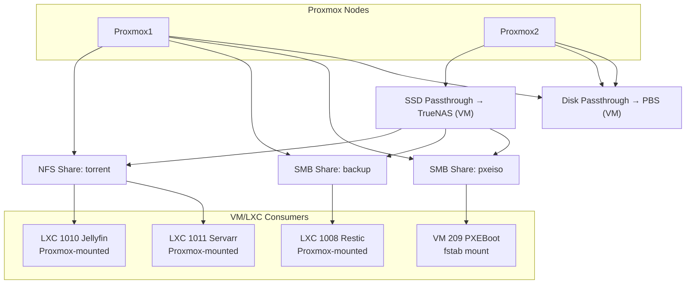
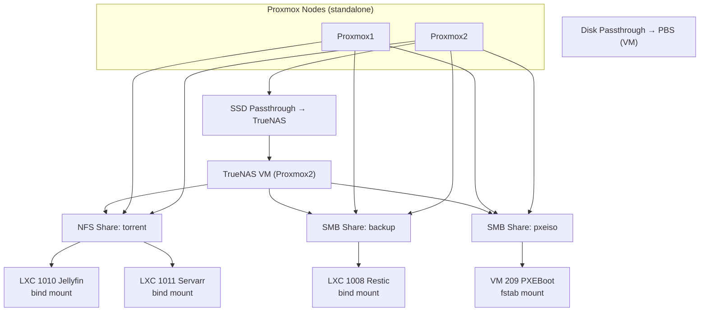

## 🖥️ Infrastructure Topology (Non-Cluster, tidy, corrected, PBS mount both nodes)

← [Vissza a Homelab főoldalra](../README_HU.md)

[🇬🇧 English](README.md) | [🇭🇺 Magyar](README_HU.md)

---

# Tervezési döntések és érvek

Itt bemutatom, hogy miért esett a döntésem bizonyos technológiákra és architektúrákra.

---
## 1TB-os M.2 SSD-n Proxmox és VM-ek közösen, később ezt szétválasztom és Proxmox kerül a 250 GB SSD-re míg VM-ek gyors 1 TB-os M.2 SSD-re

- **Helyspórolás**: Így Clonezilla mentés csak a 250 GB-os Proxmox-ot tartalmazó SSD-ről szükséges. A VM-eket a Proxmox Backup Server (PBS) menti, róluk szükségtelen Clonezilla mentés. Eredmény gyorsabb és kevesebb tárhelyet igénylő mentés.
- **I/O terhelés szétválasztása**: a Proxmox host és a VM-ek is végeznek I/O műveleteket. Ha egy lemezen lennének, a terhelés összeadódna, külön SSD-vel pedig a műveletek eloszlanak, ami stabilabb és gyorsabb rendszert biztosít.
---
## FreeFileSync lecserélése Restic-re

  - Az új laptopomon lévő fontos fájlaimról **Restic** segítségével készítek biztonsági mentést a TrueNAS szerverre.
  - Miért Restic:
    - **Biztonságos**: Restic-nél a véletlen forrásfájl törlés esetén visszaállítható a törölt fájl, míg FreeFileSync-nél, ha a forrásfájl törlése után véletlen szinkronizálok, akkor nem tudom visszaállítani a fájlt.
    - **Verziózás**: akár korábbi állapotok is visszaállíthatók.
    - **Hatékony**: tömörít, gyors, FreeFileSync sokkal lassabban ellenőrizte le a változásokat és lassabban másolta  a megváltozott fájlokat.
---
## Nextcloud

- Self-hosted fájl- és képkezelés  
- Nem szükséges Google Drive / más felhő, Nextcloud a saját Google Drive-om
- Teljes kontroll és biztonság  
---
## Vaultwarden

- Self-hosted jelszókezelés  
- Jelszavak nem kerülnek ki az internetre  
- Teljes kontroll és biztonság  
---
## Minden szolgáltatást, amit tudok, LXC-ként futtatok, minden szolgáltatás külön LXC-n fut

A fő cél, hogy **minden szolgáltatás külön LXC-ben fusson**, így izoláltak: ha egy konténer leáll, az **nem érinti a többi szolgáltatást**.

**Előnyök LXC használatával VM-ekhez képest:**
- **Kisebb erőforrásigény**: kevesebb RAM és CPU szükséges, gyorsabb indítás
- **Gyorsabb deployment**: új konténerek percek alatt létrehozhatók
- **Skálázhatóság**: több konténer fér el egy hoston, mint VM
- **Izoláció**: hibás vagy leállt szolgáltatás nem állítja le a többit

---

## Mountolási stratégiám

- Proxmox1 node-on nincsen disk passthrough
- Proxmox2 node-on fut van 2 disk passthrough (TrueNAS-nak és Proxmox Backup Servernek)
- Proxmox hosthoz csatolom a TrueNAS megosztásokat, hogy továbbadja az unprivileged LXC-nek.
- VM esetében az fstab segítségével mountolom a VM-hez közvetlenül a TrueNAS megosztásokat.

## 🖥️ Infrastructure Topology (Non-Cluster)

**Hálózati megosztások (NFS/SMB) és LXC**

**Probléma:** 
Mivel sok unprivileged LXC-t használok, szembesültem azzal, hogy nem tudok közvetlen mountolni unprivileged LXC-hez NFS vagy SMB megosztást úgy, mint a VM-hez. 

**Megoldás:**

A Proxmox hosthoz próbáltam fstab-al csatolni, systemd szolgáltatásként csatolni, azonban amennyiben nem elérhető a megosztás, a hoston kiadott df parancs fagy. Megoldásként nekem az autofs-el történő mountolás vált be, ekkor is fagyhat a df parancs, de csak 1 percig és nem a végtelenségig. 

    Miért? Ha a tároló (pl. TrueNAS) leáll, az AutoFS nem fagyasztja le a host operációs rendszert. A --ghost opcióval a mappa látható marad, de csak akkor csatolódik, ha valódi igény van rá.

    LXC továbbítás: A hoston felcsatolt könyvtárat mp0 (mount point) segítségével adjuk át a konténernek.

2. Virtuális Gépek (VM)

Helyszín: Guest OS belül Módszer: Standard /etc/fstab

    Miért? A VM teljesen izolált kernel szinten. Nem tud "osztozni" a host mountjain, ezért úgy kezeljük, mint egy fizikai gépet.

    

3. Dedikált Hardver (Disk Passthrough)

Helyszín: Proxmox CLI Módszer: qm set (by-id alapján)

    Alkalmazás: Ha egy VM-nek (pl. TrueNAS vagy PBS) saját SSD-re van szüksége a maximális teljesítmény és SMART adatok elérése érdekében.

    Logika: A host "elengedi" a lemezt, és teljes kontrollt ad a VM-nek.

        Példa: /sbin/qm set [VMID] -virtio2 /dev/disk/by-id/[ID]

💡 Best Practices (Arany szabályok)

    GUI Preferencia: Ha lehet, a tárolót a Proxmox GUI-ban add hozzá, hogy látható legyen az oldalsávban (monitorozás, mentés).

    Biztonság: Mindig Unprivileged LXC-t használj. A bind mount (host -> LXC) a legbiztonságosabb módja az adatok megosztásának.

    Stabilitás: Hálózati mountnál a hoston mindig használj soft és timeo paramétereket, hogy elkerüld a rendszer beragadását hálózati hiba esetén.

    AutoFS Ghosting: Mindig kapcsold be a ghost módot, hogy a szoftverek (pl. Jellyfin, Arr-alkalmazások) ne "tévedjenek el" az üres könyvtárakban.

---

← [Vissza a Homelab főoldalra](../README_HU.md)
