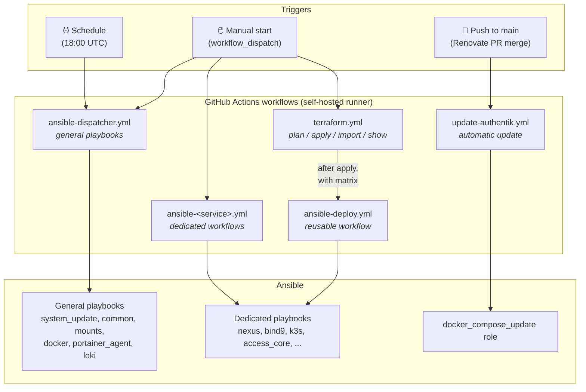
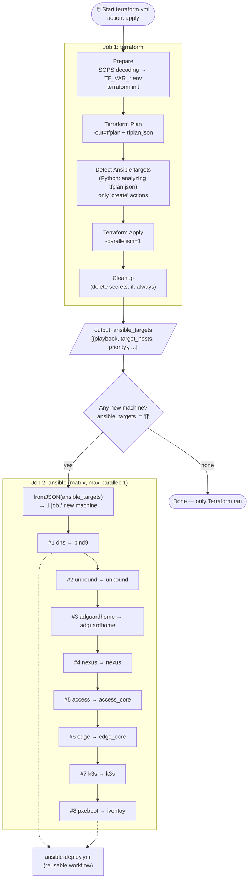
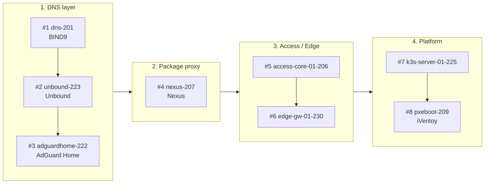
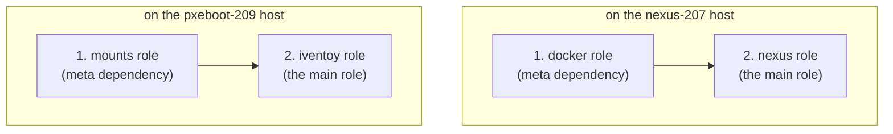
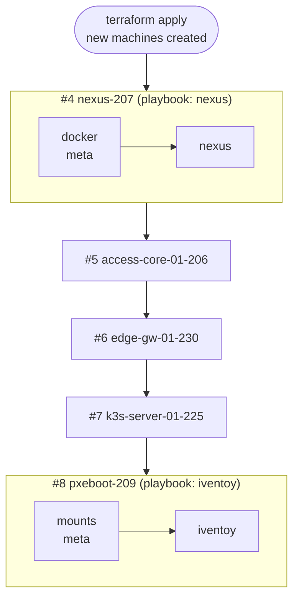
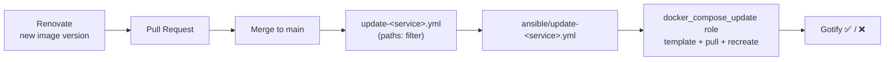

← [Back to the Homelab main page](../README.md)

[🇬🇧 English](README.md) | [🇭🇺 Magyar](README_HU.md)

---

## 📚 Table of Contents

- [Project Philosophy & Approach](#filo)
- [Technology Stack](#stack)
- [Architecture Overview](#archit)
- [Repo Structure](#repstr)
- [CI/CD Workflow Overview](#cicd)
  - [Dispatcher vs. Dedicated Workflow](#dispvsded)
  - [Workflow Map](#wftermap)
  - [Terraform → Ansible Chain (matrix)](#tfchain)
- [Dependencies and Execution Order](#deps)
  - [Machine-level Order (Terraform priority)](#deps)
  - [Role-level Dependencies (`meta/main.yml`)](#deps)
- [Full Deployment Workflow](#depwork)
  - [Terraform Details](./terraform/README.md)
- [Docker Compose Automatic Updates](#dockerupd)
- [Running Workloads](#wrkld)
- [Secrets Management](#seckez)
- [Monitoring](#monitor)
- [Current State & Future Plans](#tervek)

---

<a name="filo"></a>

## Project Philosophy & Approach

I deliberately use a **hybrid approach**.

- **Automated platform:** Creating VMs and LXC containers, configuring the OS, installing software and bringing up the K3s cluster are fully automated (Terraform + Ansible). There is **no manual step** between the two: after Terraform finishes, the pipeline automatically starts the corresponding Ansible playbooks.
- **Hybrid configuration model:** I sync the Kubernetes application settings and config files from the NAS to keep the environment consistent, while continuously evolving the system towards purely GitOps-based management.

This approach lets me quickly rebuild any machine, while the data and settings required by the running applications are immediately available.

**Context:** Currently **1 physical Proxmox server** is running, K3s is **single-node** (not an HA cluster), and persistent storage is **local-path** (not Longhorn / NAS-mounted PVC). I do **not generate the app configuration from scratch via GitOps**; instead, the pipeline restores manually configured config files saved on the NAS. This is a conscious decision, but I am steadily moving towards declarative, IaC-based configuration using API calls and descriptor files.

---

<a name="stack"></a>

## Technology Stack

| Layer | Tool |
|---|---|
| **IaC & Provisioning** | Terraform (VM + LXC provisioning), Ansible (OS configuration, users, mounts, applications, etc.) |
| **Container Orchestration** | K3s (Lightweight Kubernetes) |
| **CI/CD** | GitHub Actions (self-hosted runner, private network): general **Dispatcher** + **dedicated workflows** + **Terraform workflow** |
| **GitOps** | ArgoCD |
| **Kubernetes Management** | K9s, Lens |
| **Storage** | Local-path (planned: Longhorn / NAS-based PVC) |
| **Secrets Management** | GitHub Actions Secrets, SOPS + AGE |

---

<a name="archit"></a>

## Architecture Overview

```
┌─────────────────────────────────────────────────────────────────────┐
│                        Proxmox1 Hypervisor                          │
│                                                                     │
│  ┌─────────────────────┐  ┌──────────────────────────────────────┐  │
│  │ mgmt-core-01-204    │  │ k3s-server-01-225  (K3s single-node) │  │
│  │                     │  │                                      │  │
│  │ Ansible, Terraform  │  │ ArgoCD                               │  │
│  │ Semaphore (Docker)  │  │ identity-stack  (Vaultwarden)        │  │
│  │ GitHub Runner       │  │ monitoring-stack(Prometheus, Grafana,│  │
│  │ Portainer (Docker)  │  │                 Uptime-Kuma)         │  │
│  │                     │  │ storage-stack   (Nextcloud)          │  │
│  └─────────────────────┘  │ media-stack     (Sonarr, Radarr,     │  │
│                           │                 qBit, Prowlarr,      │  │
│  ┌─────────────────────┐  │                 Bazarr, Seerr)       │  │
│  │ access-core-01-206  │  │ notif-stack     (Gotify)             │  │
│  │                     │  │ dashboard-stack (Homarr)             │  │
│  │ Authentik (Docker)  │  │ admin-stack     (Renovate)           │  │
│  │ Teleport            │  │ access-stack    (Guacamole)          │  │
│  │ FreeRADIUS          │  │                                      │  │
│  │ Portainer Agent     │  └──────────────────────────────────────┘  │
│  │                     │                                            │
│  └─────────────────────┘  ┌──────────────────────────────────────┐  │
│                           │ edge-gw-01-230                       │  │
│                           │                                      │  │
│                           │ Traefik (Docker)                     │  │
│                           │ Cloudflare Tunnel                    │  │
│                           │ Portainer Agent                      │  │
│                           │                                      │  │
│                           └──────────────────────────────────────┘  │
│                                                                     │
│  Other LXCs/VMs (Terraform + dedicated playbook):                   │
│  dns-201 (BIND9), nexus-207 (Nexus), pxeboot-209 (iVentoy),         │
│  jellyfin-221, adguardhome-222, unbound-223                         │
│                                                                     │
│  ┌──────────────────────────────────────────────────────────────┐   │
│  │  NAS (192.168.2.220)  — NFS + SMB                            │   │
│  │  /mnt/backup/app-configs-backup/  ← saved configs            │   │
│  │  /mnt/torrent,  /mnt/pxeiso                                  │   │
│  └──────────────────────────────────────────────────────────────┘   │
└─────────────────────────────────────────────────────────────────────┘
```

---

<a name="repstr"></a>

## Repo Structure

```
.
├── .github/
│   └── workflows/
│       ├── ansible-dispatcher.yml   # General playbooks, runnable on any machine
│       ├── terraform.yml            # Proxmox Terraform (plan/apply/import/show) + Ansible chain
│       ├── ansible-deploy.yml       # Reusable workflow — called by Terraform with a matrix
│       ├── ansible-access-core.yml  # Dedicated: access-core-01-206
│       ├── ansible-edge-core.yml    # Dedicated: edge-gw-01-230
│       ├── ansible-k3s.yml          # Dedicated: k3s-server-01-225
│       ├── ansible-nexus.yml        # Dedicated: nexus-207
│       ├── ansible-bind9.yml        # Dedicated: dns-201
│       ├── ansible-unbound.yml      # Dedicated: unbound-223
│       ├── ansible-adguardhome.yml  # Dedicated: adguard-222
│       ├── ansible-iventoy.yml      # Dedicated: pxeboot-209
│       └── update-authentik.yml     # Automatic: push-triggered Docker Compose update
├── terraform/
│   └── proxmox-deploy/     # Creating/cloning VMs and LXCs on Proxmox
├── ansible/
│   ├── inventory.ini       # Host and group definitions (e.g. nexus_207_host, all_nodes)
│   ├── site.yml            # Main playbook — split into phases
│   ├── system_update.yml   # General playbooks (Dispatcher)...
│   ├── common.yml          # ...
│   ├── access_core.yml     # Dedicated playbooks (Terraform chain / dedicated workflow)...
│   ├── edge_core.yml       # ...
│   ├── k3s.yml             # ...
│   ├── roles/
│   │   ├── common/         # Basics: packages, user, SSH, timezone
│   │   ├── mounts/         # NFS/SMB mounts
│   │   ├── docker/         # Docker installation
│   │   ├── docker_compose_update/ # Generic role: update any Docker Compose stack
│   │   ├── portainer_agent/# Portainer Agent (for Docker hosts)
│   │   ├── backup/         # Backup logic that differs by machine type
│   │   ├── k3s_prep/       # K3s preparation: swap off, kernel modules
│   │   ├── k3s_install/    # K3s binary + cluster init
│   │   ├── argocd/         # ArgoCD installation with Helm
│   │   ├── argocd_apps/    # Registering ArgoCD Applications
│   │   ├── app_restore/    # Config restore from NAS (rsync)
│   │   ├── access_core_01/ # Teleport + Authentik + FreeRADIUS
│   │   ├── edge_gw_01/     # Traefik reverse proxy (Docker Compose)
│   │   ├── nexus/          # Nexus in Docker — meta dependency: docker
│   │   └── iventoy/        # iVentoy PXE — meta dependency: mounts
├── secrets/
│   └── secrets.enc.yaml    # SOPS+AGE encrypted variables (shared by Ansible + Terraform)
├── kubernetes/
│   └── apps/               # K8s manifests (read by ArgoCD)
│       ├── media/          # Sonarr, Radarr, Prowlarr, Bazarr, qBittorrent, Seerr
│       ├── monitoring/     # Prometheus, Grafana, Uptime-Kuma
│       ├── storage/        # Nextcloud
│       ├── identity/       # Vaultwarden
│       ├── notification/   # Gotify
│       ├── dashboard/      # Homarr
│       ├── access/         # Guacamole
│       └── automation/     # Renovate (scheduled as a CronJob)
└── README.md
```

---

<a name="cicd"></a>

## CI/CD Workflow Overview

All automation runs on **GitHub Actions**, on the **self-hosted runner** located on the `mgmt-core-01-204` machine, so it directly reaches the internal network (no VPN or external agent needed). I divide the workflows into four groups:

| Group | Workflow | When I use it |
|---|---|---|
| **General (Dispatcher)** | `ansible-dispatcher.yml` | Non-service-specific tasks that can run on any machine |
| **Dedicated** | `ansible-<service>.yml` | The complete deployment/configuration process of a specific infrastructure service |
| **Automatic** | `update-authentik.yml`, scheduled `system_update` | Starts on an event (push) or a schedule, without manual intervention |
| **Provisioning** | `terraform.yml` (+ `ansible-deploy.yml`) | Creating machines, then automatically configuring the new machines |

<a name="dispvsded"></a>

### Dispatcher vs. Dedicated Workflow

The essence of the difference between the two types:

> **Dispatcher:** "Pick a **general Ansible action**, and tell it **which host** to run on."
>
> **Dedicated workflow:** "Start the deployment/configuration process of **this infrastructure service**."

#### Ansible Dispatcher (`ansible-dispatcher.yml`)

This is home to the general, **machine-independent** playbooks: tasks that make sense on any machine (`system_update`, `common`, `mounts`, `docker`, `portainer_agent`, `loki`).

> **Not included here** are playbooks that target only a specific machine type, and therefore run as standalone playbooks: the K3s-related `argocd`, `argocd_apps`, `app_restore`, and `backup`, whose logic differs by machine type. The Dispatcher rule: **if a playbook makes sense on any machine, it goes here; if it applies only to a specific machine or layer, it becomes a standalone playbook / dedicated process.**

It has two triggers:

- **Automatic (schedule):** every day at `18:00 UTC` (`cron: '00 18 * * *'`) it runs the `system_update.yml` playbook against the `all_nodes` group.
- **Manual (`workflow_dispatch`):** can be started from the GitHub Actions UI, with three parameters:

| Parameter | Description |
|---|---|
| `playbook` | Which **general** playbook to run — e.g. `system_update`, `common`, `mounts`, `docker`, `portainer_agent`, `loki`, etc. |
| `target_hosts` | Which machine(s) to run on — a group (`all_nodes`, `docker_hosts`, `lxc_nodes`) or a specific host (`host_dns`, `host_nexus`, `host_adguard`, `host_unbound`, `host_jelly`, `host_mgmt`, `host_pxeboot`, `host_wazuh`) |
| `dry_run` | If enabled, it runs in `--check --diff` mode — changes nothing, only shows what would change |

The `host_*` options are mapped in the workflow by a `case` block to the actual host / group names in the inventory (e.g. `host_nexus` → `nexus_207_host`, `host_dns` → `dns_201_host`).

#### Dedicated workflows

These belong to **one specific service / machine**, and start the complete configuration process of that machine (its dedicated playbook). There is no point running them on "any machine", so there is no `target_hosts` selector — the target machine is hard-wired into the workflow.

| Workflow | Target machine | What it configures |
|---|---|---|
| `ansible-access-core.yml` | `access-core-01-206` | Teleport, Authentik, FreeRADIUS + daloRADIUS |
| `ansible-edge-core.yml` | `edge-gw-01-230` | Traefik, Cloudflare Tunnel |
| `ansible-k3s.yml` | `k3s-server-01-225` | K3s, ArgoCD, config restore |
| `ansible-nexus.yml` | `nexus-207` | Nexus (package proxy) |
| `ansible-bind9.yml` | `dns-201` | BIND9 DNS |
| `ansible-unbound.yml` | `unbound-223` | Unbound |
| `ansible-adguardhome.yml` | `adguard-222` | AdGuard Home |
| `ansible-iventoy.yml` | `pxeboot-209` | iVentoy (PXE boot) |
| `update-authentik.yml` | `access-core-01-206` | **Automatic**, push-triggered Authentik update |

#### Which one when?

| Situation | Tool |
|---|---|
| "Update all machines" | Dispatcher → `system_update` / `all_nodes` |
| "Install Docker on this host" | Dispatcher → `docker` / the given host |
| "Back up K3s / the edge / access-core" | Standalone `backup` playbook (different logic per machine type) |
| "Reinstall ArgoCD / restore the configs" | Standalone `argocd`, `argocd_apps`, `app_restore` playbooks (part of the dedicated K3s process) |
| "Rebuild the edge gateway" | `ansible-edge-core.yml` (or the Terraform chain) |
| "Create a new VM and configure it" | `terraform.yml` → automatically the Ansible chain |
| "A new Authentik image arrived" | Automatic: Renovate → merge → `update-authentik.yml` |

<a name="wftermap"></a>

### Workflow Map

This shows which trigger starts which workflow, and what they reach:



<a name="tfchain"></a>

### Terraform → Ansible Chain (matrix)

`terraform.yml` does not stop at creating machines. If an `apply` finds a **newly created** (or re-created) machine, the pipeline **automatically starts the corresponding Ansible playbook** — in the right order.

The process consists of three main steps:

1. **`terraform` job** — `plan`, then `apply` (the plan is exported to JSON: `tfplan.json`).
2. **`detect_targets` step** — a Python script walks through the plan's `resource_changes` list and selects the resources that contain a `create` action (this covers both `["create"]` and `["delete","create"]`, i.e. the rebuild case). Using the `mapping` dictionary, it converts the result into an Ansible target list (JSON), **sorted by priority**.
3. **`ansible` job (matrix)** — builds a GitHub Actions **matrix** from the target list, and calls the `ansible-deploy.yml` reusable workflow for each element.



> The diagram above shows all possible matrix elements. **In reality, only those that were newly created according to the Terraform plan run** — the rest are skipped, but the order always follows the priority.

#### Mapping: Terraform resource → Ansible playbook

| Prio | Terraform resource | Playbook | Target (inventory) |
|:---:|---|---|---|
| 1 | `container.dns-201` | `bind9` | `dns_201_host` |
| 2 | `container.unbound-223` | `unbound` | `unbound_223_host` |
| 3 | `container.adguardhome-222` | `adguardhome` | `adguard_222_host` |
| 4 | `container.nexus-207` | `nexus` | `nexus_207_host` |
| 5 | `vm.access-core-01-206` | `access_core` | `access_core_01_206_host` |
| 6 | `vm.edge-gw-01-230` | `edge_core` | `edge_gw_01_230_host` |
| 7 | `vm.k3s-server-01-225` | `k3s` | `k3s_server_01_225_host` |
| 8 | `vm.pxeboot-209` | `iventoy` | `pxeboot_209_host` |

The priority order is **intentional**: first the DNS layer (BIND9 → Unbound → AdGuard), then Nexus (the package proxy used by the `common` role), then the access/edge layer, and finally K3s and PXE. This way the newer machines are built on top of working name resolution and a package proxy. The order within a machine is given by the role `meta/main.yml` dependencies (see: [Dependencies and Execution Order](#deps)).

> `mgmt-core-01-204` and `jellyfin-221` are managed by Terraform, but have **no automatic Ansible mapping** — when needed, I run them from the Dispatcher (`host_mgmt`, `host_jelly`).

#### What is a matrix?

A **matrix** is a GitHub Actions feature that **runs one job multiple times with different parameters**. You provide a list, and a separate job instance is automatically created for each element — the same workflow, with different input values.

In my case the list is generated **dynamically** from the Terraform plan (`fromJSON(...)`), for example:

```yaml
matrix:
  include:
    - {playbook: nexus, target_hosts: nexus_207_host}
    - {playbook: k3s,   target_hosts: k3s_server_01_225_host}
```

From this, GitHub Actions creates two separate jobs, both running `ansible-deploy.yml`, but with different playbooks and different targets. If Terraform created only one machine, only one job is created; if three, three.

```yaml
strategy:
  fail-fast: false     # one failing machine does not stop the others
  max-parallel: 1      # only one machine at a time — this is how the priority order is enforced
```

By default, a `matrix` is **combinatorial** (with `playbook: [a, b]` + `host: [x, y]` you get 4 jobs, everything with everything). Mine is **list-based** (`include`): each element is exactly one job, and the keys within the element give the matching pairs (e.g. `bind9` + `dns_201_host`). Combining would make no sense here, because the `bind9` playbook only belongs on the DNS machine.

#### How is the matrix list produced? (step by step)

`priority` is **not a GitHub Actions concept**, just a number in the Python `mapping` dictionary that I use to sort the list. GitHub doesn't know about it. The order comes from the Python `sort` and `max-parallel: 1` together.

1. `terraform plan -out=tfplan` produces the **binary** plan (only Terraform understands this; `apply` executes it).
2. `terraform show -json tfplan > tfplan.json` turns it into readable JSON, because Python can only read that.
3. Python reads `tfplan.json` into the `plan` variable.
4. The loop walks through the resources. Where there is a `create` and the resource is in the `mapping`, its mapping data goes into the `ansible_targets` list.
5. `sort` orders the list by priority.
6. `json.dumps` turns it into a single-line string.
7. Python writes it into `GITHUB_OUTPUT`: `ansible_targets=...`. This makes it the output of the `detect_targets` step.
8. The `outputs:` block of the `terraform` job turns this into a job output, so the `ansible` job can reach it too.
9. The `ansible` job (`needs: terraform`) waits for the terraform job.
10. `fromJSON` turns the string back into a list.
11. The matrix starts one round for each list element, one after the other (`max-parallel: 1`).
12. In each round, `with:` passes the data to `ansible-deploy.yml`.
13. `ansible-deploy.yml` runs the `ansible-playbook` command.

##### The `tfplan.json` (simplified)

The real file is much more complicated (`type`, `before`, `after`, `variables`, etc.), but the script uses only two fields: `address` (which machine) and `change.actions` (what happens to it).

```json
{
  "resource_changes": [
    {"address": "proxmox_virtual_environment_vm.k3s-server-01-225",
     "change": {"actions": ["create"]}},
    {"address": "proxmox_virtual_environment_container.dns-201",
     "change": {"actions": ["create"]}},
    {"address": "proxmox_virtual_environment_container.nexus-207",
     "change": {"actions": ["delete", "create"]}},
    {"address": "proxmox_virtual_environment_container.adguardhome-222",
     "change": {"actions": ["no-op"]}},
    {"address": "proxmox_virtual_environment_vm.mgmt-core-01-204",
     "change": {"actions": ["create"]}},
    {"address": "proxmox_virtual_environment_container.jellyfin-221",
     "change": {"actions": ["update"]}}
  ]
}
```

| `actions` | Meaning | Ansible needed? |
|---|---|---|
| `["create"]` | a new machine is created | yes |
| `["delete","create"]` | deleted and rebuilt, the new machine is empty | yes |
| `["update"]` | the machine stays, only modified | no |
| `["no-op"]` | no change | no |

The binary `tfplan` is needed for `apply`; `tfplan.json` is only for Python to read. It may also contain secrets, so the Cleanup step deletes it at the end of the job.

##### The loop

```python
for resource in plan.get("resource_changes", []):
    address = resource.get("address", "")
    actions = resource.get("change", {}).get("actions", [])

    if "create" not in actions:
        continue
    if address not in mapping:
        print("No Ansible mapping:", address)
        continue

    target = mapping[address]
    if target not in ansible_targets:
        ansible_targets.append(target)
```

Three questions for each resource, and if any of them fails, `continue` skips it:

1. **Is there a `create` in `actions`?** If not (`no-op`, `update`), it is not a new machine, no Ansible needed.
2. **Is it in the `mapping`?** If not (e.g. `mgmt-core-01-204`), I don't know what to run on it.
3. **Is it not already in the list?** To prevent duplicates.

What goes into the list are the **mapping elements** (playbook, target_hosts, priority), not the plan rows. The plan only decides which mapping element is needed. In the example above, k3s, dns and nexus are included. adguardhome (`no-op`), mgmt (no mapping) and jellyfin (`update`) are left out.

After the loop, before sorting (in Terraform's discovery order):

```python
ansible_targets = [
  {"name": "k3s",   "playbook": "k3s",   "target_hosts": "k3s_server_01_225_host", "priority": 7},
  {"name": "dns",   "playbook": "bind9", "target_hosts": "dns_201_host",           "priority": 1},
  {"name": "nexus", "playbook": "nexus", "target_hosts": "nexus_207_host",         "priority": 4}
]
```

After the `sort`:

```python
ansible_targets.sort(key=lambda x: x.get("priority", 99))
```

```python
ansible_targets = [
  {"name": "dns",   "playbook": "bind9", "target_hosts": "dns_201_host",           "priority": 1},
  {"name": "nexus", "playbook": "nexus", "target_hosts": "nexus_207_host",         "priority": 4},
  {"name": "k3s",   "playbook": "k3s",   "target_hosts": "k3s_server_01_225_host", "priority": 7}
]
```

##### Handing over to the matrix

`json.dumps` turns the list into a single-line string (the `key=value` format doesn't like multi-line values):

```python
output = json.dumps(ansible_targets, separators=(",", ":"))
with open(os.environ["GITHUB_OUTPUT"], "a") as f:
    f.write(f"ansible_targets={output}\n")
```

This one line goes into the `GITHUB_OUTPUT` file:

```
ansible_targets=[{"name":"dns","playbook":"bind9","target_hosts":"dns_201_host","priority":1},{"name":"nexus","playbook":"nexus","target_hosts":"nexus_207_host","priority":4},{"name":"k3s","playbook":"k3s","target_hosts":"k3s_server_01_225_host","priority":7}]
```

The file is a temporary file of the runner. At the end of the step, the runner reads it out, sends it to GitHub, and deletes it. The other job thus receives the value through GitHub, so no secrets should go into it.

The `outputs:` block of the terraform job turns the step output into a job output:

```yaml
outputs:
  ansible_targets: ${{ steps.detect_targets.outputs.ansible_targets }}
```

Because of `needs: terraform`, the `ansible` job reaches it as `needs.terraform.outputs.ansible_targets`. `fromJSON` turns the string back into a list, and `include` starts one round for each element:

```yaml
ansible:
  needs: terraform
  strategy:
    fail-fast: false
    max-parallel: 1
    matrix:
      include: ${{ fromJSON(needs.terraform.outputs.ansible_targets) }}
  uses: ./.github/workflows/ansible-deploy.yml
  with:
    playbook: ${{ matrix.playbook }}
    target_hosts: ${{ matrix.target_hosts }}
    dry_run: ${{ inputs.ansible_dry_run }}
  secrets: inherit
```

| Round | `matrix.name` | `matrix.playbook` | `matrix.target_hosts` | `matrix.priority` |
|---|---|---|---|---|
| 1 | dns | bind9 | dns_201_host | 1 |
| 2 | nexus | nexus | nexus_207_host | 4 |
| 3 | k3s | k3s | k3s_server_01_225_host | 7 |

`name` and `priority` are in the matrix, but `with:` does not pass them on. `priority` was only needed for the Python `sort`.

##### `with:` and `inputs:`

The `with:` block of `terraform.yml` is the same as the `inputs:` block of `ansible-deploy.yml`, just seen from the two sides. On the caller side `with:` sends it, on the receiving side `inputs:` expects it. The names match on both sides.

| `terraform.yml` `with:` | `ansible-deploy.yml` `inputs:` | Usage |
|---|---|---|
| `playbook` | `inputs.playbook` | `"ansible/${{ inputs.playbook }}.yml"` |
| `target_hosts` | `inputs.target_hosts` | `-e target="${{ inputs.target_hosts }}"` |
| `dry_run` | `inputs.dry_run` | if `true`, `--check --diff` |
| `secrets: inherit` | `secrets.SOPS_AGE_KEY` | decoding the secrets |

> `ansible-deploy.yml` is a **workflow** (not a playbook), `on: workflow_call`, so it cannot be started manually. It runs one playbook on one target machine at a time, and doesn't know it was called from a matrix.

In round 1, `inputs.playbook = "bind9"` and `inputs.target_hosts = "dns_201_host"`. This is what runs, round by round, one after the other (the 2nd starts after the 1st finishes):

```bash
ansible-playbook "ansible/bind9.yml" -i ansible/inventory.ini -e target="dns_201_host" ...
ansible-playbook "ansible/nexus.yml" -i ansible/inventory.ini -e target="nexus_207_host" ...
ansible-playbook "ansible/k3s.yml"   -i ansible/inventory.ini -e target="k3s_server_01_225_host" ...
```

#### Terraform workflow parameters

| Parameter | Description |
|---|---|
| `action` | `plan`, `apply`, `import`, `show` |
| `mode` | `auto` — applies every difference; `select` — only the ticked machines (`-target`) |
| `nexus`, `adguardhome`, `unbound`, `dns`, `pxeboot`, `k3s`, `edge`, `access`, `mgmt`, `jellyfin` | Selecting the target machines in `select` mode (at least one must be ticked, otherwise the workflow stops with an error) |
| `ansible_dry_run` | Whether the subsequently called Ansible chain runs in `--check --diff` mode |

Other safeguards: the `concurrency` group (`proxmox-terraform`, `cancel-in-progress: false`) prevents two Terraform runs from modifying the state at the same time, and `import` only allows importing a Proxmox VM or LXC based on `imported.tf`.

---

<a name="deps"></a>

## Dependencies and Execution Order

The order is solved on **two separate levels**, and the two together give the complete build order:

| Level | Tool | What it orders | Where it is defined |
|---|---|---|---|
| **Machine-level** | Terraform workflow `priority` field | Which **machine's** playbook runs first | `terraform.yml` → `mapping` dictionary |
| **Role-level** | Ansible `meta/main.yml` (`dependencies`) | Which **role** runs first **on the same machine** | `ansible/roles/<role>/meta/main.yml` |

### Machine-level Order (Terraform priority)

When several machines are built at once, there are dependencies between them: DNS must work before the ones that use name resolution, and Nexus (the package proxy) must be available before machines that install packages with the `common` role. This is solved by the `priority` value in the `mapping` dictionary of `terraform.yml`, and the matrix runs in this order with `max-parallel: 1`.



### Role-level Dependencies (`meta/main.yml`)

**What is `meta` for?** The `dependencies` list in a role's `meta/main.yml` says: *this role needs these roles before it runs itself.* That is, **a role calls a role**: Ansible automatically runs the dependency **first**, and only then the role's own tasks.

```yaml
# ansible/roles/nexus/meta/main.yml
---
dependencies:
  - role: docker
```

**Why do I use it?** This way the role "brings along" its dependency; the calling playbook doesn't have to know it and list it in the right order. In the `nexus.yml` playbook it's enough to specify the `nexus` role, and the Docker installation automatically runs before it.

**The host is inherited:** the dependency runs on the machine on which I call the main role. If the `nexus` role runs on the `nexus-207` host, the `docker` role also runs on the `nexus-207` host.

Currently two roles use a `meta` dependency:

| Role | Dependency | Why it's needed |
|---|---|---|
| `nexus` | `docker` | Nexus runs in Docker, so Docker must be on the machine first |
| `iventoy` | `mounts` | The ISOs are on the NAS, so the NAS mounts (`/mnt/pxeiso`) must be available before iVentoy |



> **Good to know:** with identical parameters, a role runs only once within a playbook by default. So if a playbook also lists the `docker` role separately, it won't run twice. If I specifically want that (re-running), the role needs `allow_duplicates: true`.

### The two levels together

The Terraform chain orders the **machines**, and `meta` orders the **roles** within the machine:



---

<a name="depwork"></a>

## Full Deployment Workflow

### Phase 1 — Creating machines (Terraform)

I create the VMs from a **Golden Image** prepared by me (Ubuntu 22.04, Proxmox cloud-init template) using the Full Clone method — the new VMs are completely independent of the base template. Terraform declaratively defines the hardware parameters (CPU, RAM, Disk) of the nodes with different loads.

Previously I ran Terraform manually, from the CLI, on the `mgmt-core-01-204` management machine. This has since become part of the GitOps process: the Terraform code is on GitHub, and the dedicated **`terraform.yml` workflow** starts the Terraform operations (`plan`, `apply`, `import`, `show`) on the self-hosted runner. Terraform runs in a **Docker container** (`hashicorp/terraform`), and the state lives on the runner machine, in a separate folder (`/home/ansible/terraform-state/proxmox`). Manual `terraform` commands on the server are no longer needed.

**New:** after `terraform apply`, the pipeline **automatically starts the Ansible playbooks belonging to the created machines** (see: [Terraform → Ansible chain](#tfchain)). Rebuilding a deleted machine can thus be done with a single workflow start: Terraform creates it → Ansible configures it → (in the case of K3s) the config is restored from the NAS.

I did not write the Terraform configurations from scratch: first I **imported** the Ubuntu template manually created on Proxmox into the Terraform state (`terraform import`), so the already existing resource came under Terraform management. I adapted and extended this base configuration for the different VM types, according to their different hardware requirements and roles.

Managed machines:

| Machine | Type | Role |
|---|---|---|
| `k3s-server-01-225` | VM | K3s node |
| `access-core-01-206` | VM | Identity & Access layer (Teleport, Authentik, FreeRADIUS) |
| `edge-gw-01-230` | VM | Edge gateway (Traefik reverse proxy, Cloudflare Tunnel) |
| `mgmt-core-01-204` | VM | Management node (Self-hosted GitHub Runner, Ansible, Portainer) |
| `pxeboot-209` | VM | iVentoy (PXE boot) |
| `dns-201` | LXC | BIND9 |
| `unbound-223` | LXC | Unbound |
| `adguardhome-222` | LXC | AdGuard Home |
| `nexus-207` | LXC | Nexus (package proxy) |
| `jellyfin-221` | LXC | Jellyfin |

Through the Terraform `initialization` block, it injects the SSH keys and the Ansible user — right after its first boot the VM is in a "ready-to-use" state, without manual configuration:

```hcl
user_account {
  keys     = [var.laptopom_pub, var.ansible_target_key_pub]
  password = var.ansible_user_pwd
  username = var.ans_username
}
```

By pinning the MAC address I ensure static IP assignment on the DHCP server. The sensitive values (Proxmox API token, passwords, SSH keys) are stored in `secrets/secrets.enc.yaml`, encrypted with SOPS+AGE — the same as in the Ansible pipeline. At run time the workflow converts the decoded secrets file into `TF_VAR_<name>` environment variables, and deletes everything at the end of the run (`if: always()`).

The details of how the Terraform pipeline works (workflow, state management, import process, test) are documented in [`terraform/readme.md`](./terraform/README.md).

---

### Phase 2 — Base configuration (Ansible `common` role)

Runs on every machine (from the Dispatcher, or as part of the dedicated playbook in the Terraform chain):

| Task | Detail |
|---|---|
| Package proxy repository | `nexus` (192.168.2.207) — speeds up package downloads |
| Base packages | `python3`, `curl`, `git`, `mc`, `prometheus-node-exporter` |
| `dist-upgrade` | Full system upgrade |
| User & SSH | Creating the user, uploading SSH keys, `PermitRootLogin no`, `PasswordAuthentication no` |
| SSH hardening | Banner, 900-second shell timeout (`TMOUT`) |
| Timezone | `Europe/Budapest` |
| Prometheus Node Exporter | Automatic start + enable — every machine monitored |

---

### Phase 3 — NAS mounts (`mounts` role)

The K3s workloads and the backup processes assume the NAS is available. Ansible does this before the K3s/Docker installation on every affected machine:

- **NFS:** `/mnt/torrent` ← `192.168.2.220:/mnt/ssdpool/torrent`
- **SMB:** `/mnt/backup` ← `//192.168.2.220/backup` (config backup source)
- **SMB:** `/mnt/pxeiso` ← `//192.168.2.220/pxeiso`

---

### Phase 4 — Layer-specific installations

These are performed by the **dedicated playbooks**: the Terraform chain starts them automatically, or the corresponding dedicated workflow starts them manually.

#### 4a. Edge Layer (`edge-gw-01-230`)

Traefik runs in **Docker Compose** (not on K3s). Ansible:
1. Creates the directory structure (`/opt/app-data/edge-stack/traefik/`)
2. Restores the saved Traefik config from the NAS with `rsync` (dynamic routes, ACME cert)
3. Generates the static and dynamic config files from a Jinja2 template
4. Starts the Docker Compose stack

#### 4b. Identity & Access Layer (`access-core-01-206`)

**Docker Compose** (Authentik) + **systemd** (Teleport) + **native APT** (FreeRADIUS + daloRADIUS). Ansible:

**Teleport:**
1. Adds the GPG key + APT repo, installs v18.7.4
2. `rsync` from the NAS: restores Teleport `data/` (`.sock` files excluded)
3. Generates the config from a Jinja2 template, sets up the systemd service, starts Teleport

**Authentik:**
1. `rsync` from the NAS: restores PostgreSQL `db_data/` + `config/` (media, custom-templates)
2. Fixes permissions (DB: `999:999`, `0700`)
3. Starts the Docker Compose stack (`pull: always`, `recreate: always`)

**FreeRADIUS + daloRADIUS:**
1. Installs APT dependencies: Apache2, PHP, MariaDB, FreeRADIUS (with MySQL + LDAP modules)
2. **Smart restore** — checks in order what is available on the NAS:
   - If `radius_configs_backup.tar.gz` exists → full config restore (`unarchive`)
   - If `radius_db_backup.sql` exists → database restore (import from `mysqldump`)
   - If neither exists → fresh install: importing the schema, configuring the SQL module, cloning the daloRADIUS repo from GitHub
3. Sets up the Apache vhosts: operators interface (`:8000`), users interface (`:80`)
4. **Automatic backup at the end of the run:** when the role finishes, it packs the FreeRADIUS + daloRADIUS + Apache configs into a `tar.gz`, and saves the database to the NAS with `mysqldump` — so the next run always has something to restore from

#### 4c. K3s Node (`k3s-server-01-225`)

Ansible prepares the machine (swap off, required kernel modules on), then installs K3s with a one-line installer script. I disable the built-in load balancer and Traefik, because ingress traffic is handled by the separate Traefik running on `edge-gw-01-230`.

#### 4d. Service LXCs and the PXE VM

The DNS layer (`dns-201` BIND9, `unbound-223`, `adguardhome-222`), the package proxy (`nexus-207`) and the PXE server (`pxeboot-209`, iVentoy) all have their own dedicated playbooks. The Terraform chain starts them in the [priority order](#tfchain), so DNS and Nexus are already working when the configuration of the other machines starts. The `nexus` role brings the `docker` role along through its `meta` dependency, and the `iventoy` role brings the `mounts` role (NAS mount for the ISOs).

---

### Phase 5 — ArgoCD + config restore

#### ArgoCD (`argocd` role)

Installed with Helm into its own namespace. By passing the password hash, ArgoCD already has the pre-set password at its first start — no manual reset needed.

#### Config restore (`app_restore` role)

The apps (Sonarr, Radarr, Prowlarr, Grafana, etc.) **do not start from an empty state**, but from their configuration previously saved to the NAS. The process:

1. Stopping K3s (so it doesn't overwrite the data to be restored)
2. Creating the target directories on the K3s node
3. `rsync` from the NAS `/mnt/backup/app-configs-backup/` folder to the local `/opt/app-data/`
4. Restoring permissions
5. Restarting K3s

#### ArgoCD Applications (`argocd_apps` role)

ArgoCD registers the private GitHub repo, then creates the Application objects. Each stack points to one folder of the repo, with `automated` sync + `selfHeal` mode — if a K8s manifest changes on GitHub, ArgoCD syncs it automatically:

| ArgoCD Application | GitHub path | K8s namespace |
|---|---|---|
| `media-stack` | `kubernetes/apps/media` | `media` |
| `monitoring-stack` | `kubernetes/apps/monitoring` | `monitoring` |
| `storage-stack` | `kubernetes/apps/storage` | `storage` |
| `identity-stack` | `kubernetes/apps/identity` | `identity` |
| `notification-stack` | `kubernetes/apps/notification` | `notification` |
| `dashboard-stack` | `kubernetes/apps/dashboard` | `dashboard` |
| `access-stack` | `kubernetes/apps/access` | `access` |
| `automation-stack` | `kubernetes/apps/automation` | `automation` |

---

### Phase 6 — How the GitHub Actions pipelines work

The structure of the workflows and the division of labor between them is described in the [CI/CD Workflow Overview](#cicd) chapter. Here are the common operating elements used by every workflow that runs Ansible:

1. **Checkout** from the repo.
2. **Preparing the SOPS+AGE key:** `keys.txt` is created from the `SOPS_AGE_KEY` GitHub Actions Secret (`chmod 600`).
3. **Determining the playbook and target machine** (Dispatcher: `case` block based on `target_hosts`; Terraform chain: the matrix parameters).
4. **Decoding the secrets:** `sops -d secrets/secrets.enc.yaml` → `/tmp/secrets_dec.yaml`.
5. **Gotify notification — start** 🚀 (playbook, target, trigger type: ⏰ automatic / 🖱️ manual).
6. **Running `ansible-playbook`** with the `-e target=<host/group>` and `-e "@/tmp/secrets_dec.yaml"` parameters, optionally in `--check --diff` mode (`dry_run`).
7. **Gotify notification — result:** ✅ on success, ❌ on failure (with high priority, with the exit code).
8. **Security cleanup:** deleting the decoded secrets file and the AGE key file, then the workflow returns with Ansible's exit code (so GitHub also marks the run as failed if Ansible failed).

On the self-hosted runner the workflow directly reaches the internal network — no VPN or external agent needed.

---

### Phase 7 — Backup (`backup` role)

The `backup` role runs as a **standalone playbook** (not part of the Dispatcher, because it isn't general: it runs different logic by machine type). `main.yml` decides which task file to load based on `inventory_hostname`.

#### `access-core-01-206`
1. Stopping the Docker containers
2. Saving `/opt/app-data/` with rsync into a **dated folder** (`app-configs-backup-YYYY-MM-DD/`)
3. Restarting the Docker containers
4. Packing the FreeRADIUS + daloRADIUS + Apache configs into a `tar.gz` in the dated folder
5. Backing up the RADIUS database with `mysqldump`

#### `edge-gw-01-230`
1. Stopping the Docker containers
2. Saving `/opt/app-data/` with rsync into a **dated folder** (`app-configs-backup-YYYY-MM-DD/`)
3. Restarting the Docker containers

#### `k3s-server-01-225`
With K3s, stopping Docker is not enough — the pods must be shut down gracefully so the data can be saved consistently:
1. Collecting all application namespaces (system namespaces excluded)
2. Scaling every Deployment and StatefulSet to `replicas=0`
3. Waiting for the pods to stop completely (`kubectl wait`)
4. Saving `/opt/app-data/` with rsync into a **dated folder** (`.sock` and `admin-stack/` excluded)
5. Scaling the Deployments and StatefulSets back to `replicas=1`
6. Waiting for the pods to reach `Ready` state (`kubectl wait --for=condition=Ready`)

---

<a name="dockerupd"></a>

## Docker Compose Automatic Updates

For applications running on K3s, **ArgoCD** syncs automatically when a manifest changes on GitHub. For services running in **Docker Compose** outside K3s (e.g. Authentik), this used to be manual work: Renovate found a new image version, I merged it to GitHub, then on the server I manually edited the compose file over SSH and ran `docker compose up -d`.

This is now automated — this is the third workflow type (**automatic, push-triggered**):

1. **Renovate** notices that a new version of a Docker image is available, and opens a PR in the repo.
2. The PR is merged into **main**.
3. The push triggers the corresponding **GitHub Actions workflow** (`.github/workflows/update-<service>.yml`), which watches the path of that service's Compose template (`paths:` filter).
4. The workflow runs on the `self-hosted` GitHub Runner, and calls the corresponding Ansible playbook (`ansible/update-<service>.yml`).
5. The playbook calls the generic **`docker_compose_update`** role with service-specific variables (`docker_compose_update_path`, `docker_compose_update_template`).
6. The role:
   - ensures the stack's directory exists on the target machine,
   - generates the fresh `docker-compose.yml` file from the Jinja2 template,
   - with `pull: always` + `recreate: auto` mode, pulls the new image and recreates the container if necessary.
7. A **Gotify** notification arrives at the start and end of the process (success ✅ / failure ❌).



**Why is the role generic?** The `docker_compose_update` role contains no service-specific data — the target directory and the template path are always passed in as variables by the calling playbook. So for every new Docker Compose-based service (Traefik, Vaultwarden, etc.) a new, few-line playbook + a matching workflow file is enough; the role itself doesn't need to be modified.

| File | Role |
|---|---|
| `.github/workflows/update-<service>.yml` | Tells GitHub Actions **when** (push to main, when a given path is modified) and **where** (self-hosted runner) to run |
| `ansible/update-<service>.yml` | Service-specific playbook — calls the generic role with the right variables |
| `ansible/roles/docker_compose_update/` | Generic, service-independent logic: file deploy + compose pull/recreate |

**Test:**

Renovate finds a new docker image version, I merge it.


The workflow runs.


Authentik got updated.


---

<a name="wrkld"></a>

## Running Workloads

### K3s (single-node, local-path storage)

| Stack | App |
|---|---|
| media | Sonarr, Radarr |
| media | Prowlarr, Bazarr |
| media | qBittorrent |
| media | Seerr |
| monitoring | Prometheus |
| monitoring | Grafana |
| monitoring | Uptime-Kuma |
| storage | Nextcloud + DB |
| identity | Vaultwarden |
| notification | Gotify |
| dashboard | Homarr |
| access | Guacamole + DB |
| automation | Renovate |

> **Storage:** Currently the `local-path` provisioner — the PVCs go onto the K3s node's local disk. The config data is an rsync copy restored from the NAS. I plan a Longhorn / NAS-based PVC migration for the future.

### Docker Compose (outside K3s)

| VM | App |
|---|---|
| `edge-gw-01-230` | Traefik (reverse proxy, Let's Encrypt) |
| `access-core-01-206` | Teleport (SSH/RDP proxy), Authentik (SSO/IdP) |

### LXC / service machines

| Machine | App |
|---|---|
| `dns-201` | BIND9 |
| `unbound-223` | Unbound |
| `adguardhome-222` | AdGuard Home |
| `nexus-207` | Nexus (package proxy) |
| `jellyfin-221` | Jellyfin |
| `pxeboot-209` | iVentoy (PXE) |

---

<a name="seckez"></a>

## Secrets Management

| Tool | What it stores |
|---|---|
| **SOPS+AGE** (`secrets/secrets.enc.yaml`) | SMB password, user password hash, SSH keys, API tokens, Proxmox API token, Gotify data — encrypted in version control, **used by both Ansible and Terraform** |
| **GitHub Actions Secrets** (`SOPS_AGE_KEY`) | The AGE private key — the pipeline uses it to decode `secrets.enc.yaml` at run time |

The process (Ansible): the pipeline creates the key file from the Secret → `sops -d` decodes the secrets → Ansible receives them as `-e "@/tmp/secrets_dec.yaml"` → at the end of the run the key file and the decoded file are deleted.

The process (Terraform): the same decoding, but the workflow converts the secrets into `TF_VAR_<name>` environment variables (`/tmp/tf_env.sh`), which the Terraform container receives as `--env-file`. At the end of the run (`if: always()`) this is deleted too.

---

<a name="monitor"></a>

## Monitoring

`prometheus-node-exporter` is installed on every VM as part of the `common` role. Prometheus reads fixed targets from `host_vars`:

- `proxmox1` / `proxmox2` — the physical hypervisors (prometheus node exporter + SMART)
- All VMs — monitored automatically
- Grafana dashboards restored from the NAS with rsync — they work immediately after the datasource reconnects

**Gotify** notifications report the state of the pipelines (start 🚀, success ✅, failure ❌).

---

<a name="tervek"></a>

## Current State & Future Plans

- [x] Terraform-based VM and LXC provisioning (Proxmox)
- [x] Terraform pipeline from GitHub Actions (`plan` / `apply` / `import` / `show`, select + auto mode)
- [x] **Terraform → Ansible chain:** playbooks start automatically, in priority order, for the created machines (matrix)
- [x] Ansible roles for every VM type
- [x] Separation of the general **Ansible Dispatcher** + **dedicated workflows**
- [x] Self-hosted GitHub Actions pipeline
- [x] K3s single-node + ArgoCD GitOps (manifest level)
- [x] Config-based restore (rsync from the NAS)
- [x] Monitoring (Prometheus + Grafana + Uptime-Kuma)
- [x] Identity/Access layer (Teleport + Authentik)
- [x] Edge layer (Traefik + Let's Encrypt)
- [x] Automatic updates of Docker Compose-based services (outside K3s) with a Renovate + GitHub Actions + Ansible pipeline
- [ ] Bringing all VMs into the Terraform + Ansible pipeline (automatic Ansible mapping for `mgmt-core-01-204`, `jellyfin-221`)
- [ ] Full migration of the configs loaded from the NAS into Kubernetes ConfigMaps/Secrets
- [ ] Longhorn or NFS-based PVC storage (replacing local-path)
- [ ] Terraform state remote backend (currently on the runner, in a local folder)
- [ ] More nodes → K3s HA cluster

---

← [Back to the Homelab main page](../README.md)
