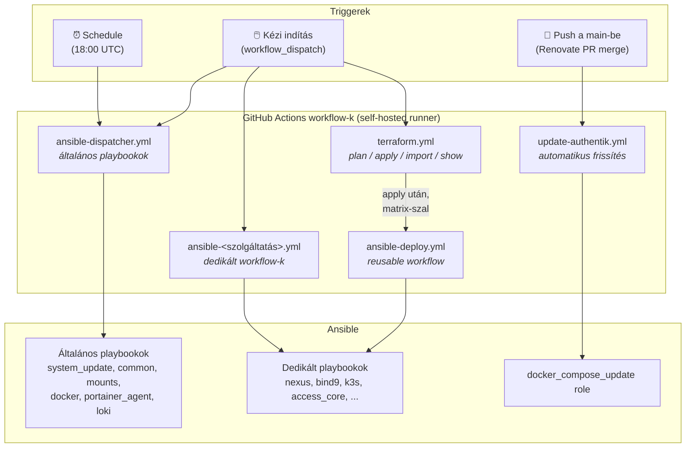
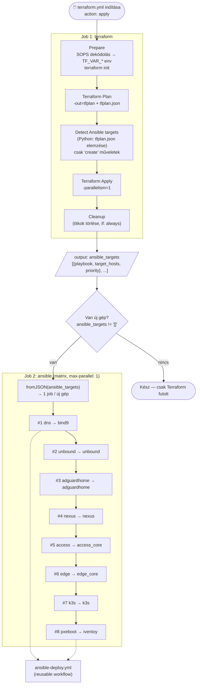
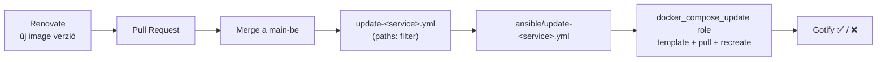

← [Vissza a Homelab főoldalra](../README_HU.md)

[🇬🇧 English](README.md) | [🇭🇺 Magyar](README_HU.md)

---

# IaC

A cél, hogy a homelabom egy folyamatosan fejlődő tanulókörnyezetként szolgáljon, amelyen keresztül az Infrastructure as Code (IaC) megvalósítását tanulom és dokumentálom.

---

## 📚 Tartalomjegyzék

- [Projektfilozófia & Megközelítés](#filo)
- [Technológiai Stack](#stack)
- [Architektúra áttekintés](#archit)
- [Repó struktúra](#repstr)
- [CI/CD workflow-k áttekintése](#cicd)
  - [Dispatcher vs. dedikált workflow](#dispvsded)
  - [Workflow térkép](#wftermap)
  - [Terraform → Ansible lánc (matrix)](#tfchain)
- [Teljes deployment workflow](#depwork)
  - [Terraform részletek](./terraform/README_HU.md)
- [Docker Compose automatikus frissítés](#dockerupd)
- [Futó workload-ok](#wrkld)
- [Secrets kezelés](#seckez)
- [Monitoring](#monitor)
- [Jelenlegi állapot & további tervek](#tervek)

---

<a name="filo"></a>

## Projektfilozófia & Megközelítés

**Hibrid megközelítést** alkalmazok — szándékosan.

- **Automatizált platform:** A VM-ek és LXC konténerek létrehozása, az OS konfigurációja, a szoftverek telepítése és a K3s cluster felállítása teljesen automatizált (Terraform + Ansible). A kettő között **nincs kézi lépés**: a Terraform után a pipeline magától elindítja a hozzájuk tartozó Ansible playbookokat.
- **Hibrid konfigurációs modell:** A Kubernetes applikációk beállításait, konfigfájlokat NAS-ról szinkronizálom, hogy a környezet konzisztenciáját megőrizzem, miközben folyamatosan fejlesztem a rendszert tisztán GitOps-alapú kezelés irányába.

Ez a megoldás lehetővé teszi, hogy gyorsan újraépítsem bármelyik gépet, miközben a működő alkalmazásokhoz szükséges adatok és beállítások azonnal rendelkezésre állnak.

**Kontextus:** Jelenleg **1 Proxmox fizikai szerver** fut, a K3s **single-node** (nem HA-klaszter), a persistent storage **local-path** (nem Longhorn/NAS-ra mountolt PVC). Az appok konfigurációját **nem GitOps-ból állítom elő nulláról**, hanem a kézzel beállított, NAS-ra mentett konfigfájlokat állítja vissza a pipeline. Ez tudatos döntés.

---

<a name="stack"></a>

## Technológiai Stack

| Réteg | Eszköz |
|---|---|
| **IaC & Provisioning** | Terraform (VM + LXC provisioning), Ansible (OS konfiguráció, userek, mountok, alkalmazások stb.) |
| **Container Orchestration** | K3s (Lightweight Kubernetes) |
| **CI/CD** | GitHub Actions (self-hosted runner, privát hálózaton): általános **Dispatcher** + **dedikált workflow-k** + **Terraform workflow** |
| **GitOps** | ArgoCD |
| **Kubernetes Management** | K9s, Lens |
| **Storage** | Local-path (tervben: Longhorn / NAS-alapú PVC) |
| **Secrets Management** | GitHub Actions Secrets, SOPS + AGE |

---

<a name="archit"></a>

## Architektúra áttekintés

```
┌─────────────────────────────────────────────────────────────────────┐
│                        Proxmox1 Hypervisor                          │
│                                                                     │
│  ┌─────────────────────┐  ┌──────────────────────────────────────┐  │
│  │ mgmt-core-01-204    │  │ k3s-server-01-225  (K3s single-node) │  │
│  │                     │  │                                      │  │
│  │ Ansible, Terraform  │  │ ArgoCD                               │  │
│  │ Semaphore (Docker)  │  │ identity-stack  (Vaultwarden)        │  │
│  │ GitHub Runner       │  │ monitoring-stack(Prometheus, Grafana,│  │
│  │ Portainer (Docker)  │  │                 Uptime-Kuma)         │  │
│  │                     │  │ storage-stack   (Nextcloud)          │  │
│  └─────────────────────┘  │ media-stack     (Sonarr, Radarr,     │  │
│                           │                 qBit, Prowlarr,      │  │
│  ┌─────────────────────┐  │                 Bazarr, Seerr)       │  │
│  │ access-core-01-206  │  │ notif-stack     (Gotify)             │  │
│  │                     │  │ dashboard-stack (Homarr)             │  │
│  │ Authentik (Docker)  │  │ admin-stack     (Renovate)           │  │
│  │ Teleport            │  │ access-stack    (Guacamole)          │  │
│  │ FreeRADIUS          │  │                                      │  │
│  │ Portainer Agent     │  └──────────────────────────────────────┘  │
│  │                     │                                            │
│  └─────────────────────┘  ┌──────────────────────────────────────┐  │
│                           │ edge-gw-01-230                       │  │
│                           │                                      │  │
│                           │ Traefik (Docker)                     │  │
│                           │ Cloudflare Tunnel                    │  │
│                           │ Portainer Agent                      │  │
│                           │                                      │  │
│                           └──────────────────────────────────────┘  │
│                                                                     │
│  LXC konténerek / szolgáltatás VM-ek (Terraform + dedikált playbook)│
│  dns-201 (BIND9) · nexus-207 (Nexus) · pxeboot-209 (iVentoy)        │
│  jellyfin-221 · adguardhome-222 · unbound-223                       │
│                                                                     │
│  ┌──────────────────────────────────────────────────────────────┐   │
│  │  NAS (192.168.2.220)  — NFS + SMB                            │   │
│  │  /mnt/backup/app-configs-backup/  ← mentett konfigok         │   │
│  │  /mnt/torrent,  /mnt/pxeiso                                  │   │
│  └──────────────────────────────────────────────────────────────┘   │
└─────────────────────────────────────────────────────────────────────┘
```

---

<a name="repstr"></a>

## Repó struktúra

```
.
├── .github/
│   └── workflows/
│       ├── ansible-dispatcher.yml   # Általános, bármely gépre futtatható playbookok
│       ├── terraform.yml            # Proxmox Terraform (plan/apply/import/show) + Ansible lánc
│       ├── ansible-deploy.yml       # Újrahasznosítható (reusable) workflow — a Terraform hívja matrix-szal
│       ├── ansible-access-core.yml  # Dedikált: access-core-01-206
│       ├── ansible-edge-core.yml    # Dedikált: edge-gw-01-230
│       ├── ansible-k3s.yml          # Dedikált: k3s-server-01-225
│       ├── ansible-nexus.yml        # Dedikált: nexus-207
│       ├── ansible-bind9.yml        # Dedikált: dns-201
│       ├── ansible-unbound.yml      # Dedikált: unbound-223
│       ├── ansible-adguardhome.yml  # Dedikált: adguard-222
│       ├── ansible-iventoy.yml      # Dedikált: pxeboot-209
│       └── update-authentik.yml     # Automatikus: push-ra triggerelt Docker Compose frissítés
├── terraform/
│   └── proxmox-deploy/     # VM-ek és LXC-k létrehozása/clonozása Proxmox-on
├── ansible/
│   ├── inventory.ini       # Host- és csoportdefiníciók (pl. nexus_207_host, all_nodes)
│   ├── site.yml            # Fő playbook — fázisokra bontva
│   ├── system_update.yml   # Általános playbookok (Dispatcher)...
│   ├── common.yml          # ...
│   ├── access_core.yml     # Dedikált playbookok (Terraform lánc / dedikált workflow)...
│   ├── edge_core.yml       # ...
│   ├── k3s.yml             # ...
│   ├── roles/
│   │   ├── common/         # Alapozás: csomagok, user, SSH, időzóna
│   │   ├── mounts/         # NFS/SMB csatolások
│   │   ├── docker/         # Docker telepítése
│   │   ├── docker_compose_update/ # Generikus role: bármely Docker Compose stack frissítése
│   │   ├── portainer_agent/# Portainer Agent (Docker hostokra)
│   │   ├── backup/         # Géptípusonként eltérő mentési logika
│   │   ├── k3s_prep/       # K3s előkészítés: swap off, kernel modulok
│   │   ├── k3s_install/    # K3s binary + cluster init
│   │   ├── argocd/         # ArgoCD telepítése Helm-mel
│   │   ├── argocd_apps/    # ArgoCD Application-ök regisztrálása
│   │   ├── app_restore/    # Konfig visszaállítás NAS-ról (rsync)
│   │   ├── access_core_01/ # Teleport + Authentik + FreeRADIUS
│   │   └── edge_gw_01/     # Traefik reverse proxy (Docker Compose)
├── secrets/
│   └── secrets.enc.yaml    # SOPS+AGE titkosított változók (Ansible + Terraform közös)
├── kubernetes/
│   └── apps/               # K8s manifest-ek (ArgoCD olvassa)
│       ├── media/          # Sonarr, Radarr, Prowlarr, Bazarr, qBittorrent, Seerr
│       ├── monitoring/     # Prometheus, Grafana, Uptime-Kuma
│       ├── storage/        # Nextcloud
│       ├── identity/       # Vaultwarden
│       ├── notification/   # Gotify
│       ├── dashboard/      # Homarr
│       ├── access/         # Guacamole
│       └── automation/     # Renovate (CronJob-al időzítve)
└── README.md
```

---

<a name="cicd"></a>

## CI/CD workflow-k áttekintése

Az összes automatizálás **GitHub Actions**-ön fut, a `mgmt-core-01-204` gépen lévő **self-hosted runneren**, így közvetlenül eléri a belső hálózatot (nincs szükség VPN-re vagy külső agentre). A workflow-kat három csoportba osztom:

| Csoport | Workflow | Mikor használom |
|---|---|---|
| **Általános (Dispatcher)** | `ansible-dispatcher.yml` | Bármely gépre futtatható, nem szolgáltatás-specifikus feladatok |
| **Dedikált** | `ansible-<szolgáltatás>.yml` | Egy adott infrastruktúra-szolgáltatás teljes deployment/konfigurációs folyamata |
| **Automatikus** | `update-authentik.yml`, ütemezett `system_update` | Eseményre (push) vagy időzítésre indul, kézi beavatkozás nélkül |
| **Provisioning** | `terraform.yml` (+ `ansible-deploy.yml`) | Gépek létrehozása, majd az új gépek automatikus konfigurálása |

<a name="dispvsded"></a>

### Dispatcher vs. dedikált workflow

A két típus közötti különbség lényege:

> **Dispatcher:** „Válassz egy **általános Ansible műveletet**, és mondd meg, **melyik hoston** fusson.”
>
> **Dedikált workflow:** „Indítsd el **ennek az infrastruktúra-szolgáltatásnak** a deployment/konfigurációs folyamatát.”

#### Ansible Dispatcher (`ansible-dispatcher.yml`)

Az általános, **géptől független** playbookok kapják itt a helyet: olyan feladatok, amelyek bármelyik gépen értelmesek (`system_update`, `common`, `mounts`, `docker`, `portainer_agent`, `loki`).

> **Nem ide tartoznak** azok a playbookok, amelyek csak egy adott géptípusra szólnak, ezért önálló playbookként futnak: a K3s-hez kötődő `argocd`, `argocd_apps`, `app_restore`, valamint a géptípusonként eltérő logikájú `backup`. A Dispatcher szabálya: **ha egy playbook bármelyik gépen értelmes, ide kerül; ha csak egy konkrét gépre vagy rétegre, akkor önálló playbook / dedikált folyamat lesz belőle.**

Két triggerrel rendelkezik:

- **Automatikus (schedule):** minden nap `18:00 UTC`-kor (`cron: '00 18 * * *'`) lefuttatja a `system_update.yml` playbook-ot az `all_nodes` csoportra.
- **Manuális (`workflow_dispatch`):** GitHub Actions felületéről indítható, három paraméterrel:

| Paraméter | Leírás |
|---|---|
| `playbook` | Melyik **általános** playbook fusson — pl. `system_update`, `common`, `mounts`, `docker`, `portainer_agent`, `loki`, stb. |
| `target_hosts` | Melyik gép(ek)re fusson — csoport (`all_nodes`, `docker_hosts`, `lxc_nodes`) vagy egy konkrét host (`host_dns`, `host_nexus`, `host_adguard`, `host_unbound`, `host_jelly`, `host_mgmt`, `host_pxeboot`, `host_wazuh`) |
| `dry_run` | Ha be van kapcsolva, `--check --diff` módban fut — nem változtat semmit, csak megmutatja mi változna |

A `host_*` választékok a workflow-ban egy `case` blokkal képződnek le az inventory-ban szereplő tényleges host- / csoportnevekre (pl. `host_nexus` → `nexus_207_host`, `host_dns` → `dns_201_host`).

#### Dedikált workflow-k

Ezek **egy konkrét szolgáltatáshoz / géphez** tartoznak, és az adott gép teljes konfigurációs folyamatát (a hozzá tartozó, dedikált playbookot) indítják el. Itt nincs értelme „bármelyik gépre” futtatni őket, ezért nincs `target_hosts` választó — a célgép a workflow-ba van égetve.

| Workflow | Célgép | Mit konfigurál |
|---|---|---|
| `ansible-access-core.yml` | `access-core-01-206` | Teleport, Authentik, FreeRADIUS + daloRADIUS |
| `ansible-edge-core.yml` | `edge-gw-01-230` | Traefik, Cloudflare Tunnel |
| `ansible-k3s.yml` | `k3s-server-01-225` | K3s, ArgoCD, konfig visszaállítás |
| `ansible-nexus.yml` | `nexus-207` | Nexus (csomag proxy) |
| `ansible-bind9.yml` | `dns-201` | BIND9 DNS |
| `ansible-unbound.yml` | `unbound-223` | Unbound |
| `ansible-adguardhome.yml` | `adguard-222` | AdGuard Home |
| `ansible-iventoy.yml` | `pxeboot-209` | iVentoy (PXE boot) |
| `update-authentik.yml` | `access-core-01-206` | **Automatikus**, push-ra triggerelt Authentik frissítés |

#### Mikor melyiket?

| Helyzet | Eszköz |
|---|---|
| „Frissítsd az összes gépet” | Dispatcher → `system_update` / `all_nodes` |
| „Telepíts Dockert erre a hostra” | Dispatcher → `docker` / adott host |
| „Mentsd le a K3s-t / az edge-et / az access-core-t” | Önálló `backup` playbook (géptípusonként más logika) |
| „Telepítsd újra az ArgoCD-t / állítsd vissza a konfigokat” | Önálló `argocd`, `argocd_apps`, `app_restore` playbookok (a K3s dedikált folyamat része) |
| „Építsd újra az edge gatewayt” | `ansible-edge-core.yml` (vagy Terraform lánc) |
| „Hozz létre új VM-et és konfiguráld” | `terraform.yml` → automatikusan az Ansible lánc |
| „Új Authentik image jött” | Automatikus: Renovate → merge → `update-authentik.yml` |

<a name="wftermap"></a>

### Workflow térkép

Ez mutatja, hogy melyik trigger melyik workflow-t indítja, és azok mit érnek el:



<a name="tfchain"></a>

### Terraform → Ansible lánc (matrix)

A legfontosabb újdonság: a `terraform.yml` nem áll meg a gépek létrehozásánál. Ha egy `apply` **újonnan létrehozott** (vagy újra létrehozott) gépet talál, a pipeline **automatikusan elindítja a hozzá tartozó Ansible playbookot** — a megfelelő sorrendben.

A folyamat három fő lépésből áll:

1. **`terraform` job** — `plan`, majd `apply` (a plan-t JSON-ba exportálja: `tfplan.json`).
2. **`detect_targets` lépés** — egy Python script végigmegy a plan `resource_changes` listáján, és kiválasztja azokat az erőforrásokat, amelyek `create` műveletet tartalmaznak (ez lefedi a `["create"]` és a `["delete","create"]`, azaz újraépítés esetét is). Az eredményt a `mapping` szótár alapján Ansible target-listává (JSON) alakítja, **prioritás szerint rendezve**.
3. **`ansible` job (matrix)** — a target-listából GitHub Actions **matrix**-ot épít, és minden elemre meghívja a `ansible-deploy.yml` reusable workflow-t.



> A fenti diagramon az összes lehetséges matrix-elem látszik. **Valójában csak azok futnak le, amelyek a Terraform-plan alapján újonnan jöttek létre** — a többi kimarad, a sorrend viszont mindig a prioritást követi.

#### Mapping: Terraform erőforrás → Ansible playbook

| Prio | Terraform erőforrás | Playbook | Target (inventory) |
|:---:|---|---|---|
| 1 | `container.dns-201` | `bind9` | `dns_201_host` |
| 2 | `container.unbound-223` | `unbound` | `unbound_223_host` |
| 3 | `container.adguardhome-222` | `adguardhome` | `adguard_222_host` |
| 4 | `container.nexus-207` | `nexus` | `nexus_207_host` |
| 5 | `vm.access-core-01-206` | `access_core` | `access_core_01_206_host` |
| 6 | `vm.edge-gw-01-230` | `edge_core` | `edge_gw_01_230_host` |
| 7 | `vm.k3s-server-01-225` | `k3s` | `k3s_server_01_225_host` |
| 8 | `vm.pxeboot-209` | `iventoy` | `pxeboot_209_host` |

A prioritási sorrend **szándékos**: előbb a DNS-réteg (BIND9 → Unbound → AdGuard), aztán a Nexus (csomag proxy, amit a `common` role használ), majd az access/edge réteg, végül a K3s és a PXE. Így az újabb gépek már működő névfeloldásra és csomag proxyra épülnek.

> `mgmt-core-01-204` és `jellyfin-221` Terraform-mal kezelt, de **nincs hozzájuk automatikus Ansible mapping** — ezeket szükség esetén a Dispatcherből futtatom (`host_mgmt`, `host_jelly`).

#### Mi az a matrix?

A **matrix** egy GitHub Actions funkció, amely **egy jobot többször futtat le különböző paraméterekkel**. Megadsz egy listát, és minden elemére automatikusan létrejön egy külön job példány — ugyanaz a workflow, más bemeneti értékekkel.

Az én esetemben a lista a Terraform plan alapján **dinamikusan** áll elő (`fromJSON(...)`), például:

```yaml
matrix:
  include:
    - {playbook: nexus, target_hosts: nexus_207_host}
    - {playbook: k3s,   target_hosts: k3s_server_01_225_host}
```

Ebből GitHub Actions két külön jobot csinál, mindkettő az `ansible-deploy.yml`-t futtatja, de más playbook-kal és más target-tel. Ha a Terraform csak egy gépet hozott létre, csak egy job jön létre; ha hármat, három.

```yaml
strategy:
  fail-fast: false     # egy hibás gép nem állítja le a többit
  max-parallel: 1      # egyszerre csak egy gép — a prioritási sorrend így érvényesül
```

#### A Terraform workflow paraméterei

| Paraméter | Leírás |
|---|---|
| `action` | `plan`, `apply`, `import`, `show` |
| `mode` | `auto` — minden eltérést alkalmaz; `select` — csak a bepipált gépeket (`-target`) |
| `nexus`, `adguardhome`, `unbound`, `dns`, `pxeboot`, `k3s`, `edge`, `access`, `mgmt`, `jellyfin` | `select` módban a célgépek kiválasztása (legalább egyet ki kell jelölni, különben a workflow hibával leáll) |
| `ansible_dry_run` | Az utólag meghívott Ansible lánc `--check --diff` módban fusson-e |

Egyéb biztosítékok: a `concurrency` csoport (`proxmox-terraform`, `cancel-in-progress: false`) megakadályozza, hogy két Terraform futás egyszerre módosítsa a state-et, az `import` pedig csak Proxmox VM-et vagy LXC-t enged importálni az `imported.tf` alapján.

---

<a name="depwork"></a>

## Teljes deployment workflow

### 1. fázis — Gépek létrehozása (Terraform)

A VM-eket egy általam előkészített **Golden Image** (Ubuntu 22.04, Proxmox cloud-init template) alapján hozom létre Full Clone módszerrel — az új VM-ek teljesen függetlenek az alap sablontól. A Terraform deklaratív módon definiálja az eltérő terhelésű csomópontok hardveres paramétereit (CPU, RAM, Disk).

Korábban a Terraform-ot manuálisan, CLI-ból futtattam az `mgmt-core-01-204` menedzsment gépről. Ez mára a GitOps-folyamat része lett: a Terraform kód GitHubon van, és a dedikált **`terraform.yml` workflow** indítja el a self-hosted runneren a Terraform műveleteket (`plan`, `apply`, `import`, `show`). A Terraform egy **Docker konténerben** (`hashicorp/terraform`) fut, a state a runner gépen, egy külön mappában (`/home/ansible/terraform-state/proxmox`) él. A szerveren manuális `terraform` parancsra többé nincs szükség.

**Újdonság:** a `terraform apply` után a pipeline **automatikusan elindítja a létrehozott gépekhez tartozó Ansible playbookokat** (lásd: [Terraform → Ansible lánc](#tfchain)). Egy törölt gép újraépítése így egyetlen workflow-indítással megoldható: Terraform létrehozza → Ansible konfigurálja → (K3s esetén) a konfig visszaállítása a NAS-ról.

A Terraform konfigurációkat nem nulláról írtam meg: először a Proxmoxon kézzel elkészített Ubuntu template-et **importáltam** a Terraform state-be (`terraform import`), így a már létező erőforrás Terraform felügyelete alá került. Ezt az alap konfigurációt adaptáltam és bővítettem a különböző VM-típusokhoz, az eltérő hardverigények és szerepkörök szerint.

Kezelt gépek:

| Gép | Típus | Szerep |
|---|---|---|
| `k3s-server-01-225` | VM | K3s node |
| `access-core-01-206` | VM | Identity & Access layer (Teleport, Authentik, FreeRADIUS) |
| `edge-gw-01-230` | VM | Edge gateway (Traefik reverse proxy, Cloudflare Tunnel) |
| `mgmt-core-01-204` | VM | Management node (Self-hosted GitHub Runner, Ansible, Portainer) |
| `pxeboot-209` | VM | iVentoy (PXE boot) |
| `dns-201` | LXC | BIND9 |
| `unbound-223` | LXC | Unbound |
| `adguardhome-222` | LXC | AdGuard Home |
| `nexus-207` | LXC | Nexus (csomag proxy) |
| `jellyfin-221` | LXC | Jellyfin |

A Terraform `initialization` blokkján keresztül injektálja az SSH-kulcsokat és az Ansible usert — a VM az első bootja után azonnal "ready-to-use" állapotba kerül, manuális konfiguráció nélkül:

```hcl
user_account {
  keys     = [var.laptopom_pub, var.ansible_target_key_pub]
  password = var.ansible_user_pwd
  username = var.ans_username
}
```

A MAC-cím rögzítéssel biztosítom a statikus IP kiosztást a DHCP szerveren. Az érzékeny értékeket (Proxmox API token, jelszavak, SSH kulcsok) a `secrets/secrets.enc.yaml`-ban, SOPS+AGE-vel titkosítva tárolom — ugyanúgy, mint az Ansible pipeline-nál. A workflow futáskor a dekódolt secrets fájlt `TF_VAR_<név>` környezeti változókká alakítja, és a futás végén (`if: always()`) mindent töröl.

A Terraform-pipeline működésének részletei (workflow, state-kezelés, import folyamat, teszt) a [`terraform/readme.md`](./terraform/README_HU.md)-ben vannak dokumentálva.

---

### 2. fázis — Alap konfiguráció (Ansible `common` role)

Minden gépen lefut (a Dispatcherből, vagy a Terraform lánc dedikált playbookjának részeként):

| Feladat | Részlet |
|---|---|
| Csomag proxy repository | `nexus` (192.168.2.207) — gyorsítja a csomagletöltést |
| Alapcsomagok | `python3`, `curl`, `git`, `mc`, `prometheus-node-exporter` |
| `dist-upgrade` | Teljes rendszerfrissítés |
| User & SSH | User létrehozása, SSH kulcsok feltöltése, `PermitRootLogin no`, `PasswordAuthentication no` |
| SSH hardening | Banner, 900 mp-es shell timeout (`TMOUT`) |
| Időzóna | `Europe/Budapest` |
| Prometheus Node Exporter | Automatikus start + enable — minden gép monitorozva |

---

### 3. fázis — NAS csatolások (`mounts` role)

A K3s workload-ok és a backup folyamatok feltételezik a NAS elérhetőségét. Az Ansible ezt a K3s/Docker telepítés előtt végzi el minden érintett gépen:

- **NFS:** `/mnt/torrent` ← `192.168.2.220:/mnt/ssdpool/torrent`
- **SMB:** `/mnt/backup` ← `//192.168.2.220/backup` (konfig-backup forrás)
- **SMB:** `/mnt/pxeiso` ← `//192.168.2.220/pxeiso`

---

### 4. fázis — Réteg-specifikus telepítések

Ezeket a **dedikált playbookok** végzik: a Terraform lánc automatikusan, vagy a hozzájuk tartozó dedikált workflow kézzel indítja őket.

#### 4a. Edge Layer (`edge-gw-01-230`)

A Traefik **Docker Compose**-ban fut (nem K3s-en). Az Ansible:
1. Létrehozza a könyvtárstruktúrát (`/opt/app-data/edge-stack/traefik/`)
2. `rsync`-kel visszatölti a NAS-ról az elmentett Traefik konfigot (dinamikus route-ok, ACME cert)
3. Jinja2 template alapján generálja a statikus és dinamikus config fájlokat
4. Elindítja a Docker Compose stacket

#### 4b. Identity & Access Layer (`access-core-01-206`)

**Docker Compose** (Authentik) + **systemd** (Teleport) + **natív APT** (FreeRADIUS + daloRADIUS). Az Ansible:

**Teleport:**
1. GPG kulcs + APT repo hozzáadása, v18.7.4 telepítése
2. `rsync` a NAS-ról: Teleport `data/` visszaállítása (`.sock` fájlok kizárva)
3. Jinja2 template alapján config generálása, systemd service beállítása, Teleport indítása

**Authentik:**
1. `rsync` a NAS-ról: PostgreSQL `db_data/` + `config/` (media, custom-templates) visszaállítása
2. Jogosultságok fixálása (DB: `999:999`, `0700`)
3. Docker Compose stack elindítása (`pull: always`, `recreate: always`)

**FreeRADIUS + daloRADIUS:**
1. APT függőségek telepítése: Apache2, PHP, MariaDB, FreeRADIUS (MySQL + LDAP modulokkal)
2. **Smart visszaállítás** — sorrendben ellenőrzi mi érhető el a NAS-on:
   - Ha van `radius_configs_backup.tar.gz` → teljes konfig visszaállítás (`unarchive`)
   - Ha van `radius_db_backup.sql` → adatbázis visszaállítás (`mysqldump` importból)
   - Ha egyik sem létezik → friss telepítés: séma importálás, SQL modul konfigurálása, daloRADIUS repo klónozása GitHubról
3. Apache vhostok beállítása: operators felület (`:8000`), users felület (`:80`)
4. **Automatikus mentés a futás végén:** a role befejezésekor `tar.gz`-be csomagolja a FreeRADIUS + daloRADIUS + Apache konfigokat, és `mysqldump`-pal menti az adatbázist a NAS-ra — így a következő futásnál már mindig van miből visszaállítani

#### 4c. K3s Node (`k3s-server-01-225`)

Az Ansible előkészíti a gépet (swap ki, szükséges kernel modulok be), majd egy egysoros installer scripttel telepíti a K3s-t. A beépített load balancert és Traefik-et kikapcsolom, mert az ingress forgalmat az `edge-gw-01-230`-on futó külön Traefik kezeli.

#### 4d. Szolgáltató LXC-k és a PXE VM

A DNS-réteg (`dns-201` BIND9, `unbound-223`, `adguardhome-222`), a csomag proxy (`nexus-207`) és a PXE szerver (`pxeboot-209`, iVentoy) mind saját, dedikált playbookkal rendelkeznek. Ezeket a Terraform lánc a [prioritási sorrendben](#tfchain) indítja, így a DNS és a Nexus már akkor működik, amikor a többi gép konfigurációja elindul.

---

### 5. fázis — ArgoCD + konfig visszaállítás

#### ArgoCD (`argocd` role)

Helm-mel települ a saját namespace-be. A jelszó hash átadásával az ArgoCD első indulásakor már az előre beállított jelszóval rendelkezik — nincs szükség manuális resetelésre.

#### Konfig visszaállítás (`app_restore` role)

Az appok (Sonarr, Radarr, Prowlarr, Grafana, stb.) **nem üres állapotból indulnak**, hanem a NAS-ra korábban elmentett konfigurációjukból. A folyamat:

1. K3s leállítása (hogy ne írja felül a visszaállítandó adatokat)
2. Célkönyvtárak létrehozása a K3s node-on
3. `rsync` a NAS `/mnt/backup/app-configs-backup/` mappájából a lokális `/opt/app-data/` alá
4. Jogosultságok helyreállítása
5. K3s visszaindítása

#### ArgoCD Applications (`argocd_apps` role)

Az ArgoCD regisztrálja a privát GitHub repót, majd létrehozza az Application objektumokat. Minden stack a repó egy-egy mappájára mutat, `automated` sync + `selfHeal` módban — ha a K8s manifest változik GitHubon, ArgoCD automatikusan szinkronizálja:

| ArgoCD Application | GitHub path | K8s namespace |
|---|---|---|
| `media-stack` | `kubernetes/apps/media` | `media` |
| `monitoring-stack` | `kubernetes/apps/monitoring` | `monitoring` |
| `storage-stack` | `kubernetes/apps/storage` | `storage` |
| `identity-stack` | `kubernetes/apps/identity` | `identity` |
| `notification-stack` | `kubernetes/apps/notification` | `notification` |
| `dashboard-stack` | `kubernetes/apps/dashboard` | `dashboard` |
| `access-stack` | `kubernetes/apps/access` | `access` |
| `automation-stack` | `kubernetes/apps/automation` | `automation` |

---

### 6. fázis — GitHub Actions pipeline-ok működése

A workflow-k felépítését és a köztük lévő munkamegosztást a [CI/CD workflow-k áttekintése](#cicd) fejezet írja le. Itt a közös működési elemek szerepelnek, amelyeket minden Ansible-t futtató workflow használ:

1. **Checkout** a repóból.
2. **SOPS+AGE kulcs előkészítése:** a `SOPS_AGE_KEY` GitHub Actions Secretből létrejön a `keys.txt` (`chmod 600`).
3. **Playbook és célgép meghatározása** (Dispatcher: `case` blokk a `target_hosts` alapján; Terraform lánc: a matrix paraméterei).
4. **Secrets dekódolása:** `sops -d secrets/secrets.enc.yaml` → `/tmp/secrets_dec.yaml`.
5. **Gotify értesítés — indulás** 🚀 (playbook, target, trigger típusa: ⏰ automatikus / 🖱️ kézi).
6. **`ansible-playbook` futtatása** `-e target=<host/csoport>` és `-e "@/tmp/secrets_dec.yaml"` paraméterekkel, opcionálisan `--check --diff` módban (`dry_run`).
7. **Gotify értesítés — eredmény:** siker esetén ✅, hiba esetén ❌ (magas prioritással, exit kóddal).
8. **Biztonsági takarítás:** a dekódolt secrets fájl és az AGE kulcsfájl törlése, majd a workflow az Ansible exit kódjával tér vissza (így a GitHub is hibásnak jelöli a futást, ha az Ansible elbukott).

A workflow a self-hosted runneren közvetlenül éri el a belső hálózatot — nincs szükség VPN-re vagy külső agent-re.

---

### 7. fázis — Backup (`backup` role)

A `backup` role **önálló playbookként** fut (nem a Dispatcher része, mert nem általános: géptípusonként más logikát futtat). A `main.yml` az `inventory_hostname` alapján dönti el melyik task fájl töltődik be.

#### `access-core-01-206`
1. Docker konténerek leállítása
2. `/opt/app-data/` **dátumozott mappába** mentése rsync-kel (`app-configs-backup-YYYY-MM-DD/`)
3. Docker konténerek újraindítása
4. FreeRADIUS + daloRADIUS + Apache konfigok becsomagolása `tar.gz`-be a dátumozott mappába
5. RADIUS adatbázis mentése `mysqldump`-pal

#### `edge-gw-01-230`
1. Docker konténerek leállítása
2. `/opt/app-data/` **dátumozott mappába** mentése rsync-kel (`app-configs-backup-YYYY-MM-DD/`)
3. Docker konténerek visszaindítása

#### `k3s-server-01-225`
A K3s esetében nem elég leállítani a Dockert — a podokat graceful módon kell lekapcsolni, hogy az adatok konzisztensen menthetők legyenek:
1. Összes alkalmazás namespace összegyűjtése (rendszer namespace-ek kizárva)
2. Minden Deployment és StatefulSet `replicas=0`-ra skálázása
3. Podok teljes leállásának megvárása (`kubectl wait`)
4. `/opt/app-data/` **dátumozott mappába** mentése rsync-kel (`.sock` és `admin-stack/` kizárva)
5. Deploymentek és StatefulSetek visszaskálázása `replicas=1`-re
6. Podok `Ready` állapotának megvárása (`kubectl wait --for=condition=Ready`)

---

<a name="dockerupd"></a>

## Docker Compose automatikus frissítés

A K3s-en futó alkalmazásoknál az **ArgoCD** automatikusan szinkronizál, ha egy manifest változik GitHubon. A K3s-en kívüli, **Docker Compose**-ban futó szolgáltatásoknál (pl. Authentik) korábban ez kézi munka volt: a Renovate talált egy új image verziót, én mergeltem GitHubra, majd a szerveren SSH-n keresztül kézzel írtam át a compose fájlt és futtattam a `docker compose up -d` parancsot.

Ez most automatizálva van — ez a harmadik workflow-típus (**automatikus, push-triggered**):

1. **Renovate** észreveszi, hogy egy Docker image-nek új verziója érhető el, és PR-t nyit a repóban.
2. A PR **main**-be kerül mergelésre.
3. A push triggereli a hozzá tartozó **GitHub Actions workflow**-t (`.github/workflows/update-<service>.yml`), amely figyeli az adott service Compose template-jének elérési útját (`paths:` filter).
4. A workflow a `self-hosted` GitHub Runneren fut le, és meghívja a hozzá tartozó Ansible playbook-ot (`ansible/update-<service>.yml`).
5. A playbook a generikus **`docker_compose_update`** role-t hívja meg, service-specifikus változókkal (`docker_compose_update_path`, `docker_compose_update_template`).
6. A role:
   - biztosítja, hogy a stack könyvtára létezzen a célgépen,
   - legenerálja a friss `docker-compose.yml` fájlt a Jinja2 template-ből,
   - `pull: always` + `recreate: auto` móddal lehúzza az új image-et és újrakreálja a konténert, ha szükséges.
7. A folyamat elejéről és végéről **Gotify** értesítés érkezik (siker ✅ / hiba ❌).



**Miért generikus a role?** A `docker_compose_update` role semmilyen service-specifikus adatot nem tartalmaz — a célkönyvtárat és a template elérési útját mindig a hívó playbook adja át változóként. Így minden új Docker Compose-alapú szolgáltatáshoz (Traefik, Vaultwarden stb.) elég egy új, pár soros playbook + egy hozzá tartozó workflow fájl, magát a role-t nem kell módosítani.

| Fájl | Szerep |
|---|---|
| `.github/workflows/update-<service>.yml` | Megmondja a GitHub Actionsnek: **mikor** (push a main-be, adott path módosulásakor) és **hol** (self-hosted runner) fusson le |
| `ansible/update-<service>.yml` | Service-specifikus playbook — meghívja a generikus role-t a megfelelő változókkal |
| `ansible/roles/docker_compose_update/` | Generikus, service-független logika: fájl deploy + compose pull/recreate |

**Teszt:** 

Renovate talál egy új docker image verziót, mergelem.


Lefut a workflow.


Authentik frissült.


---

<a name="wrkld"></a>

## Futó workload-ok

### K3s (single-node, local-path storage)

| Stack | App |
|---|---|
| media | Sonarr, Radarr |
| media | Prowlarr, Bazarr |
| media | qBittorrent |
| media | Seerr |
| monitoring | Prometheus |
| monitoring | Grafana |
| monitoring | Uptime-Kuma |
| storage | Nextcloud + DB |
| identity | Vaultwarden |
| notification | Gotify |
| dashboard | Homarr |
| access | Guacamole + DB |
| automation | Renovate |

> **Storage:** Jelenleg `local-path` provisioner — a PVC-k a K3s node lokális lemezére kerülnek. A konfig adat a NAS-ról visszaállított rsync-másolat. Longhorn / NAS-alapú PVC migrációt tervezem a jövőre nézve.

### Docker Compose (K3s-en kívül)

| VM | App |
|---|---|
| `edge-gw-01-230` | Traefik (reverse proxy, Let's Encrypt) |
| `access-core-01-206` | Teleport (SSH/RDP proxy), Authentik (SSO/IdP) |

### LXC / szolgáltatás gépek

| Gép | App |
|---|---|
| `dns-201` | BIND9 |
| `unbound-223` | Unbound |
| `adguardhome-222` | AdGuard Home |
| `nexus-207` | Nexus (csomag proxy) |
| `jellyfin-221` | Jellyfin |
| `pxeboot-209` | iVentoy (PXE) |

---

<a name="seckez"></a>

## Secrets kezelés

| Eszköz | Mit tárol |
|---|---|
| **SOPS+AGE** (`secrets/secrets.enc.yaml`) | SMB jelszó, user jelszó hash, SSH kulcsok, API tokenek, Proxmox API token, Gotify adatok — titkosítva verziókövetésben, **Ansible és Terraform közösen használja** |
| **GitHub Actions Secrets** (`SOPS_AGE_KEY`) | Az AGE privát kulcs — ebből dekódolja a pipeline a `secrets.enc.yaml`-t futáskor |

A folyamat (Ansible): a pipeline létrehozza a kulcsfájlt a Secretből → `sops -d` dekódolja a titkokat → Ansible megkapja `-e "@/tmp/secrets_dec.yaml"` formában → futás végén a kulcsfájl és a dekódolt fájl törlésre kerül.

A folyamat (Terraform): ugyanaz a dekódolás, de a titkokat a workflow `TF_VAR_<név>` környezeti változókká alakítja (`/tmp/tf_env.sh`), amelyet a Terraform konténer `--env-file`-ként kap meg. A futás végén (`if: always()`) ez is törlődik.

---

<a name="monitor"></a>

## Monitoring

Minden VM-re települ a `prometheus-node-exporter` a `common` role részeként. A Prometheus fix targeteket olvas a `host_vars`-ból:

- `proxmox1` / `proxmox2` — a fizikai hypervisorok (prometheus node exporter + SMART)
- Összes VM — automatikusan monitorozva
- Grafana dashboardok a NAS-ról rsync-kel visszaállítva — az adatsource reconnect után azonnal működik

A pipeline-ok állapotáról a **Gotify** értesítések tájékoztatnak (indulás 🚀, siker ✅, hiba ❌).

---

<a name="tervek"></a>

## Jelenlegi állapot & további tervek

- [x] Terraform-alapú VM és LXC provisioning (Proxmox)
- [x] Terraform pipeline GitHub Actions-ből (`plan` / `apply` / `import` / `show`, select + auto mód)
- [x] **Terraform → Ansible lánc:** a létrehozott gépekhez automatikusan, prioritás szerint indulnak a playbookok (matrix)
- [x] Ansible roles minden VM-típushoz
- [x] Általános **Ansible Dispatcher** + **dedikált workflow-k** szétválasztása
- [x] Self-hosted GitHub Actions pipeline
- [x] K3s single-node + ArgoCD GitOps (manifest szintű)
- [x] Konfig-alapú visszaállítás (rsync a NAS-ról)
- [x] Monitoring (Prometheus + Grafana + Uptime-Kuma)
- [x] Identity/Access layer (Teleport + Authentik)
- [x] Edge layer (Traefik + Let's Encrypt)
- [x] Docker Compose alapú szolgáltatások (K3s-en kívüli) automatikus frissítése Renovate + GitHub Actions + Ansible pipeline-nal
- [ ] Az összes VM bevonása a Terraform + Ansible pipeline-ba (`mgmt-core-01-204`, `jellyfin-221` automatikus Ansible mappingje)
- [ ] NAS-ról betöltött konfigok teljes migrációja Kubernetes ConfigMap-ekbe/Secret-ekbe
- [ ] Longhorn vagy NFS-alapú PVC storage (local-path kiváltása)
- [ ] Terraform state remote backend (jelenleg a runneren, lokális mappában)
- [ ] Több node → K3s HA cluster

---

← [Vissza a Homelab főoldalra](../README_HU.md)
