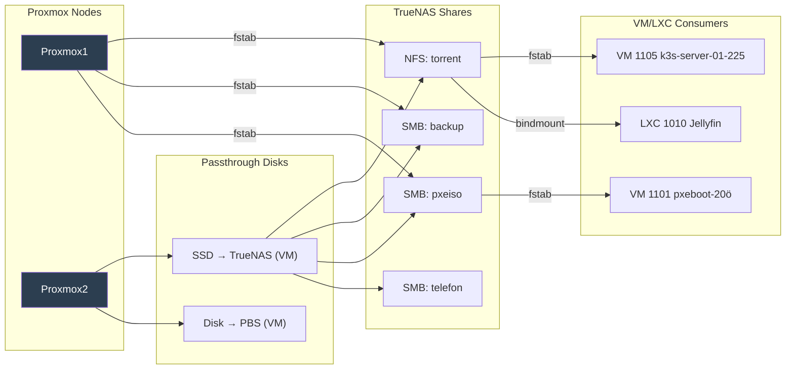

← [Back to Homelab main page](../README.md)

[🇬🇧 English](README.md) | [🇭🇺 Magyar](README_HU.md)

---

# Design Decisions and Rationale

Here I present why I chose certain technologies and architectural approaches.

---

## 📚 Table of Contents

- [Proxmox and VMs initially sharing a 1TB M.2 SSD, later separating them](#ssd-strategy)
- [Replacing FreeFileSync with Restic](#restic)
- [Why Nextcloud?](#nextcloud)
- [Why Vaultwarden?](#vaultwarden)
- [My mounting strategy](#mounting)
- [Bind9, AdGuard Home, Unbound cache and TTL strategy](#dns-ttl)
- [Scheduled Tasks (Backup & Maintenance)](#scheduled)
- [Confusion caused by identical VM/LXC IDs in Proxmox Backup Server](#pbs-id)
- [My VM/LXC naming convention](#naming)
- [Docker Runtime Environment: VM vs. LXC](#dockervms)
- [Traefik Configuration Strategy: Modularity](#traefik-strategy)

---
## Proxmox and VMs initially sharing a 1TB M.2 SSD, later separating them so Proxmox moves to a 250 GB SSD while VMs remain on the fast 1 TB M.2 SSD

- **Space saving**: This way, Clonezilla backup is only required for the 250 GB SSD containing Proxmox. The VMs are backed up by Proxmox Backup Server (PBS), so Clonezilla backup for them is unnecessary. Result: faster backups and less storage usage.
- **I/O load separation**: The Proxmox host and the VMs both perform I/O operations. If they were on the same disk, the load would accumulate. With separate SSDs, operations are distributed, providing a more stable and faster system.

---
## Replacing FreeFileSync with Restic

- I back up the important files from my new laptop to the TrueNAS server using **Restic**.
- Why Restic:
  - **Safe**: With Restic, accidentally deleted source files can be restored. With FreeFileSync, if I sync after deleting a source file, I cannot restore it.
  - **Versioning**: Previous states can be restored at any time.
  - **Efficient**: Compression, fast operation. FreeFileSync was much slower at detecting changes and copying modified files.

---
## Why Nextcloud?

- Self-hosted file and photo management
- No need for Google Drive / other cloud providers — Nextcloud is my own Google Drive
- Full control and security

---
## Why Vaultwarden?

- Self-hosted password manager
- Passwords never leave my infrastructure
- Full control and security

---

## My mounting strategy

- No disk passthrough on Proxmox1 node
- On Proxmox2 node there are 2 disk passthroughs (for TrueNAS and Proxmox Backup Server)
- I mount TrueNAS shares to the Proxmox host with fstab, which then passes them to unprivileged LXCs
- In the case of VMs, I mount TrueNAS shares directly inside the VM via fstab, not through Proxmox

---

## Bind9, AdGuard Home, Unbound cache and TTL strategy

**BIND9 (Local authoritative source):**
- Since pfSense assigns static IPs, internal service addresses are constant, the name-IP mapping does not change.
- The **1 hour (3600s) TTL** in zone files creates an ideal balance between stability and flexibility during testing.

**Unbound (Recursive resolver):**
- **TTL Capping (0–3600s)**: Unbound respects the original TTL but caps it at 1 hour.
- **Optimistic Caching**: With serve-expired enabled, expired records are kept for another hour.

**AdGuard Home (Client-side filtering):**
- **TTL range (0–86400s)**: Maximum limit raised to 1 day.
- **Optimistic caching**: Ensures availability even if BIND9/Unbound stops.

Layer / Server                | Cache Size                               | Minimum TTL | Maximum TTL
-----------------------------|-------------------------------------------|-------------|-------------
AdGuard Home (for clients)  | 128 MB                                    | 0           | 86400 (1 day)
BIND9 (local zones)         | default                                   | 3600        | 3600
Unbound (public DNS)        | msg-cache 64 MB, rrset-cache 128 MB       | 0           | 3600 (1 hour)

---

## Scheduled Tasks (Backup & Maintenance)

**Explanation of the Scheduling Logic:**
- **02:00 short SMART test & HDSentinel Health Check:** This allows me to know by the morning whether the disks are healthy and safe to use for daily operations.
- **04:00/05:30 Backups every Sunday:** Backups run during early morning hours because network traffic and CPU load are at their lowest. The two nodes (`PVE1` and `PVE2`) start at different times to avoid overloading the PBS server’s SSD write performance and network bandwidth simultaneously.
- **08:00 Renovate & ArgoCD Sync:** Ensures that the K3s cluster’s declarative states and automated dependency updates are synchronized before the start of the workday.
- **08:00 Garbage Collection every Saturday:** Removes backups from PBS that are no longer needed according to the Prune rules, thereby actually freeing up storage space.
- **10:00 Deep Verification on the last Saturday of every month:** Having backups alone is not enough — their integrity must also be verified.
- **22:00 Prune:** Marks outdated backups for deletion based on the configured retention policy, preparing the environment for the next backup cycle.
- **22:30 Apt-Cacher-NG Maintenance:** Cleans and maintains the proxy cache right before system updates, ensuring that Ansible can later operate from a clean and error-free package source.
- **23:00 Ansible Update:** Virtual machines and LXC containers are updated when daily usage has already decreased, minimizing disruption in case services need to restart.

**The timing diagram is shown in the figure below.** I measured how long each task takes. The job durations were last verified on **2026-02-11**. For Proxmox VM/LXC backups, it is important to note that the first backup takes the longest, while subsequent backups are incremental and therefore significantly faster.

```mermaid
gantt
    title Optimized System Task Scheduling
    dateFormat  HH:mm
    axisFormat  %H:%M
    todayMarker off

    section Daily Routine
    SMART & HDSentinel Health    : 02:00, 6m
    Renovate & ArgoCD Sync       : 08:00, 15m
    Prune (Retention)            : 22:00, 1m
    Apt-Cacher-NG Maintenance    : 22:30, 1m
    Ansible Update               : 23:00, 30m

    section Backup Window (Sun)
    PVE1 -> PBS Backup (Sun)     :crit, 04:00, 15m
    PVE2 -> PBS Backup (Sun)     :crit, 05:30, 5m

    section Maintenance
    Garbage Collection (Weekly)  :done, 08:00, 1m
    Backup Verification (Monthly):done, 10:00, 50m
```

| Time | Task Name | Target Device | Frequency | Duration |
| :--- | :--- | :--- | :--- | :--- |
| **02:00** | SMART & HDSentinel Health Check | Proxmox 1 & 2 (Bash + Cron) | Daily | 6 min |
| **04:00** | VM/LXC Backup | Proxmox 1 -> PBS | Weekly (Sunday) | 15 min (Incremental) |
| **05:30** | VM/LXC Backup | Proxmox 2 -> PBS | Weekly (Sunday) | 5 min (Incremental) |
| **08:00** | Self-hosted Renovate & ArgoCD Sync | K3s Cluster (CronJob) | Daily | 15 min |
| **08:00** | Garbage Collection | PBS Server | Weekly | 1 min |
| **10:00** | Backup Verification (Verify) | PBS Server (Root) | Monthly (30 Days re-verify) | 50 min |
| **22:00** | Prune (Retention) | PBS Server | Daily | 1 min |
| **22:30** | Apt-Cacher-NG Maintenance | Apt-Proxy Server | Daily | 1 min |
| **23:00** | Ansible Update | VM/LXC | Daily | 30 min |

---

## Confusion caused by identical VM/LXC IDs in Proxmox Backup Server

**Problem**

When using multiple Proxmox nodes, PBS (Proxmox Backup Server) organizes backups by default based on VM/LXC IDs. If identical IDs are used (e.g., 101 on Node1 and 101 on Node2), I ran into the following issue: the PBS interface does not distinguish which node the given VM/LXC backup came from. As a result, backups from two different machines are placed under the same identifier and are not separated.

**Solution**

Use **globally unique VM/LXC IDs**, assigned according to a structured system rather than randomly, based on the table below.

I am renumbering my current system according to this table, and when creating new VM/LXC instances, I assign IDs following this structure. Every VM/LXC is registered in a table so I always know which ID is assigned to which machine.

| ID Range | Category | Notes |
| :--- | :--- | :--- |
| **100 - 499** | **LXC Core infrastructure** | Essential LXCs required for operation |
| **500 - 999** | **VM Core infrastructure** | Essential virtual machines required for operation |
| **1000 - 1099** | **LXC services** | Additional service containers |
| **1100 - 1199** | **VM Linux servers** | Linux-based servers |
| **1200 - 1299** | **VM Linux clients** | Linux-based clients |
| **1300 - 1399** | **VM Windows servers** | Windows-based servers |
| **1400 - 1499** | **VM Windows clients** | Windows-based clients |

**My current allocation**

**LXC Core infrastructure (100-499)**
- `100:dns`, `101:unbound`, `102:traefik`, `103:adguard`, `104:pi-hole`, `105:nginx`

**VM Core infrastructure (500-999)**
- `500:pfsense`, `501:pbs`, `502:truenas`

**LXC Services (1000-1099)**
- `1000:zabbix`, `1001:ansible`, `1002:nextcloud`, `1003:homarr`, `1004:guacamole`, `1005:apt-cacher`, `1006:freeipa`, `1007:freeradius`, `1008:restic`, `1009:vaultwarden`, `1010:jellyfin`, `1011:servarr`, `1012:gotify`, `1013:portainer`,  `1015:changedetection`

**VM Linux servers (1100-1199)**
- `1100:crowdsec`, `1101:pxeboot`

**VM Linux clients (1200-1299)**
- `1200:mainubuntu`, `1201:kali`, `1202:probaubi`

**VM Windows servers (1300-1399)**
- `1300:winszerver1`, `1301:winszerver2`, `1302:winszerver-core`

**VM Windows clients (1400-1499)**
- `1400:mainwindows11`, `1401:win11kliens1`, `1402:win11kliens2`

---

## My VM/LXC naming convention

The VM/LXC name refers to the service or role running on it, extended with the last octet of its IP address. This way, at a glance, I know what it does and what its IP address is. For example, `traefik-224` clearly shows that Traefik runs on it and its IP address is `192.168.2.224`.

  

---

## Docker Runtime Environment: VM vs. LXC

**Decision:** Docker and Kubernetes (k3s) systems are deployed in a **Virtual Machine (VM)** instead of an LXC container.

**Rationale:**

*   **Security (Isolation):** A VM is a completely separate unit with its own operating system. If a bug or hack occurs inside Docker, it cannot "leak" out to the host server (Proxmox). With LXC, this protection is weaker because the container shares the host's core (kernel).
*   **Simplicity:** Docker is natively designed to run on full operating systems (VMs). In a VM, all features work out of the box without extra configuration. Running it in LXC often requires granting extra permissions to the container, which creates security risks.

---

## Traefik Configuration Strategy: Modularity

**Decision:** Traefik uses internal DNS names instead of IP addresses to reach backends, and the configuration is stored in multiple small files rather than one giant file.

**Why modular file structure (multiple small .yml files)?**
*   **Clarity:** Instead of a 500-line `external.yml`, every service has its own dedicated file (e.g., `nextcloud.yml`, `jellyfin.yml`). This makes troubleshooting or modifying settings much easier.
*   **Maintainability:** When removing a service or adding a new one, I only need to delete or create a single file. This eliminates the risk of accidentally breaking other working rules in a large, shared configuration file.

---

← [Back to Homelab main page](../README.md)
