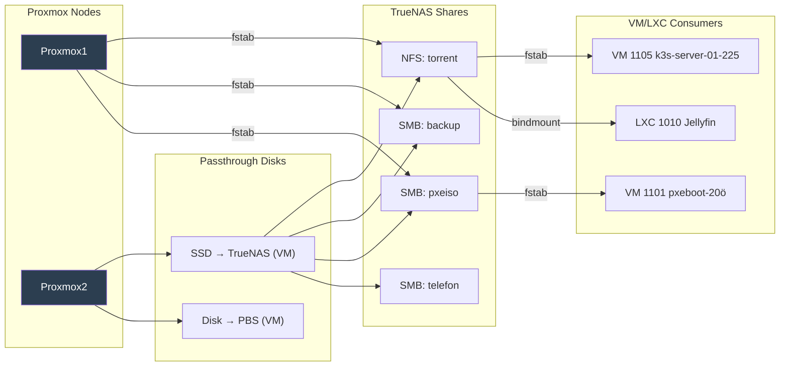

← [Vissza a Homelab főoldalra](../README_HU.md)

[🇬🇧 English](README.md) | [🇭🇺 Magyar](README_HU.md)

---

# Design Decisions

Itt bemutatom, hogy miért esett a döntésem bizonyos technológiákra és architektúrákra.

---

## 📚 Tartalomjegyzék

- [1TB-os M.2 SSD-n Proxmox és VM-ek közösen, később ezt szétválasztom és Proxmox kerül a 250 GB SSD-re míg VM-ek gyors 1 TB-os M.2 SSD-re](#ssdvalasztas)
- [FreeFileSync lecserélése Restic-re](#resticrecsere)
- [Miért Nextcloud?](#nextcloud)
- [Miért Vaultwarden?](#vaultwarden)
- [Mountolási stratégiám](#mountstrategia)
- [Bind9, AdGuard Home, Unbound cache és TTL stratégiája](#ttl)
- [Ütemezett feladatok (Backup & Karbantartás)](#utemezes)
- [Proxmox Backup Server mentésnél azonos VM/LXC ID-k miatti kavarodás](#kavarodas)
- [VM/LXC elnevezési konvencióm](#konvenicom)
- [Docker futtatási környezet: VM vs. LXC](#dockervms)
- [SSL Tanúsítványkezelés: DNS-01 Challenge és Wildcard előnyei](#ssl-strategy)
- [Traefik konfigurációs stratégia: Modularitás](#traefik-strategy)

---
## 1TB-os M.2 SSD-n Proxmox és VM-ek közösen, később ezt szétválasztom és Proxmox kerül a 250 GB SSD-re míg VM-ek gyors 1 TB-os M.2 SSD-re

- **Helyspórolás**: Így Clonezilla mentés csak a 250 GB-os Proxmox-ot tartalmazó SSD-ről szükséges. A VM-eket a Proxmox Backup Server (PBS) menti, róluk szükségtelen Clonezilla mentés. Eredmény gyorsabb és kevesebb tárhelyet igénylő mentés.
- **I/O terhelés szétválasztása**: a Proxmox host és a VM-ek is végeznek I/O műveleteket. Ha egy lemezen lennének, a terhelés összeadódna, külön SSD-vel pedig a műveletek eloszlanak, ami stabilabb és gyorsabb rendszert biztosít.
---
## FreeFileSync lecserélése Restic-re

  - Az új laptopomon lévő fontos fájlaimról **Restic** segítségével készítek biztonsági mentést a TrueNAS szerverre.
  - Miért Restic:
    - **Biztonságos**: Restic-nél a véletlen forrásfájl törlés esetén visszaállítható a törölt fájl, míg FreeFileSync-nél, ha a forrásfájl törlése után véletlen szinkronizálok, akkor nem tudom visszaállítani a fájlt.
    - **Verziózás**: akár korábbi állapotok is visszaállíthatók.
    - **Hatékony**: tömörít, gyors, FreeFileSync sokkal lassabban ellenőrizte le a változásokat és lassabban másolta  a megváltozott fájlokat.
---
## Miért Nextcloud?

- Self-hosted fájl- és képkezelés  
- Nem szükséges Google Drive / más felhő, Nextcloud a saját Google Drive-om
- Teljes kontroll és biztonság  
---
## Miért Vaultwarden?

- Self-hosted jelszókezelés  
- Jelszavak nem kerülnek ki az internetre  
- Teljes kontroll és biztonság  
---

## Mountolási stratégiám

- Proxmox1 node-on nincsen disk passthrough
- Proxmox2 node-on fut van 2 disk passthrough (TrueNAS-nak és Proxmox Backup Servernek)
- Proxmox hosthoz csatolom a TrueNAS megosztásokat fstab-al, hogy továbbadja az unprivileged LXC-nek.
- VM esetében az fstab segítségével mountolom a VM-hez közvetlenül a TrueNAS megosztásokat és nem a Proxmox adja tovább.

---

## Bind9, AdGuard Home, Unbound cache és TTL stratégiája

**BIND9 (Lokális autoritatív forrás):**
- Mivel a pfSense statikus IP-ket oszt, a belső szolgáltatások címei állandóak, a név-IP párosítás nem változik.
- A zónafájlokban rögzített **1 órás (3600s) TTL** ideális egyensúlyt teremt a stabilitás és a tesztelés alatti rugalmasság között.

**Unbound (Rekurzív feloldó):**
- **TTL Capping (0-3600s):** Az Unbound tiszteletben tartja az eredeti TTL-t, de 1 órában maximalizálja azt. Ez megvéd az elavult rekordoktól, miközben engedi a **CDN**-nek, hogy a rövid TTL-lel (pl. 10s) mindig a legközelebbi/leggyorsabb szervert ajánlják fel.
- **Optimistic Caching:** A serve-expired funkcióval a lejárt rekordokat további 1 óráig megőrzi. Ha az upstream szerver nem elérhető vagy lassú, a cache-ből azonnal válaszol, így a hálózati hiba vagy késleltetés észrevétlen marad a kliensek számára.

**AdGuard Home (Kliens oldali szűrő):**
- **TTL tartomány (0-86400s):** Itt a maximum limit 1 napra van emelve.
- **Optimistic caching** Az AdGuard szintén használ -et. Ha a BIND9 konténer vagy az Unbound ideiglenesen leállna, az AdGuard akár 24 órán át képes kiszolgálni a már ismert belső neveket a cache-ből, biztosítva a homelab szolgáltatások folyamatos elérését.

Layer / Server                 | Cache Size                          | Minimum TTL | Maximum TTL
-------------------------------|-------------------------------------|-------------|-------------
AdGuard Home (for clients)     | 128 MB                              | 0           | 86400 (1 day)
BIND9 (local zones)            | default                             | 3600        | 3600
Unbound (public DNS)           | msg-cache 64 MB, rrset-cache 128 MB | 0           | 3600 (1 hour)
 
---

## Ütemezett feladatok (Backup & Karbantartás)

**Az ütemezés logikájának magyarázata:**
- **02:00 short SMART teszt & HDSentinel Health Check**: Így reggelre már tisztában vagyok azzal, hogy a lemezeim épek-e, és lehet-e rájuk biztonságosan dolgozni.
- **Vasárnaponként 04:00/05:30 Backup**: Azért hajnalban fut, mert ilyenkor a legkisebb a hálózati forgalom és a CPU terhelés. A két node (PVE1 és PVE2) eltolva indul, hogy ne terheljék túl egyszerre a PBS szerver SSD írási sebességét és a hálózatát.
- **08:00 Renovate & ArgoCD Sync**: Biztosítja, hogy a K3s klaszter deklaratív állapotai és az automatizált függőségek frissítései még a munkaidő kezdete előtt szinkronizálódjanak.
- **Szombatonként 08:00 Garbage Collection**: Törli a PBS-ről azokat a mentéseket, amikre a Prune szabályok miatt már nincs szükség, így ténylegesen felszabadul a tárhely.
- **A hónap utolsó szombatján 10:00 (Last Saturday of the month) mély ellenőrzés (Verify):** Nem elég hogy van mentésem, de meg kell győződni róla, hogy épek.
- **22:00 prune**: A megadott megőrzési policy (retention) alapján jelöli meg a már szükségtelen régi backupokat törlésre, előkészítve a terepet a következő mentési ciklusnak.
- **22:30 Apt-Cacher-NG Maint**: Közvetlenül a rendszerek frissítése előtt karbantartja és tisztítja a proxy gyorsítótárát, így az Ansible később tiszta forrásból, hibák nélkül tud dolgozni.
- **23:00 Ansible Update (GitHub Actions):** GitHub Actions-szel futtatott Ansible playbook frissíti automatikusan a virtuális gépeket és LXC konténereket, amikor a napi használat már lecsökkent, így egy esetleges szolgáltatás-újraindulás nem zavar senkit.

**Lenti ábrán látható az időzítési diagram.** Lemértem, hogy melyik mennyi időt vesz igénybe. Utoljára **2026.02.11-én** ellenőriztem a jobok időtartamát. A Proxmox VM/LXC backupnál figyelembe kell venni, hogy az első backup tart a legtovább, utána már inkrementális backupok vannak, amik lényegesen gyorsabbak.

```mermaid
gantt
    title Optimized System Task Scheduling
    dateFormat  HH:mm
    axisFormat  %H:%M
    todayMarker off

    section Daily Routine
    SMART & HDSentinel Health    : 02:00, 6m
    Renovate & ArgoCD Sync       : 08:00, 15m
    Prune (Retention)            : 22:00, 1m
    Apt-Cacher-NG Maintenance    : 22:30, 1m
    Ansible Update               : 23:00, 30m

    section Backup Window (Sun)
    PVE1 -> PBS Backup (Sun)     :crit, 04:00, 15m
    PVE2 -> PBS Backup (Sun)     :crit, 05:30, 5m

    section Maintenance
    Garbage Collection (Weekly)  :done, 08:00, 1m
    Backup Verification (Monthly):done, 10:00, 50m
```

| Time | Task Name | Target Device | Frequency | Duration |
| :--- | :--- | :--- | :--- | :--- |
| **02:00** | SMART & HDSentinel Health Check | Proxmox 1 & 2 (Bash + Cron) | Daily | 6 min |
| **04:00** | VM/LXC Backup | Proxmox 1 -> PBS | Weekly (Sunday) | 15 min (Incremental) |
| **05:30** | VM/LXC Backup | Proxmox 2 -> PBS | Weekly (Sunday) | 5 min (Incremental) |
| **08:00** | Self-hosted Renovate & ArgoCD Sync | K3s Cluster (CronJob) | Daily | 15 min |
| **08:00** | Garbage Collection | PBS Server | Weekly | 1 min |
| **10:00** | Backup Verification (Verify) | PBS Server (Root) | Monthly (30 Days re-verify) | 50 min |
| **22:00** | Prune (Retention) | PBS Server | Daily | 1 min |
| **22:30** | Apt-Cacher-NG Maintenance | Apt-Proxy Server | Daily | 1 min |
| **23:00** | Ansible Update | VM/LXC | Daily | 30 min |

---

## Proxmox Backup Server mentésnél azonos VM/LXC ID-k miatti kavarodás

**Problélma**

Több Proxmox node használata esetén a PBS (Proxmox Backup Server) alapértelmezés szerint a VM/LXC ID-k alapján rendszerezi a mentéseket. Azonos ID-k használata (pl. 101 a Node1-en és 101 a Node2-n) esetén az alábbi hibába ütköztem. A PBS felületén nem különbözteti meg, hogy az adott 101-es VM/LXC az most a Node1 vagy Node2-ről érkezett-e, így egy azonosító alá helyeté a kétféle VM/LXC mentését, nincsenek különvélasztva.

**Megoldás**
Globálisan Egyedi VM/LXC ID-k használata, és ezeket nem véletlenszerűen adom meg, hanem egy rendszerbe foglalom, az alábbi táblázat alapján.
A jelenlegi rendszerem átszámozom a táblázat alapján és az új VM/LXC létrehozásakor a táblázat szerinti osztok ID-t. Minden VM/LXC-t regisztrálok a egy táblázatban, hogy kinek milyen ID van kiosztva.

| ID Tartomány | Kategória | Megjegyzés |
| :--- | :--- | :--- |
| **100 - 499** | **LXC Core infrastruktúra** | Alapvető működéshez kötelező LXC |
| **500 - 999** | **VM Core infrastruktúra** | Alapvető működéshez kötelező virtuális VM |
| **1000 - 1099** | **LXC services** | Kiegészítő szolgáltatások (LXC) |
| **1100 - 1199** | **VM linux szerverek** | Linux alapú szerverek |
| **1200 - 1299** | **VM linux kliensek** | Linux alapú kliensek |
| **1300 - 1399** | **VM windows szerverek** | Windows alapú szerverek |
| **1400 - 1499** | **VM windows kliensek** | Windows alapú kliensek |

**Konkrét kiosztásom**

**LXC Core infrastruktúra (100-499)**
- `100:dns`, `101:unbound`, `102:traefik`, `103:adguard`, `104:pi-hole`, `105:nginx`

**VM Core infrastruktúra (500-999)**
- `500:pfsense`, `501:pbs`, `502:truenas`

**LXC Services (1000-1099)**
- `1000:zabbix`, `1001:ansible`, `1002:nextcloud`, `1003:homarr`, `1004:guacamole`, `1005:apt-cacher`, `1006:freeipa`, `1007:freeradius`, `1008:restic`, `1009:vaultwarden`, `1010:jellyfin`, `1011:servarr`, `1012:gotify`, `1013:portainer`, `1015:changedetection`

**VM linux szerverek (1100-1199)**
- `1100:crowdsec`, `1101:pxeboot`

**VM linux kliensek (1200-1299)**
- `1200:mainubuntu`, `1201:kali`, `1202:probaubi`

**VM windows szerverek (1300-1399)**
- `1300:winszerver1`, `1301:winszerver2`, `1302:winszerver-core`

**VM windows kliensek (1400-1499)**
- `1400:mainwindows11`, `1401:win11kliens1`, `1402:win11kliens2`

---

## VM/LXC elnevezési konvencióm

A VM/LXC neve a rajta futó szolgáltatásra vagy szerepkörre utal, kiegészítve az IP címének utolsó oktettjével, így ahogy ránézek tudom hogy mit csinál és mi az IP címe, segítve a tájékozódásom. Példa a lenti ábrán, a traefik-224, amiről így egyértelmű számomra, hogy a traefik fut rajta és az IP címe 192.168.2.224.

  

---

## Docker futtatási környezet: VM vs. LXC

**Döntés:** A Docker és a Kubernetes (k3s) rendszereket **Virtuális Gépben (VM)** futtatom, nem LXC konténerben.

**Indoklás:**

*   **Biztonság (Elszigetelés):** A VM egy teljesen különálló egység saját operációs rendszerrel. Ha a Dockerben hiba történik vagy feltörik, az nem tud "kilépni" a gazdagépre (Proxmox). Az LXC-nél ez a védelem gyengébb, mert a konténer osztozik a fizikai szerver alapjain (kernel).
*   **Egyszerűség:** A Docker alapvetően teljes operációs rendszerekre (VM) lett tervezve. VM-ben minden funkció azonnal, extra konfiguráció nélkül működik. LXC-ben gyakran plusz jogosultságokat kell adni a konténernek a működéshez, ami biztonsági kockázatot jelent.

---

## SSL Certificate Management: DNS-01 Challenge and Wildcard Benefits

**Decision:** I use Let's Encrypt certificates with **DNS-01 challenge** validation in a **Wildcard** (`*.domain.com`) format.

**Why DNS-01 challenge?**
*   **No open ports required:** Validation happens at the DNS level (via Cloudflare API), eliminating the need to open port 80 or 443 to the internet for the challenge itself.
*   **Internal SSL:** I can generate trusted, public SSL certificates for internal services that are never exposed to the public web.

**Why Wildcard and how it helps scaling?**
*   **Instant Scaling:** When deploying a new service (e.g., `app.domain.com`), there is no need to request a new certificate or wait for validation. The existing wildcard cert immediately covers any new subdomain.
*   **Simplicity:** Managing a single certificate for all subdomains is far more efficient than maintaining individual certificates for every single service.
*   **Privacy:** Only the wildcard entry (`*.domain.com`) appears in public Certificate Transparency logs. This hides the specific names of my internal subdomains from external observers and automated scanners.

---

## Traefik konfigurációs stratégia: Modularitás

**Döntés:** A Traefik nem IP-címeket, hanem belső DNS neveket használ a backendek eléréséhez, a konfigurációt pedig több apróbb fájlban tárolom egyetlen óriási fájl helyett.

**Miért a moduláris fájlszerkezet (sok apró .yml)?**
*   **Áttekinthetőség:** Egy 500 soros `external.yml` helyett külön fájlja van minden szolgáltatásnak (pl. `nextcloud.yml`, `jellyfin.yml`). Így sokkal könnyebb hibát keresni vagy módosítani.
*   **Karbantarthatóság:** Ha egy szolgáltatást kivezetek vagy újat adok hozzá, csak egy fájlt kell törölnöm/létrehoznom, nem kockáztatom, hogy véletlenül elrontom a többi működő szabályt egy nagy közös fájlban.

---

← [Vissza a Homelab főoldalra](../README_HU.md)

