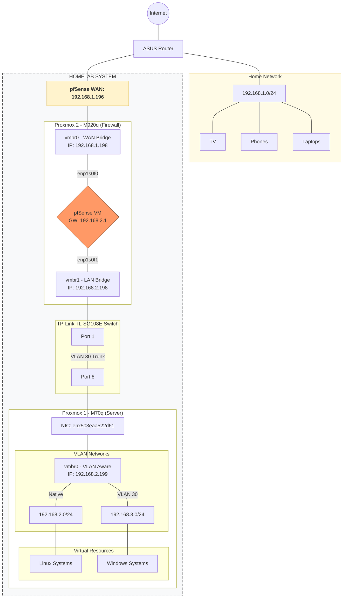

← [Back to Homelab Main Page](../README.md)

[🇬🇧 English](README.md) | [🇭🇺 Magyar](README_HU.md)

---

# 📚 Table of Contents

- [00. Homelab Hardware](./00-Homelab_Hardware/README.md)
- [01. Operating Systems](./01-Operating_Systems/README.md)
- [02. Virtualization](./02-Virtualization/README.md)
- [03. Network and Services](./03-Network_and_Services/README.md)
- [04. Remote Access](./04-Remote_Access/README.md)
- [05. Monitoring](./05-Monitoring/README.md)
- [06. Automation](./06-Automation/README.md)
- [07. Backup and Recovery](./07-Backup_and_Recovery/README.md)
- [08. Dashboard](./08-Dashboard/README.md)
- [09. Password Management](./09-Password_Management/README.md)
- [10. Storage](./10-Storage/README.md)
- [11. Scripts](./11-Scripts/README.md)
- [12. Docker](./12-Docker/README.md)
- [13. Design Decisions](./13-Design_Decisions/README.md)
- [14. Errors and Troubleshooting](./14-Errors/README.md)

---

# Homelab Short Summary 

## 🏠 Homelab Project Overview

This project presents a self-designed, enterprise-grade homelab where I practice virtualization, network security, and systems administration on Linux and Windows platforms. It includes both Windows and Linux solutions. For the implementation and the mastery of the underlying theory, Udemy courses, YouTube videos, articles, and forums have been of great help—all in English. I have also started using ChatGPT, which I find useful for drastically accelerating information gathering and research.

| Domain | Tools Used |
|----------------------|---------------------------------------------------|
| **Operating Systems** | CentOS 9 Stream, Ubuntu 22.04 Desktop/Server, Windows 10/11, Windows Server 2019 |
| **Virtualization** | Proxmox VE (on 2 nodes), LXC, VM, Template + Cloud-init |
| **Firewall & Router** | pfSense |
| **DHCP** | ISC-KEA, Windows Server 2019 DHCP Server |
| **DNS** | BIND9 + Unbound + Namecheap + Cloudflare, Windows Server 2019 DNS Server |
| **VPN** | Tailscale, WireGuard, OpenVPN, NordVPN |
| **Remote Access** | SSH (Termius), RDP (Guacamole) |
| **Reverse Proxy** | Nginx Proxy Manager (replaced), Traefik (currently used) |
| **Monitoring** | Zabbix |
| **Automation** | Ansible + Semaphore, Cron + Cronicle |
| **Security & Backup** | Proxmox Backup Server, Clonezilla, rclone, Nextcloud, FreeFileSync, Restic, Veeam Backup & Replication Community Edition, Macrium Reflect |
| **Ad Filtering** | Pi-hole (replaced), AdGuard Home (currently used) |
| **APT Cache Proxy** | APT-Cacher-NG |
| **Dashboard** | Homarr |
| **RADIUS, LDAP** | FreeRADIUS, FreeIPA |
| **Password Management** | Vaultwarden |
| **PXE Boot** | iVentoy |
| **Troubleshooting** | Wireshark |
| **Storage** | TrueNAS |

---

## 🎯 How this Homelab supports my professional growth:
- Deepened my theoretical knowledge through practical, hands-on tasks.
- Infrastructure design required significant planning and research, fostering foresight.
- Explored and implemented new technologies, broadening my technical stack.
- Faced real-world problems that required independent troubleshooting, improving problem-solving skills.
- Increased the need to understand the root cause of errors to prevent them in the future.

> [!IMPORTANT]
> I would like to highlight the following two sections, which I consider the most valuable parts of this project. In these documents, I explain the rationale behind my design decisions, the challenges I encountered, and the specific troubleshooting steps I took to resolve them.
> 
> - [13. Design Decisions](./13-Design_Decisions/README.md)
> - [14. Errors and Troubleshooting](./14-Errors/README.md)

---

## 🔮 Future Learning and Implementation Goals

- **WS-C2960CX-8TC-L Switch** purchase. I want to try **802.1X** port-based authentication, **DHCP snooping**, **port security**, **VLAN**, and **STP**.
- **MikroTik hAP ax2** router purchase.
- Deepening my knowledge of the **Python** programming language.
- **Cloud computing.** I am very interested in this field and want to get to know it better (**AWS**, **Azure**).
- **Advanced monitoring.** Learning **Grafana + Prometheus**, deepening my knowledge of **Zabbix**.
- **Cloud storage** via **Hetzner** or **pCloud** to comply with the **3-2-1 backup rule**.
- Migrating **TrueNAS** to a separate physical machine from a VM.
- **High Availability.** Planning to acquire three 2.5" SSDs and a **Lenovo M920q Tiny PC** to install Proxmox and create a **three-node cluster** with my existing machines. My goal is to integrate the three SSDs into **Ceph**.
- **DIY PiKVM.** KVM over IP would be very useful. I want to buy an **RPI 4** to implement **PiKVM**.
- **IDS/IPS** **Suricata** implementation.
- **Expanding further network security elements:** **pfBlockerNG**, **PacketFence**.

---

**Homelab Network Topology:**

---

← [Back to Homelab Home](../README.md)
