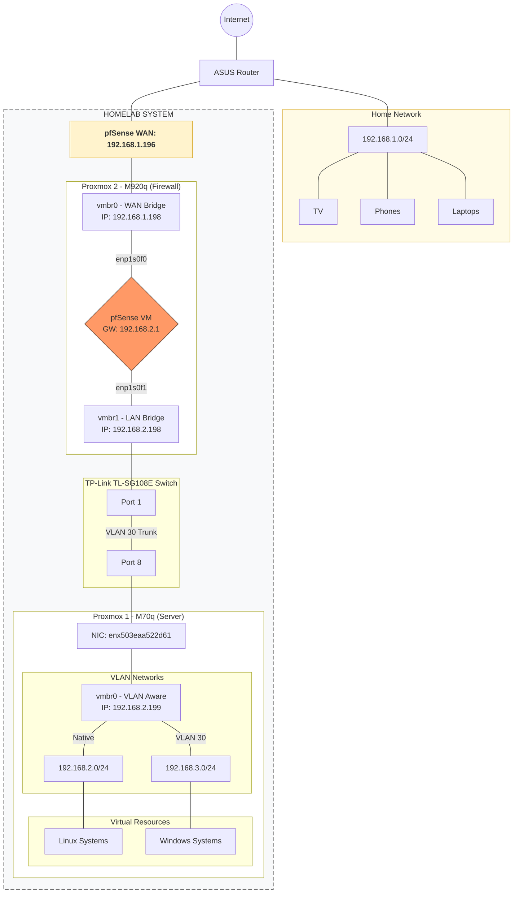

← [Vissza a Homelab főoldalra](../README_HU.md)

[🇬🇧 English](README.md) | [🇭🇺 Magyar](README_HU.md)

---

# 📚 Tartalomjegyzék

- [00. Homelab hardver](./00-Homelab_Hardware/README_HU.md)
- [01. Operációs rendszerek](./01-Operating_Systems/README_HU.md)
- [02. Virtualizáció](./02-Virtualization/README_HU.md)
- [03. Hálózat és szolgáltatások](./03-Network_and_Services/README_HU.md)
- [04. Távoli elérés](./04-Remote_Access/README_HU.md)
- [05. Monitorozás](./05-Monitoring/README_HU.md)
- [06. Automatizáció](./06-Automation/README_HU.md)
- [07. Mentés és helyreállítás](./07-Backup_and_Recovery/README_HU.md)
- [08. Dashboard](./08-Dashboard/README_HU.md)
- [09. Jelszókezelés](./09-Password_Management/README_HU.md)
- [10. Tárolás](./10-Storage/README_HU.md)
- [11. Scriptek](./11-Scripts/README.md)
- [12. Tervezési döntések](./12-Design_Decisions/README_HU.md)
- [13. Hibák és hibaelhárítás](./13-Errors/README_HU.md)

---

# Homelabom rövid összefoglalója 

## 🏠 Homelab projekt ismertetése

Ez a projekt egy saját tervezésű, vállalati környezet szerű homelabot mutat be, ahol Linux és Windows rendszereken gyakorlok virtualizációt, hálózatbiztonságot és üzemeltetést. Windows és Linux megoldásokat egyaránt tartalmaz. A konkrét megvalósításhoz és a mögöttes elmélet elsajátításához Udemy-n vásárolt videók, YouTube videók, cikkek és fórumok sokat segítettek, mindez angol nyelven. Elkezdtem használni a ChatGPT-t is, amit hasznosnak találtam, az információgyűjtést és keresést drasztikusan felgyorsítja.

| Terület              | Használt eszközök                       |
|----------------------|---------------------------------------------------|
| **Operációs rendszer** | CentOS 9 Stream, Ubuntu 22.04 desktop, Ubuntu 22.04 server, Windows 10, Windows 11, Windows Server 2019      |   
| **Virtualizáció**     | Proxmox VE (2 gépen), LXC, VM, Template + Cloud init  |
| **Tűzfal-router** | pfSense   |
| **DHCP** | ISC-KEA, Windows Server 2019 DHCP szerver   |   
| **DNS** | DNS (BIND9) + Unbound + Namecheap + Cloudflare, Windows Server 2019 DNS szerver |
| **VPN** | Tailscale, WireGuard, Openvpn, Nordvpn|
| **Távoli elérés**     | SSH (Termius), RDP (Guacamole) |
| **Reverse proxy** | Nginx Proxy Manager (leváltottam), Traefik (ezt használom jelenleg)               |
| **Monitorozás**       | Zabbix|
| **Automatizálás**     | Ansible+Semaphore, Cron+Cronicle       |
| **Biztonság és mentés**| Proxmox Backup Server, Clonezilla, Rclone, Nextcloud, FreeFileSync, Restic, Veeam Backup & Replication Community Edition, Macrium Reflect|
| **Reklámszűrés** | Pi-hole (leváltottam), AdGuard Home (ezt használom jelenleg)        |
| **APT cache proxy** | APT-Cacher-NG        |
| **Dashboard** | Homarr        |
| **Radius, LDAP** | FreeRADIUS, FreeIPA |
| **Password management** | Vaultwarden        |
| **PXE boot** | iVentoy        |
| **Hibakeresés** | Wireshark        |
| **Tárolás**       | TrueNAS|

---

## 🎯 Hogyan segíti ez a homelab a fejlődésem?:
- elméleti tudásom a gyakorlati feladatok által mélyítettem
- sok tervezést és utánajárást igényelt az infrastuktúra kialakítása, ami előrelátást igényelt
- új technológiákat próbáltam ki és ismertem meg, így bővítettem az ismeretem
- valós problémákkal találkoztam, amikre önállóan kellett megoldást találnom, javítva a problémamegoldó képességem
- hibák hátterének megértésének igénye nőtt, hogy legközelebb elkerüljem őket

[!CAUTION]
- [12. Tervezési döntések](./12-Design_Decisions/README_HU.md)
- [13. Hibák és hibaelhárítás](./13-Errors/README_HU.md)

---

## 🔮 További tanulási és megvalósítási célkitűzéseim

- **Python** programozási nyelv mélyebb elsajátítása.
- **Cloud computing.** Nagyon érdekel ez a terület, szeretném jobban megismerni (AWS, Azure).
- **Monitorozás továbbfejlesztése.** Grafana + Prometheus megtanulása, Zabbix ismeretet elmélyíteni.
- **Cloud storage** Hetzner vagy pCloud, hogy a 3-2-1 mentési szabálynak eleget tegyek.
- **Magas rendelkezésre állás.** Három darab 2,5"-os SSD és egy Lenovo M920q Tiny PC beszerzése van tervben, amelyre Proxmoxot telepítek, hogy a meglévő gépeimmel együtt háromtagú **klasztert** alakíthassak ki. A célom, hogy a három SSD-t **Ceph**-be integráljam.
- **DIY PiKVM.**  KVM over IP hasznos lenne. Venni szeretnék RPI 4-et, amin a PiKVM-et megvalósítanám.
- **IDS/IPS** Suricata implementálása.
- **További hálózati biztonsági elemek bővítése:** pfBlockerNG, PacketFence. 
- **Komolyabb switch vásárlása.** Ki szeretném próbálni a 802.1x port based autentikációt és beállítani a Radius felügyeletet a portokon. DHCP snooping és port security által még tovább növelhetném a biztonságot.
  
---

**Homelabom hálózati topológiája:**

---

← [Vissza a Homelab főoldalra](../README_HU.md)
