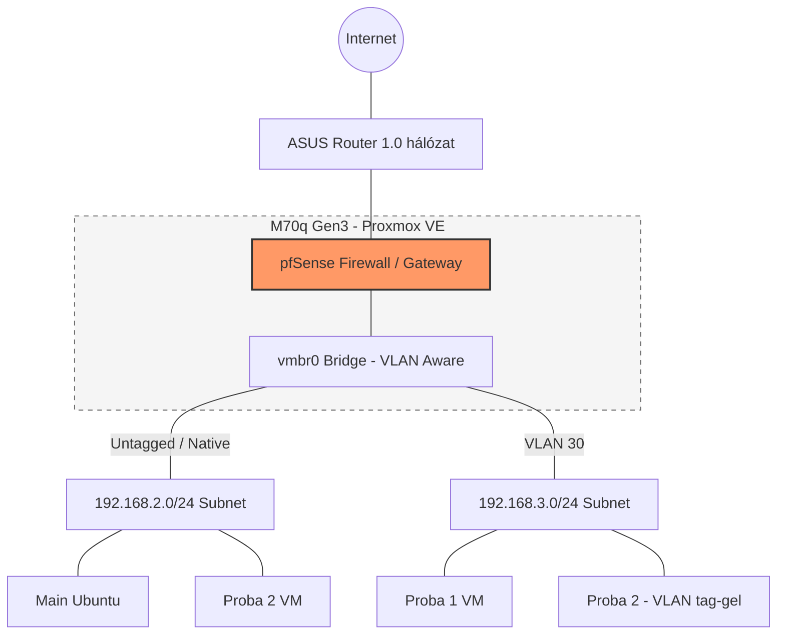

    
← [Vissza a Homelab főoldalra](../README_HU.md)

[🇬🇧 English](README.md) | [🇭🇺 Magyar](README_HU.md)

---

# 📚 Tartalomjegyzék

- [00. Homelab hardver](./00-Homelab_Hardware/README_HU.md)
- [01. Operációs rendszerek](./01-Operating_Systems/README_HU.md)
- [02. Virtualizáció](./02-Virtualization/README_HU.md)
- [03. Hálózat és szolgáltatások](./03-Network_and_Services/README_HU.md)
- [04. Távoli elérés](./04-Remote_Access/README_HU.md)
- [05. Monitorozás](./05-Monitoring/README_HU.md)
- [06. Automatizáció](./06-Automation/README_HU.md)
- [07. Mentés és helyreállítás](./07-Backup_and_Recovery/README_HU.md)
- [08. Dashboard](./08-Dashboard/README_HU.md)
- [09. Jelszókezelés](./09-Password_Management/README_HU.md)
- [10. Tárolás](./10-Storage/README_HU.md)
- [11. Scriptek](./11-Scripts/README.md)
- [12. Tervezési döntések](./12-Design_Decisions/README_HU.md)
- [13. Hibák és hibaelhárítás](./13-Errors/README_HU.md)

---

# Homelabom rövid összefoglalója 

## 🏠 Homelab projekt ismertetése

Ez a projekt egy saját tervezésű, vállalati környezet szerű homelabot mutat be, ahol Linux és Windows rendszereken gyakorlok virtualizációt, hálózatbiztonságot és üzemeltetést. Windows és Linux megoldásokat egyaránt tartalmaz. A konkrét megvalósításhoz és a mögöttes elmélet elsajátításához Udemy-n vásárolt videók, YouTube videók, cikkek és fórumok sokat segítettek, mindez angol nyelven. Elkezdtem használni a ChatGPT-t is, amit hasznosnak találtam, az információgyűjtést és keresést drasztikusan felgyorsítja.

❗❗❗Részletes dokumentációt készítettem magamnak az installálási folyamatokról, konfigurációs fájlokról, mit és hogyan állítottam be, felmerülő problémákról és megoldásaikról, képekkel illusztrálva, de ezek itt nem kerültek publikálásra. 

> 🎯 **Célom**:
Az elméleti tudásom mellett gyakorlati tapasztalat szerzése, új technológiák kipróbálása és megismerése. A technológiák kiválasztásakor figyelembe vettem a jelenlegi munkaerőpiaci trendeket, amit olykor a célra rendelkezésemre álló büdzsé befolyásolt.
Emellett fontos szempont volt, hogy az álláspályázatok során a munkáltatók könnyebben megismerhessék a tudásomat,  és könnyebben eldönthessék, hogy én vagyok-e a keresett személy.

---

## 🔮 További tanulási és megvalósítási célkitűzéseim

- **Python** programozási nyelv mélyebb megismerése.
- **Cloud computing.** Érdekel ez a terület, szeretném jobban megismerni (AWS, Azure).
- **Monitorozás továbbfejlesztése.** Grafana + Prometheus megtanulása. Zabbix ismeretet elmélyíteni.
- **Cloud storage** (Hetzner vagy pCloud).
- **Magas rendelkezésre állás.** Három darab 2,5"-os SSD és egy Lenovo M920q Tiny PC beszerzése van tervben, amelyre Proxmoxot telepítek, hogy a meglévő gépeimmel együtt háromtagú **klasztert** alakíthassak ki. A célom, hogy a három SSD-t **Ceph**-be integráljam.
- **DIY PiKVM.**  KVM over IP hasznos lenne. Venni szeretnék RPI 4-et, amin a PiKVM-et megvalósítanám.
- **IDS/IPS továbbfejlesztése.** CrowdSec elmélyítése, Nginx Proxy Managerre történő beállítása és Suricata implementálása.
- **Komolyabb switch vásárlása.** Ki szeretném próbálni a 802.1x port based autentikációt és beállítani a Radius felügyeletet a portokon. DHCP snooping és port security által még tovább növelhetném a biztonságot.
---

← [Vissza a Homelab főoldalra](../README_HU.md)
