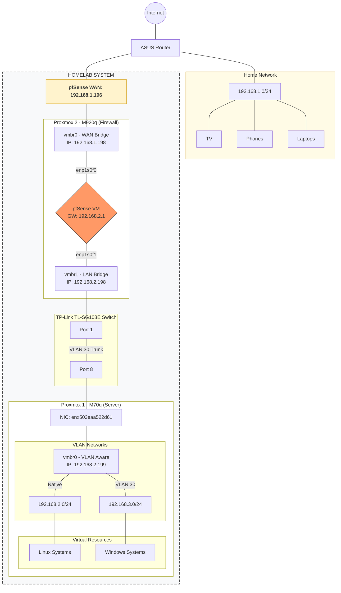

← [Vissza a Homelab főoldalra](../README_HU.md)

[🇬🇧 English](README.md) | [🇭🇺 Magyar](README_HU.md)

---

👤 Kapcsolat 

🔗 [LinkedIn](https://www.linkedin.com/in/rolf-krisztián-török-529aa436a/)

---

# 📚 Tartalomjegyzék

- [00. Homelab hardver](./00-Homelab_Hardware/README_HU.md)
- [01. Operációs rendszerek](./01-Operating_Systems/README_HU.md)
- [02. Virtualizáció](./02-Virtualization/README_HU.md)
- [03. Hálózat és szolgáltatások](./03-Network_and_Services/README_HU.md)
- [04. Távoli elérés](./04-Remote_Access/README_HU.md)
- [05. Monitorozás](./05-Monitoring/README_HU.md)
- [06. Automatizáció](./06-Automation/README_HU.md)
- [07. Mentés és helyreállítás](./07-Backup_and_Recovery/README_HU.md)
- [08. Dashboard](./08-Dashboard/README_HU.md)
- [09. Identity and Access Management](./09-Identity_and_Access_Management/README_HU.md)
- [10. Tárolás](./10-Storage/README_HU.md)
- [11. Scriptek](./11-Scripts/README_HU.md)
- [12. Docker](./12-Docker/README_HU.md)
- [13. Infrastructure as Code (IaC)](./13-Infrastructure_as_Code_(IaC)/README_HU.md)
- [14. Tervezési döntések](./14-Design_Decisions/README_HU.md)
- [15. Hibák és hibaelhárítás](./15-Errors/README_HU.md)

---

# Homelabom rövid összefoglalója 

## 🏠 Homelab projekt ismertetése

Ez a projekt egy saját tervezésű, vállalati környezet szerű homelabot mutat be, ahol Linux és Windows rendszereken gyakorlok virtualizációt, hálózatbiztonságot és üzemeltetést. Windows és Linux megoldásokat egyaránt tartalmaz. A konkrét megvalósításhoz és a mögöttes elmélet elsajátításához Udemy-n vásárolt videók, YouTube videók, cikkek és fórumok sokat segítettek, mindez angol nyelven. Elkezdtem használni a ChatGPT-t is, amit hasznosnak találtam, az információgyűjtést és keresést drasztikusan felgyorsítja.

| Terület | Használt eszközök |
|---|---|
| Operációs rendszer | Ubuntu 22.04 Server, Ubuntu 22.04 Desktop, CentOS 9 Stream, Windows 10, Windows 11, Windows Server 2019 |
| Virtualizáció | Proxmox VE, LXC, VM, Template + Cloud-Init |
| IaC & Automatizálás | Terraform, Ansible, Semaphore, GitHub Actions (self-hosted runner) |
| Container Orchestration | K3s (Kubernetes), Docker, Docker Compose |
| GitOps | ArgoCD |
| Tűzfal / Router | pfSense |
| DNS | BIND9, Unbound, AdGuard Home, Cloudflare, Namecheap |
| DHCP | ISC-KEA |
| Reverse proxy | Traefik, Cloudflare Tunnel |
| VPN / Távoli elérés | Tailscale, WireGuard, OpenVPN, Teleport, Guacamole |
| Identity & Access | Authentik (SSO/IdP), FreeIPA, FreeRADIUS |
| Monitorozás | Prometheus, Grafana, Uptime-Kuma |
| Biztonság / SIEM | Wazuh |
| Secrets management | Vaultwarden, SOPS + AGE |
| Mentés | Proxmox Backup Server, Restic, Rclone, Nextcloud, Veeam Community Edition |
| Tárolás | NAS (NFS + SMB) |
| Dashboard | Homarr |
| Media | Sonarr, Radarr, Prowlarr, Bazarr, Jellyfin, qBittorrent, Seerr |
| APT cache proxy | APT-Cacher-NG |
| PXE boot | iVentoy |
| Hibakeresés | Wireshark |

---

## 🎯 Hogyan segíti ez a homelab a fejlődésem?:
- elméleti tudásom a gyakorlati feladatok által mélyítettem
- sok tervezést és utánajárást igényelt az infrastuktúra kialakítása, ami előrelátást igényelt
- új technológiákat próbáltam ki és ismertem meg, így bővítettem az ismeretem
- valós problémákkal találkoztam, amikre önállóan kellett megoldást találnom, javítva a problémamegoldó képességem
- hibák hátterének megértésének igénye nőtt, hogy legközelebb elkerüljem őket

> [!IMPORTANT]
>  Az alábbi két menüpontot kiemelném, amit a legértékesebb pontoknak tartok, ahol elmagyarázom milyen döntést miért hoztam és hogy milyen hibákkal szembesültem illetve hogyan oldottam meg őket.
> 
> - [13. Tervezési döntések](./13-Design_Decisions/README_HU.md)
> - [14. Hibák és hibaelhárítás](./14-Errors/README_HU.md)

---

## 🔮 További tanulási és megvalósítási célkitűzéseim

- **WS-C2960CX-8TC-L Switch** vásárlása. Ki szeretném próbálni a 802.1x port based autentikációt, DHCP snooping-ot, port security-t, VLAN-t, STP-t.
- **MikroTik hAP ax2** router vásárlása 
- **Python** programozási nyelv mélyebb elsajátítása.
- **Cloud computing.** Nagyon érdekel ez a terület, szeretném jobban megismerni (AWS, Azure).
- **Cloud storage** Hetzner vagy pCloud, hogy a 3-2-1 mentési szabálynak eleget tegyek.
- **TrueNAS átköltöztetése** egy külön fizikai gépre VM-ből.
- **Magas rendelkezésre állás.** Három darab 2,5"-os SSD és egy Lenovo M920q Tiny PC beszerzése van tervben, amelyre Proxmoxot telepítek, hogy a meglévő gépeimmel együtt háromtagú **klasztert** alakíthassak ki. A célom, hogy a három SSD-t **Ceph**-be integráljam.
- **DIY PiKVM.**  KVM over IP hasznos lenne. Venni szeretnék RPI 4-et, amin a PiKVM-et megvalósítanám.
- **IDS/IPS** Suricata implementálása.
- **További hálózati biztonsági elemek bővítése:** pfBlockerNG, PacketFence. 
  
---

**Homelabom hálózati topológiája:**

```mermaid
graph TD
    %% Global
    Internet((Internet)) --- Asus[ASUS Router]

    %% Home Network Section
    subgraph Home_Net ["Home Network"]
        Subnet["192.168.1.0/24"]
        TV["TV"]
        Phone["Phones"]
        Laptop["Laptops"]
    end
    Asus --- Subnet
    Subnet --- TV
    Subnet --- Phone
    Subnet --- Laptop

    %% Homelab Entry Point
    Entry_IP["pfSense WAN: 192.168.1.196"]
    Asus --- Entry_IP

    %% HOMELAB SYSTEM
    subgraph Homelab_System ["HOMELAB SYSTEM"]
        direction TB

        %% Node2 - Firewall Node
        subgraph Node2 ["Proxmox 2 - M920q (Firewall)"]
            P2_WAN["vmbr0 - WAN Bridge <br/> IP: 192.168.1.198"]
            pfS{pfSense VM <br/> GW: 192.168.2.1}
            P2_LAN["vmbr1 - LAN Bridge <br/> IP: 192.168.2.198"]

            P2_WAN -- "enp1s0f0" --- pfS
            pfS -- "enp1s0f1" --- P2_LAN
        end

        Entry_IP --- P2_WAN

        %% Physical Switch
        subgraph Switch ["TP-Link TL-SG108E Switch"]
            SW_P1[Port 1] -- "VLAN 30 Trunk" --- SW_P8[Port 8]
        end

        P2_LAN --- SW_P1
        SW_P8 --- P1_NIC

        %% Node1 - Compute Node
        subgraph Node1 ["Proxmox 1 - M70q (Server)"]
            P1_NIC["NIC: enx503eaa522d61"]
            P1_Bridge["vmbr0 - VLAN Aware <br/> IP: 192.168.2.199"]

            P1_NIC --- P1_Bridge

            subgraph Subnets ["VLAN Networks"]
                P1_Bridge -- "Native" --- LAN2["192.168.2.0/24"]
                P1_Bridge -- "VLAN 30" --- VLAN3["192.168.3.0/24"]
            end

            subgraph VMs ["Virtual Resources"]
                LAN2 --- Linux["Linux Systems"]
                VLAN3 --- Windows["Windows Systems"]
            end
        end
    end

    %% Styles
    style Home_Net fill:#fffbe6,stroke:#d4a017
    style Entry_IP fill:#fff3cd,stroke:#d4a017,font-weight:bold
    style pfS fill:#f96,stroke:#333
    style Homelab_System fill:#f8f9fa,stroke:#333,stroke-dasharray: 8 4
    style Node1 fill:#fff
    style Node2 fill:#fff
```

---

← [Vissza a Homelab főoldalra](../README_HU.md)
